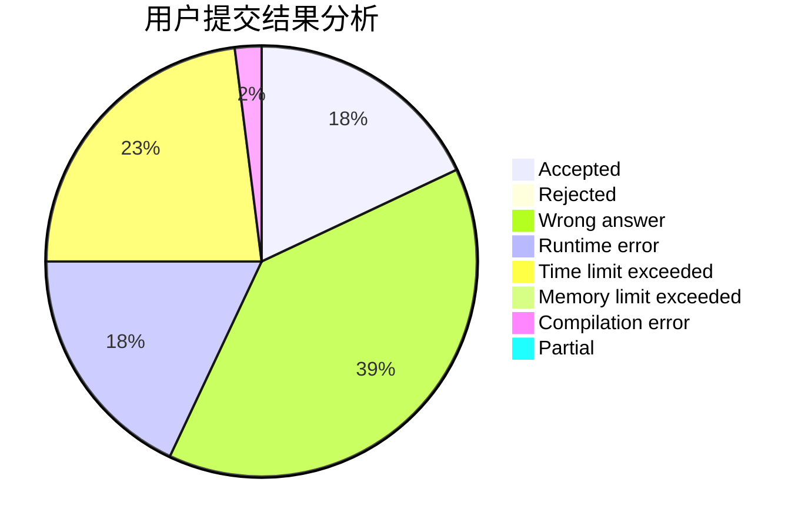
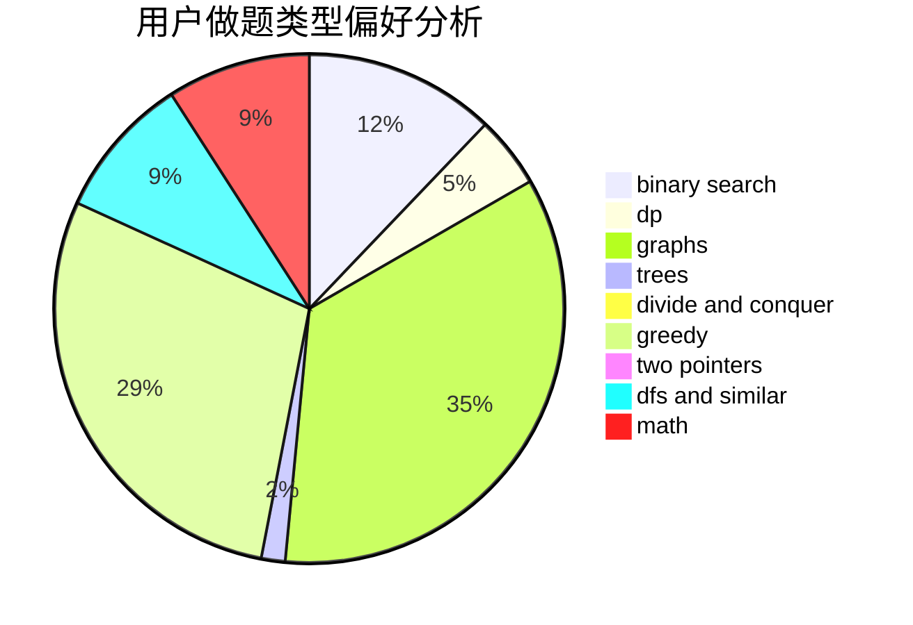

# WhyWhy

<!-- tabs:start -->

#### **用户提交结果分析**

#### **用户做题类型偏好分析**

<!-- tabs:end -->
# 推荐题目
[433B](https://codeforces.com/contest/433/problem/B)
[957D](https://codeforces.com/contest/957/problem/D)
[12962](https://codeforces.com/contest/1296/problem/2)
[453E](https://codeforces.com/contest/453/problem/E)
[500B](https://codeforces.com/contest/500/problem/B)
[1242A](https://codeforces.com/contest/1242/problem/A)
[1213C](https://codeforces.com/contest/1213/problem/C)
[1360C](https://codeforces.com/contest/1360/problem/C)
[1490C](https://codeforces.com/contest/1490/problem/C)
[1497B](https://codeforces.com/contest/1497/problem/B)
