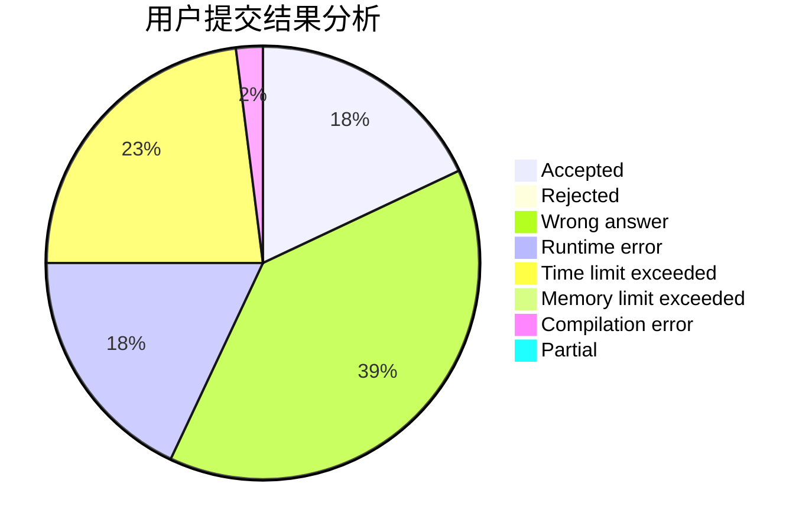
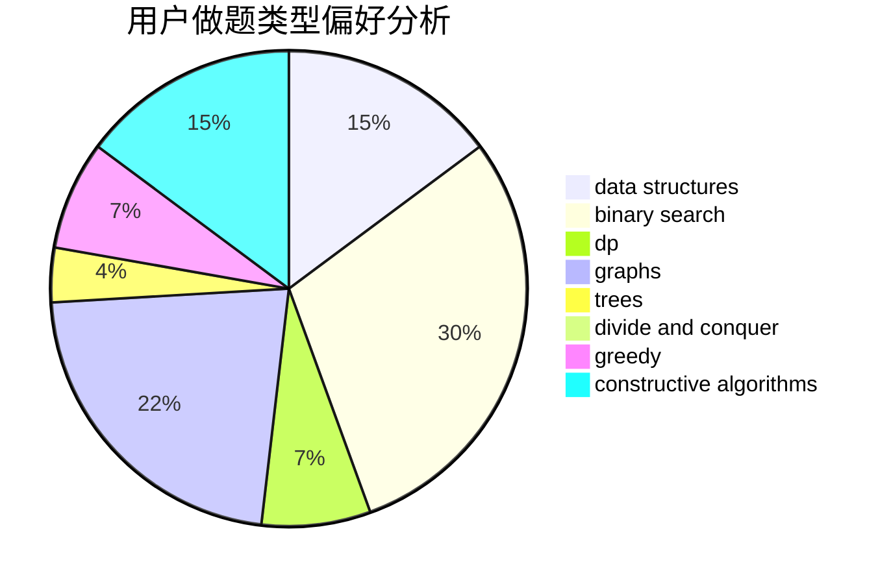
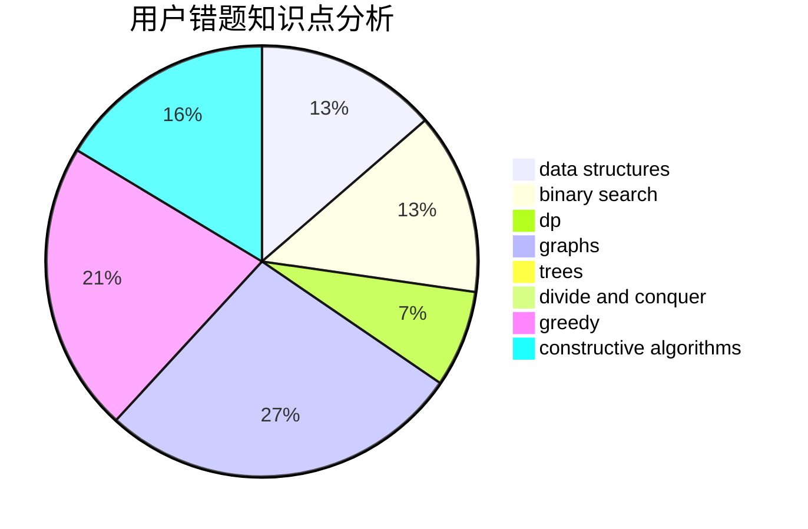

# WhyWhy

<!-- tabs:start -->

#### **用户提交结果分析**

#### **用户做题类型偏好分析**

#### **用户错题知识点分析**

<!-- tabs:end -->
# 推荐题目
[433B](https://codeforces.com/contest/433/problem/B)		dp,
                        implementation,
                        sortings		  
[957D](https://codeforces.com/contest/957/problem/D)		dsu,graphs,sortings,trees		  
[12962](https://codeforces.com/contest/1296/problem/2)		dsu,graphs,sortings,trees		  
[453E](https://codeforces.com/contest/453/problem/E)		data structures		  
[500B](https://codeforces.com/contest/500/problem/B)		dfs and similar,
                        dsu,
                        graphs,
                        greedy,
                        math,
                        sortings		  
[1242A](https://codeforces.com/contest/1242/problem/A)		constructive algorithms,
                        math,
                        number theory		  
[1213C](https://codeforces.com/contest/1213/problem/C)		math		  
[1360C](https://codeforces.com/contest/1360/problem/C)		constructive algorithms,
                        graph matchings,
                        greedy,
                        sortings		  
[1490C](https://codeforces.com/contest/1490/problem/C)		binary search,
                        brute force,
                        brute force,
                        math		  
[1497B](https://codeforces.com/contest/1497/problem/B)		constructive algorithms,
                        greedy,
                        math		  
