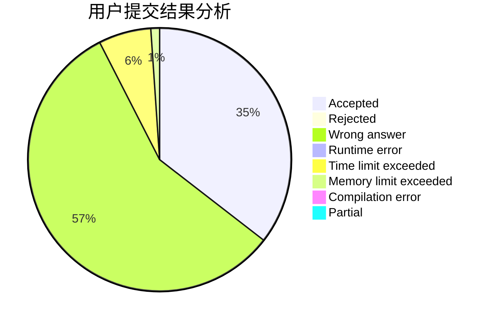
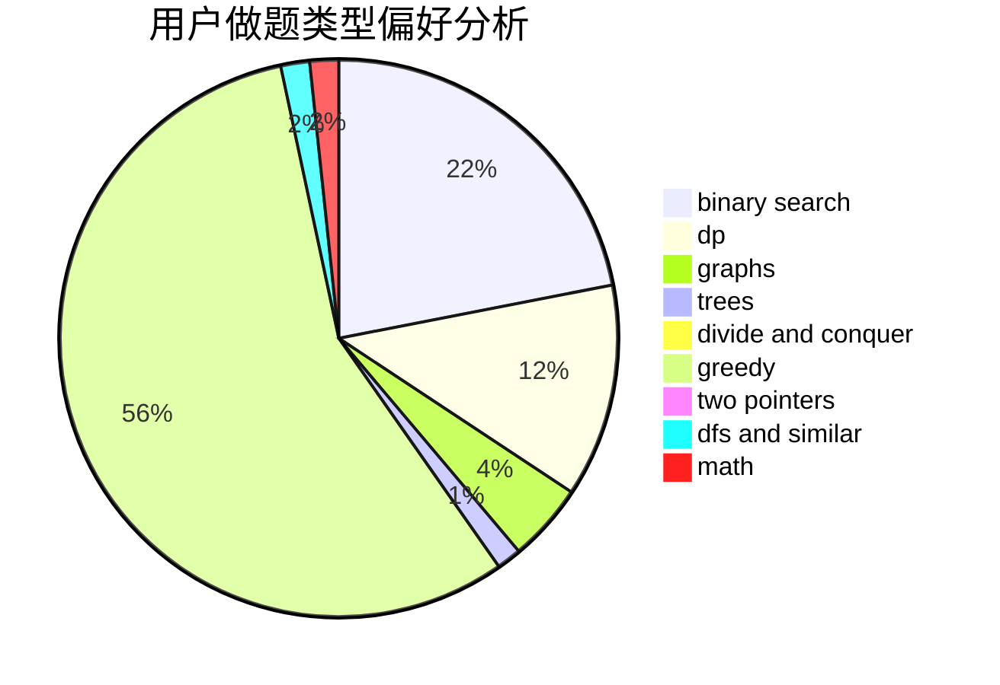

# Wi1der

<!-- tabs:start -->

#### **用户提交结果分析**

#### **用户做题类型偏好分析**

<!-- tabs:end -->
# 推荐题目
[867E](https://codeforces.com/contest/867/problem/E)
[1266A](https://codeforces.com/contest/1266/problem/A)
[293A](https://codeforces.com/contest/293/problem/A)
[1129D](https://codeforces.com/contest/1129/problem/D)
[831F](https://codeforces.com/contest/831/problem/F)
[1215B](https://codeforces.com/contest/1215/problem/B)
[1264F](https://codeforces.com/contest/1264/problem/F)
[861A](https://codeforces.com/contest/861/problem/A)
[363B](https://codeforces.com/contest/363/problem/B)
[81C](https://codeforces.com/contest/81/problem/C)
