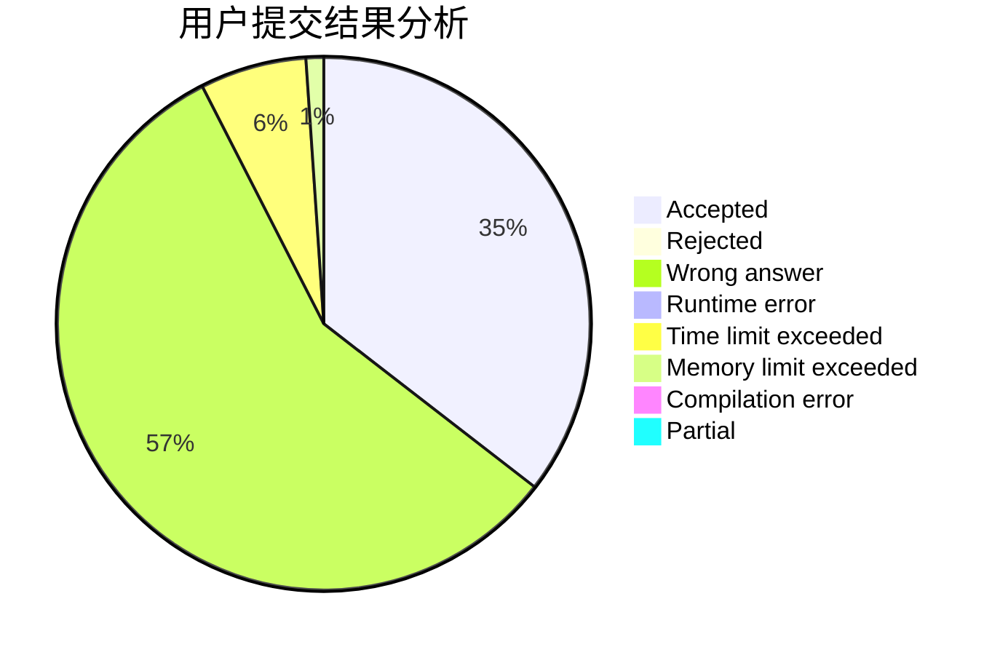
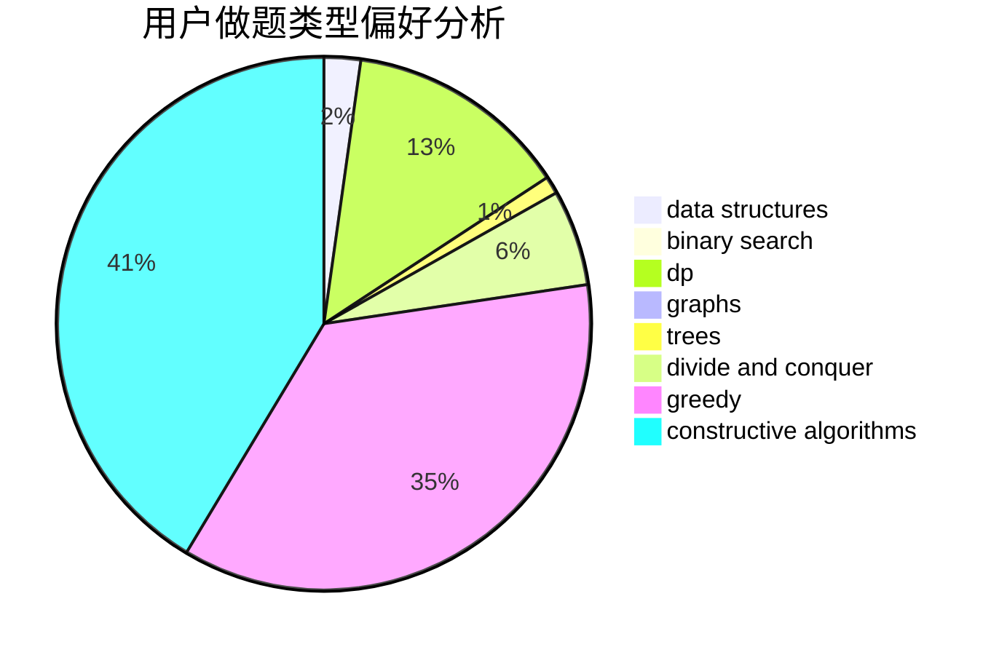
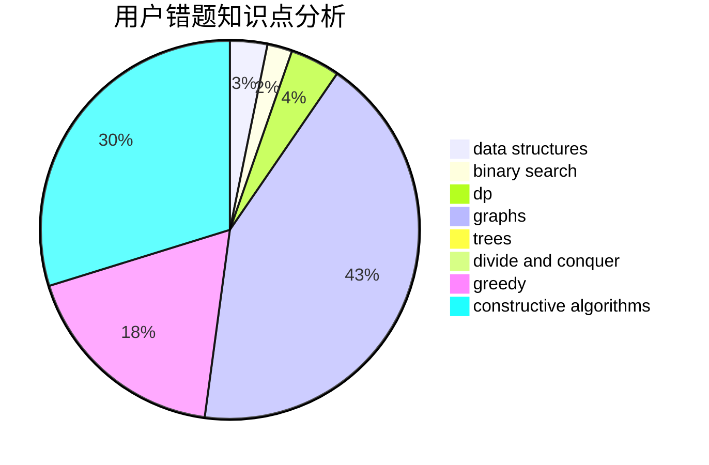

# Wi1der
<!-- tabs:start -->
#### **用户提交结果分析**

#### **用户做题类型偏好分析**

#### **用户错题知识点分析**

<!-- tabs:end -->
# 推荐题目
[Heating](http://codeforces.com/problemset/problem/1260/A)		math		  
[Two Melodies](http://codeforces.com/problemset/problem/813/D)		dp,
                        flows		  
[Triple](http://codeforces.com/problemset/problem/1119/H)		fft,
                        math		  
[Big Secret](http://codeforces.com/problemset/problem/925/C)		constructive algorithms,
                        math		  
[Gleb And Pizza](http://codeforces.com/problemset/problem/842/B)		geometry		  
[Transformation: from A to B](http://codeforces.com/problemset/problem/727/A)		brute force,
                        dfs and similar,
                        math		  
[Binary Tree on Plane](http://codeforces.com/problemset/problem/277/E)		flows,
                        trees		  
[Cola](http://codeforces.com/problemset/problem/44/B)		implementation		  
[Periodic RMQ Problem](http://codeforces.com/problemset/problem/803/G)		data structures		  
[Road to Cinema](http://codeforces.com/problemset/problem/729/C)		binary search,
                        greedy,
                        sortings		  
<!-- tabs:start -->
#### **data structures**
[Heating](http://codeforces.com/problemset/problem/803/G)		data structures		  
[Two Melodies](http://codeforces.com/problemset/problem/932/B)		binary search,
                        data structures,
                        dfs and similar		  
[Triple](http://codeforces.com/problemset/problem/689/D)		binary search,
                        data structures		  
[Big Secret](http://codeforces.com/problemset/problem/733/D)		data structures,
                        hashing		  
[Gleb And Pizza](http://codeforces.com/problemset/problem/1070/C)		data structures,
                        greedy		  
[Transformation: from A to B](http://codeforces.com/problemset/problem/848/C)		data structures,
                        divide and conquer		  
[Binary Tree on Plane](http://codeforces.com/problemset/problem/1386/C)		*special problem,
                        bitmasks,
                        data structures,
                        divide and conquer,
                        dsu		  
[Cola](http://codeforces.com/problemset/problem/1257/E)		data structures,
                        dp,
                        greedy		  
[Periodic RMQ Problem](http://codeforces.com/problemset/problem/1428/E)		binary search,
                        data structures,
                        greedy,
                        math,
                        sortings		  
[Road to Cinema](http://codeforces.com/problemset/problem/1492/C)		binary search,
                        data structures,
                        dp,
                        greedy,
                        two pointers		  
#### **binary search**
[Heating](http://codeforces.com/problemset/problem/729/C)		binary search,
                        greedy,
                        sortings		  
[Two Melodies](http://codeforces.com/problemset/problem/932/B)		binary search,
                        data structures,
                        dfs and similar		  
[Triple](http://codeforces.com/problemset/problem/689/D)		binary search,
                        data structures		  
[Big Secret](http://codeforces.com/problemset/problem/487/A)		binary search,
                        brute force,
                        implementation		  
[Gleb And Pizza](http://codeforces.com/problemset/problem/216/D)		binary search,
                        sortings,
                        two pointers		  
[Transformation: from A to B](http://codeforces.com/problemset/problem/1428/E)		binary search,
                        data structures,
                        greedy,
                        math,
                        sortings		  
[Binary Tree on Plane](http://codeforces.com/problemset/problem/1436/C)		binary search,
                        combinatorics		  
[Cola](http://codeforces.com/problemset/problem/1492/C)		binary search,
                        data structures,
                        dp,
                        greedy,
                        two pointers		  
[Periodic RMQ Problem](http://codeforces.com/problemset/problem/1463/D)		binary search,
                        constructive algorithms,
                        greedy,
                        two pointers		  
[Road to Cinema](http://codeforces.com/problemset/problem/1490/G)		binary search,
                        data structures,
                        math		  
#### **dp**
[Heating](http://codeforces.com/problemset/problem/813/D)		dp,
                        flows		  
[Two Melodies](http://codeforces.com/problemset/problem/335/F)		dp,
                        greedy		  
[Triple](http://codeforces.com/problemset/problem/1209/E2)		bitmasks,
                        dp,
                        greedy,
                        sortings		  
[Big Secret](https://codeforces.com/contest/918/problem/E)		combinatorics,
                        dp,
                        matrices		  
[Gleb And Pizza](http://codeforces.com/problemset/problem/479/E)		combinatorics,
                        dp		  
[Transformation: from A to B](http://codeforces.com/problemset/problem/301/E)		dp		  
[Binary Tree on Plane](http://codeforces.com/problemset/problem/1472/G)		dfs and similar,
                        dp,
                        graphs,
                        shortest paths		  
[Cola](http://codeforces.com/problemset/problem/1257/E)		data structures,
                        dp,
                        greedy		  
[Periodic RMQ Problem](http://codeforces.com/problemset/problem/932/E)		combinatorics,
                        dp,
                        math		  
[Road to Cinema](http://codeforces.com/problemset/problem/1492/C)		binary search,
                        data structures,
                        dp,
                        greedy,
                        two pointers		  
#### **graph**
[Heating](https://codeforces.com/contest/197/problem/D)		dfs and similar,
                        graphs		  
[Two Melodies](http://codeforces.com/problemset/problem/1365/D)		constructive algorithms,
                        dfs and similar,
                        dsu,
                        graphs,
                        greedy,
                        implementation,
                        shortest paths		  
[Triple](http://codeforces.com/problemset/problem/1320/B)		dfs and similar,
                        graphs,
                        shortest paths		  
[Big Secret](http://codeforces.com/problemset/problem/132/E)		flows,
                        graphs		  
[Gleb And Pizza](https://codeforces.com/contest/1465/problem/C)		dfs and similar,
                        dsu,
                        graphs		  
[Transformation: from A to B](http://codeforces.com/problemset/problem/1472/G)		dfs and similar,
                        dp,
                        graphs,
                        shortest paths		  
[Binary Tree on Plane](http://codeforces.com/problemset/problem/1487/C)		brute force,
                        constructive algorithms,
                        dfs and similar,
                        graphs,
                        greedy,
                        implementation,
                        math		  
[Cola](http://codeforces.com/problemset/problem/1437/C)		dp,
                        flows,
                        graph matchings,
                        greedy,
                        math,
                        sortings		  
[Periodic RMQ Problem](http://codeforces.com/problemset/problem/1470/D)		constructive algorithms,
                        dfs and similar,
                        graph matchings,
                        graphs,
                        greedy		  
[Road to Cinema](http://codeforces.com/problemset/problem/1476/C)		dp,
                        graphs,
                        greedy		  
#### **trees**
[Heating](http://codeforces.com/problemset/problem/277/E)		flows,
                        trees		  
[Two Melodies](http://codeforces.com/problemset/problem/1479/D)		binary search,
                        bitmasks,
                        brute force,
                        data structures,
                        probabilities,
                        trees		  
[Triple](http://codeforces.com/problemset/problem/1511/C)		brute force,
                        data structures,
                        implementation,
                        trees		  
[Big Secret](http://codeforces.com/problemset/problem/1499/F)		combinatorics,
                        dfs and similar,
                        dp,
                        trees		  
[Gleb And Pizza](http://codeforces.com/problemset/problem/1491/E)		brute force,
                        dfs and similar,
                        divide and conquer,
                        number theory,
                        trees		  
[Transformation: from A to B](http://codeforces.com/problemset/problem/1466/D)		data structures,
                        greedy,
                        sortings,
                        trees		  
[Binary Tree on Plane](http://codeforces.com/problemset/problem/1495/D)		combinatorics,
                        dfs and similar,
                        graphs,
                        math,
                        shortest paths,
                        trees		  
[Cola](http://codeforces.com/problemset/problem/1303/G)		data structures,
                        divide and conquer,
                        geometry,
                        trees		  
[Periodic RMQ Problem](http://codeforces.com/problemset/problem/1454/E)		combinatorics,
                        dfs and similar,
                        graphs,
                        trees		  
[Road to Cinema](http://codeforces.com/problemset/problem/1494/D)		constructive algorithms,
                        data structures,
                        dfs and similar,
                        divide and conquer,
                        dsu,
                        greedy,
                        sortings,
                        trees		  
#### **divide and conquer**
[Heating](http://codeforces.com/problemset/problem/848/C)		data structures,
                        divide and conquer		  
[Two Melodies](http://codeforces.com/problemset/problem/1386/C)		*special problem,
                        bitmasks,
                        data structures,
                        divide and conquer,
                        dsu		  
[Triple](http://codeforces.com/problemset/problem/1461/D)		binary search,
                        brute force,
                        data structures,
                        divide and conquer,
                        implementation,
                        sortings		  
[Big Secret](http://codeforces.com/problemset/problem/1466/G)		combinatorics,
                        divide and conquer,
                        hashing,
                        math,
                        string suffix structures,
                        strings		  
[Gleb And Pizza](http://codeforces.com/problemset/problem/1490/D)		dfs and similar,
                        divide and conquer,
                        implementation		  
[Transformation: from A to B](https://codeforces.com/contest/1483/problem/C)		data structures,
                        divide and conquer,
                        dp		  
[Binary Tree on Plane](http://codeforces.com/problemset/problem/1491/E)		brute force,
                        dfs and similar,
                        divide and conquer,
                        number theory,
                        trees		  
[Cola](http://codeforces.com/problemset/problem/1303/G)		data structures,
                        divide and conquer,
                        geometry,
                        trees		  
[Periodic RMQ Problem](http://codeforces.com/problemset/problem/1494/D)		constructive algorithms,
                        data structures,
                        dfs and similar,
                        divide and conquer,
                        dsu,
                        greedy,
                        sortings,
                        trees		  
[Road to Cinema](http://codeforces.com/problemset/problem/1482/E)		data structures,
                        divide and conquer,
                        dp		  
#### **greedy**
[Heating](http://codeforces.com/problemset/problem/729/C)		binary search,
                        greedy,
                        sortings		  
[Two Melodies](http://codeforces.com/problemset/problem/335/F)		dp,
                        greedy		  
[Triple](http://codeforces.com/problemset/problem/1209/E2)		bitmasks,
                        dp,
                        greedy,
                        sortings		  
[Big Secret](http://codeforces.com/problemset/problem/1365/D)		constructive algorithms,
                        dfs and similar,
                        dsu,
                        graphs,
                        greedy,
                        implementation,
                        shortest paths		  
[Gleb And Pizza](http://codeforces.com/problemset/problem/1070/C)		data structures,
                        greedy		  
[Transformation: from A to B](http://codeforces.com/problemset/problem/1163/A)		greedy,
                        math		  
[Binary Tree on Plane](http://codeforces.com/problemset/problem/1474/E)		constructive algorithms,
                        greedy		  
[Cola](http://codeforces.com/problemset/problem/1486/A)		greedy,
                        implementation		  
[Periodic RMQ Problem](http://codeforces.com/problemset/problem/1268/A)		constructive algorithms,
                        greedy,
                        implementation,
                        strings		  
[Road to Cinema](http://codeforces.com/problemset/problem/1461/A)		constructive algorithms,
                        greedy		  
#### **constructive algorithms**
[Heating](http://codeforces.com/problemset/problem/925/C)		constructive algorithms,
                        math		  
[Two Melodies](http://codeforces.com/problemset/problem/1365/D)		constructive algorithms,
                        dfs and similar,
                        dsu,
                        graphs,
                        greedy,
                        implementation,
                        shortest paths		  
[Triple](http://codeforces.com/problemset/problem/1474/E)		constructive algorithms,
                        greedy		  
[Big Secret](http://codeforces.com/problemset/problem/1268/A)		constructive algorithms,
                        greedy,
                        implementation,
                        strings		  
[Gleb And Pizza](http://codeforces.com/problemset/problem/1461/A)		constructive algorithms,
                        greedy		  
[Transformation: from A to B](http://codeforces.com/problemset/problem/1371/D)		constructive algorithms,
                        greedy,
                        implementation		  
[Binary Tree on Plane](http://codeforces.com/problemset/problem/1493/A)		constructive algorithms,
                        greedy		  
[Cola](http://codeforces.com/problemset/problem/1463/D)		binary search,
                        constructive algorithms,
                        greedy,
                        two pointers		  
[Periodic RMQ Problem](https://codeforces.com/contest/1456/problem/B)		bitmasks,
                        brute force,
                        constructive algorithms		  
[Road to Cinema](http://codeforces.com/problemset/problem/1492/D)		bitmasks,
                        constructive algorithms,
                        greedy,
                        math		  
#### **sortings**
[Heating](http://codeforces.com/problemset/problem/729/C)		binary search,
                        greedy,
                        sortings		  
[Two Melodies](http://codeforces.com/problemset/problem/1209/E2)		bitmasks,
                        dp,
                        greedy,
                        sortings		  
[Triple](http://codeforces.com/problemset/problem/216/D)		binary search,
                        sortings,
                        two pointers		  
[Big Secret](http://codeforces.com/problemset/problem/1428/E)		binary search,
                        data structures,
                        greedy,
                        math,
                        sortings		  
[Gleb And Pizza](https://codeforces.com/contest/1496/problem/C)		geometry,
                        greedy,
                        math,
                        sortings		  
[Transformation: from A to B](http://codeforces.com/problemset/problem/1495/A)		geometry,
                        greedy,
                        math,
                        sortings		  
[Binary Tree on Plane](http://codeforces.com/problemset/problem/1497/A)		brute force,
                        data structures,
                        greedy,
                        sortings		  
[Cola](http://codeforces.com/problemset/problem/1427/A)		math,
                        sortings		  
[Periodic RMQ Problem](http://codeforces.com/problemset/problem/1461/D)		binary search,
                        brute force,
                        data structures,
                        divide and conquer,
                        implementation,
                        sortings		  
[Road to Cinema](http://codeforces.com/problemset/problem/1437/C)		dp,
                        flows,
                        graph matchings,
                        greedy,
                        math,
                        sortings		  
<!-- tabs:end -->
