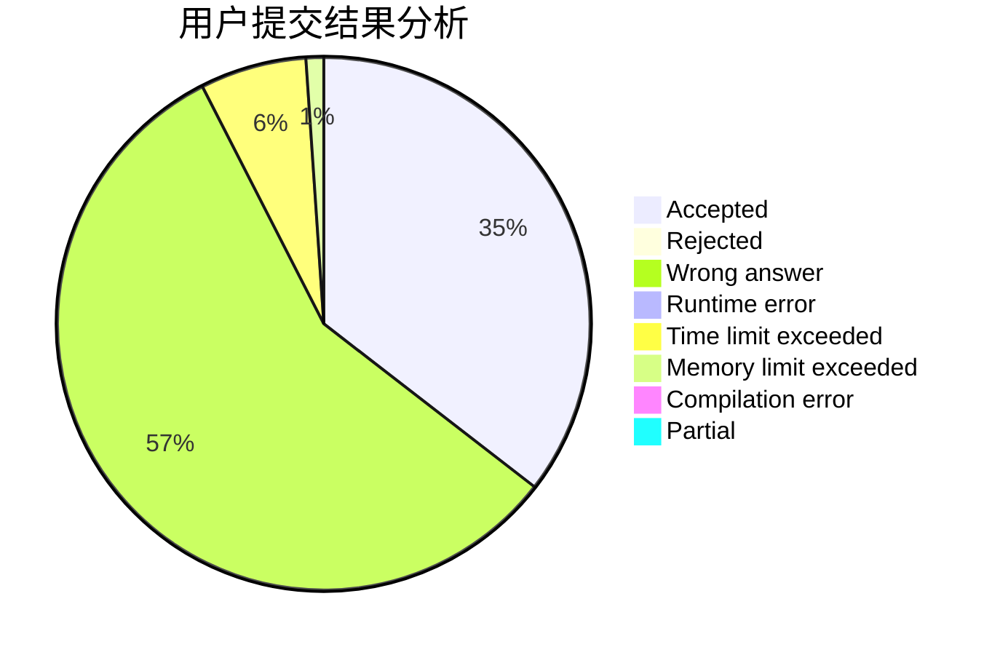
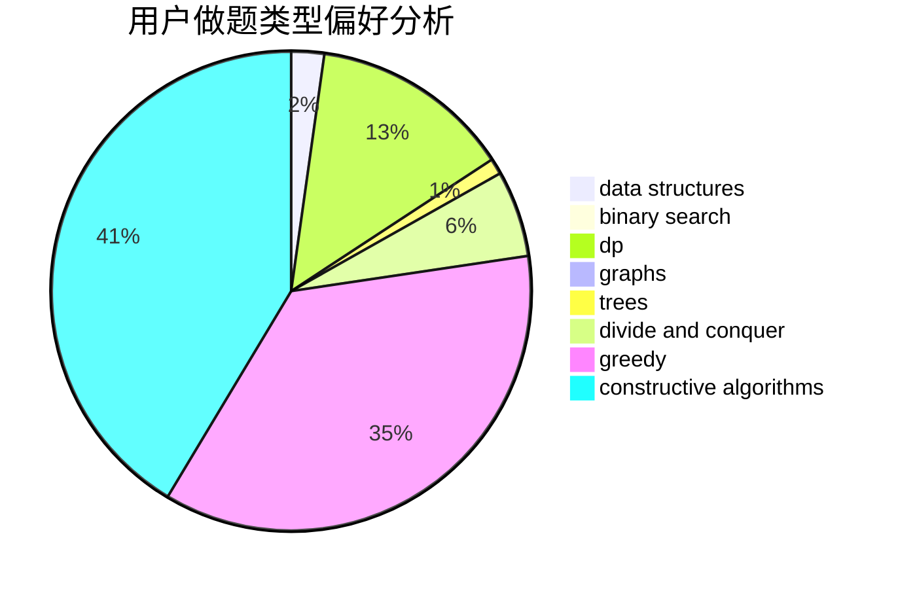
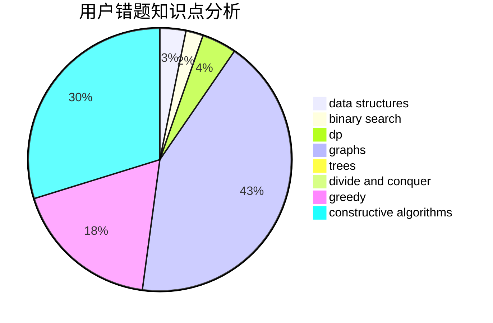

# Wi1der

<!-- tabs:start -->

#### **用户提交结果分析**

#### **用户做题类型偏好分析**

#### **用户错题知识点分析**

<!-- tabs:end -->
# 推荐题目
[848C](https://codeforces.com/contest/848/problem/C)		data structures,
                        divide and conquer		  
[1260A](https://codeforces.com/contest/1260/problem/A)		math		  
[277E](https://codeforces.com/contest/277/problem/E)		flows,
                        trees		  
[1119H](https://codeforces.com/contest/1119/problem/H)		fft,
                        math		  
[813D](https://codeforces.com/contest/813/problem/D)		dp,
                        flows		  
[1209E2](https://codeforces.com/contest/1209E/problem/2)		bitmasks,
                        dp,
                        greedy,
                        sortings		  
[1257E](https://codeforces.com/contest/1257/problem/E)		data structures,
                        dp,
                        greedy		  
[842B](https://codeforces.com/contest/842/problem/B)		geometry		  
[335F](https://codeforces.com/contest/335/problem/F)		dp,
                        greedy		  
[803G](https://codeforces.com/contest/803/problem/G)		data structures		  
