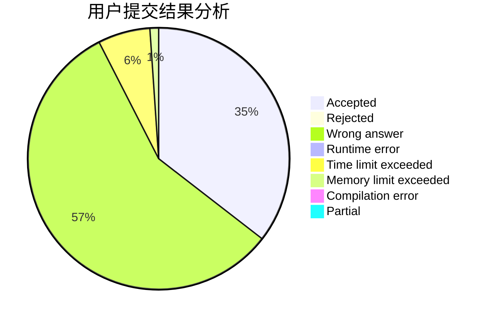
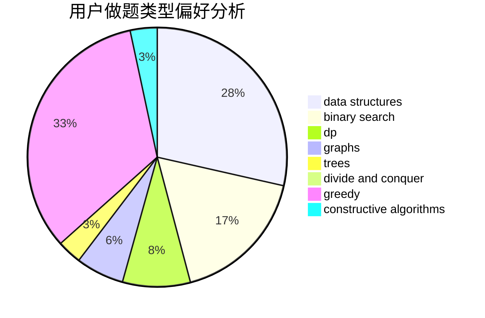

# Wi1der

<!-- tabs:start -->

#### **用户提交结果分析**

#### **用户做题类型偏好分析**

#### **用户错题知识点分析**

<!-- tabs:end -->
# 推荐题目
[867E](https://codeforces.com/contest/867/problem/E)		dsu,graphs,sortings,trees		  
[1266A](https://codeforces.com/contest/1266/problem/A)		chinese remainder theorem,
                        math		  
[293A](https://codeforces.com/contest/293/problem/A)		games,
                        greedy		  
[1129D](https://codeforces.com/contest/1129/problem/D)		data structures,
                        dp		  
[831F](https://codeforces.com/contest/831/problem/F)		dsu,graphs,sortings,trees		  
[1215B](https://codeforces.com/contest/1215/problem/B)		combinatorics,
                        dp,
                        implementation		  
[1264F](https://codeforces.com/contest/1264/problem/F)		constructive algorithms,
                        number theory		  
[861A](https://codeforces.com/contest/861/problem/A)		dsu,graphs,sortings,trees		  
[363B](https://codeforces.com/contest/363/problem/B)		brute force,
                        dp		  
[81C](https://codeforces.com/contest/81/problem/C)		greedy,
                        math,
                        sortings		  
