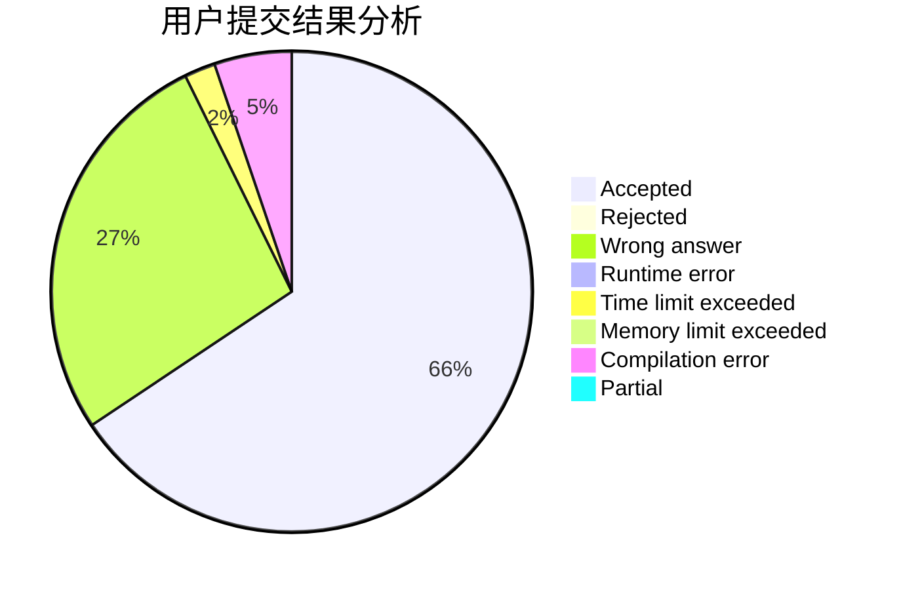
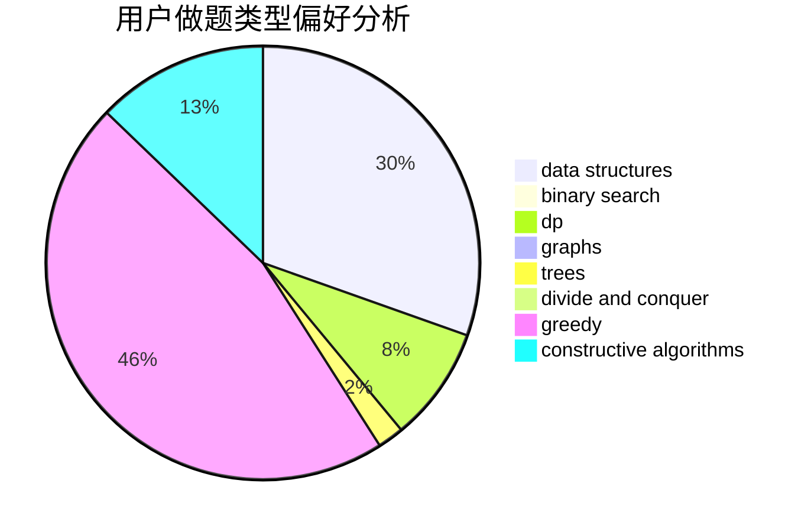

# Willem

<!-- tabs:start -->

#### **用户提交结果分析**

#### **用户做题类型偏好分析**

#### **用户错题知识点分析**

<!-- tabs:end -->
# 推荐题目
[1272E](https://codeforces.com/contest/1272/problem/E)		dfs and similar,
                        graphs,
                        shortest paths		  
[1423C](https://codeforces.com/contest/1423/problem/C)		divide and conquer,
                        graphs,
                        trees		  
[616A](https://codeforces.com/contest/616/problem/A)		implementation,
                        strings		  
[914A](https://codeforces.com/contest/914/problem/A)		brute force,
                        implementation,
                        math		  
[1469E](https://codeforces.com/contest/1469/problem/E)		bitmasks,
                        brute force,
                        hashing,
                        string suffix structures,
                        strings,
                        two pointers		  
[846A](https://codeforces.com/contest/846/problem/A)		brute force,
                        implementation		  
[1030G](https://codeforces.com/contest/1030/problem/G)		number theory		  
[1020A](https://codeforces.com/contest/1020/problem/A)		math		  
[127A](https://codeforces.com/contest/127/problem/A)		geometry		  
[1016D](https://codeforces.com/contest/1016/problem/D)		constructive algorithms,
                        flows,
                        math		  
