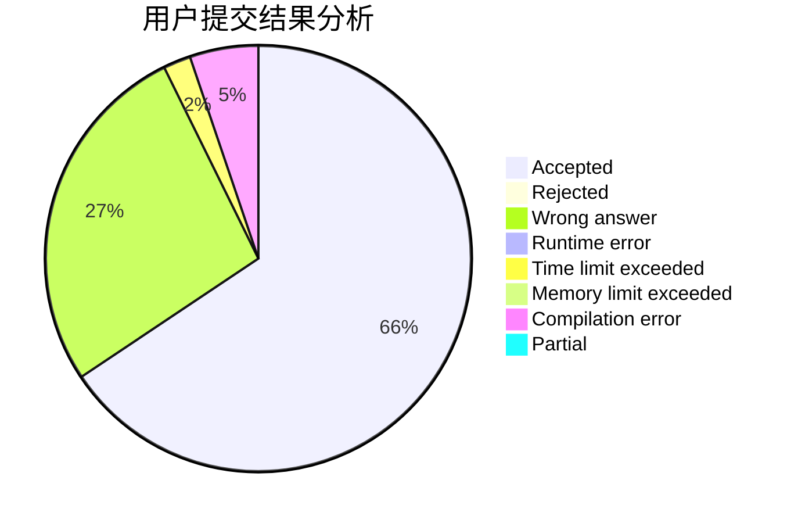
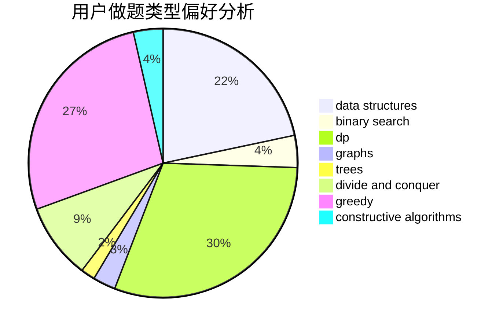

# Willem

<!-- tabs:start -->

#### **用户提交结果分析**

#### **用户做题类型偏好分析**

#### **用户错题知识点分析**

<!-- tabs:end -->
# 推荐题目
[1267B](https://codeforces.com/contest/1267/problem/B)		nan		  
[1413F](https://codeforces.com/contest/1413/problem/F)		data structures,
                        trees		  
[598B](https://codeforces.com/contest/598/problem/B)		implementation,
                        strings		  
[897B](https://codeforces.com/contest/897/problem/B)		brute force		  
[1462C](https://codeforces.com/contest/1462/problem/C)		brute force,
                        greedy,
                        math		  
[827E](https://codeforces.com/contest/827/problem/E)		fft,
                        math,
                        strings		  
[1030C](https://codeforces.com/contest/1030/problem/C)		implementation		  
[1019E](https://codeforces.com/contest/1019/problem/E)		data structures,
                        divide and conquer,
                        trees		  
[1270G](https://codeforces.com/contest/1270/problem/G)		constructive algorithms,
                        dfs and similar,
                        graphs,
                        math		  
[1016A](https://codeforces.com/contest/1016/problem/A)		greedy,
                        implementation,
                        math		  
