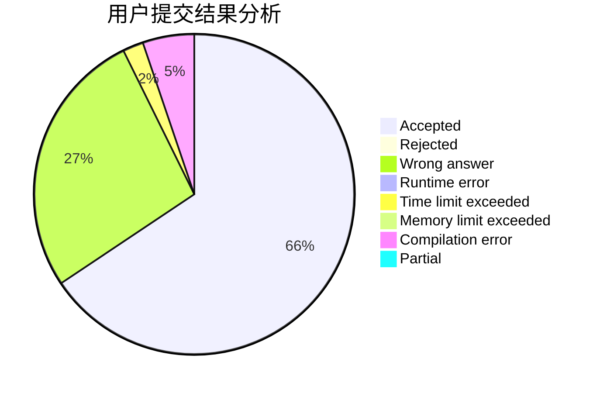
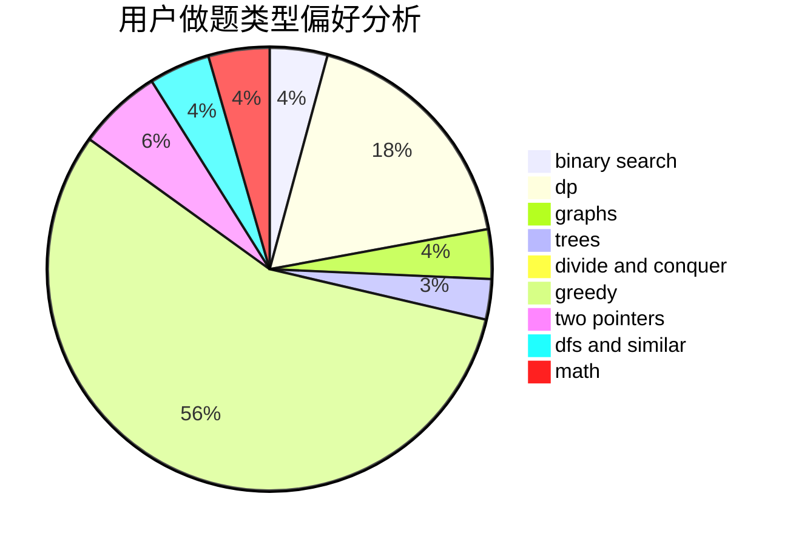

# Willem

<!-- tabs:start -->

#### **用户提交结果分析**

#### **用户做题类型偏好分析**

<!-- tabs:end -->
# 推荐题目
[1272E](https://codeforces.com/contest/1272/problem/E)
[1423C](https://codeforces.com/contest/1423/problem/C)
[616A](https://codeforces.com/contest/616/problem/A)
[914A](https://codeforces.com/contest/914/problem/A)
[1469E](https://codeforces.com/contest/1469/problem/E)
[846A](https://codeforces.com/contest/846/problem/A)
[1030G](https://codeforces.com/contest/1030/problem/G)
[1020A](https://codeforces.com/contest/1020/problem/A)
[127A](https://codeforces.com/contest/127/problem/A)
[1016D](https://codeforces.com/contest/1016/problem/D)
