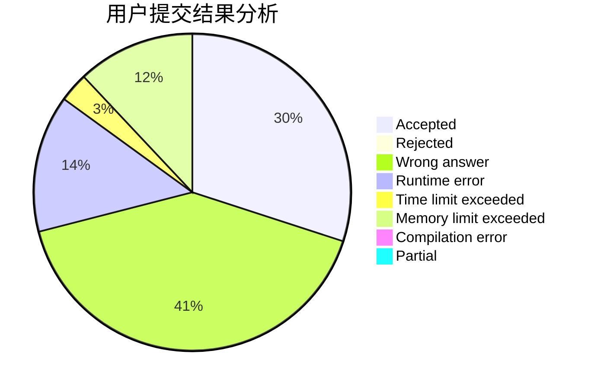
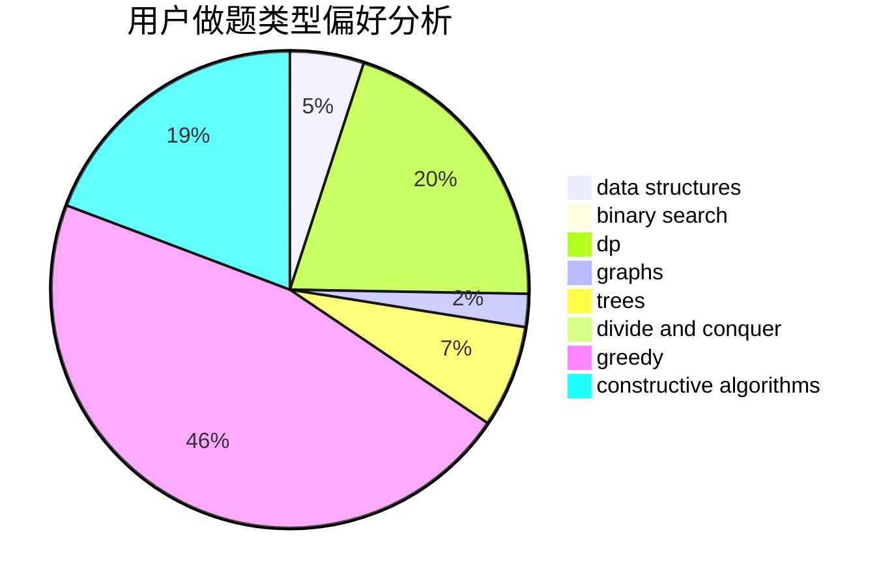
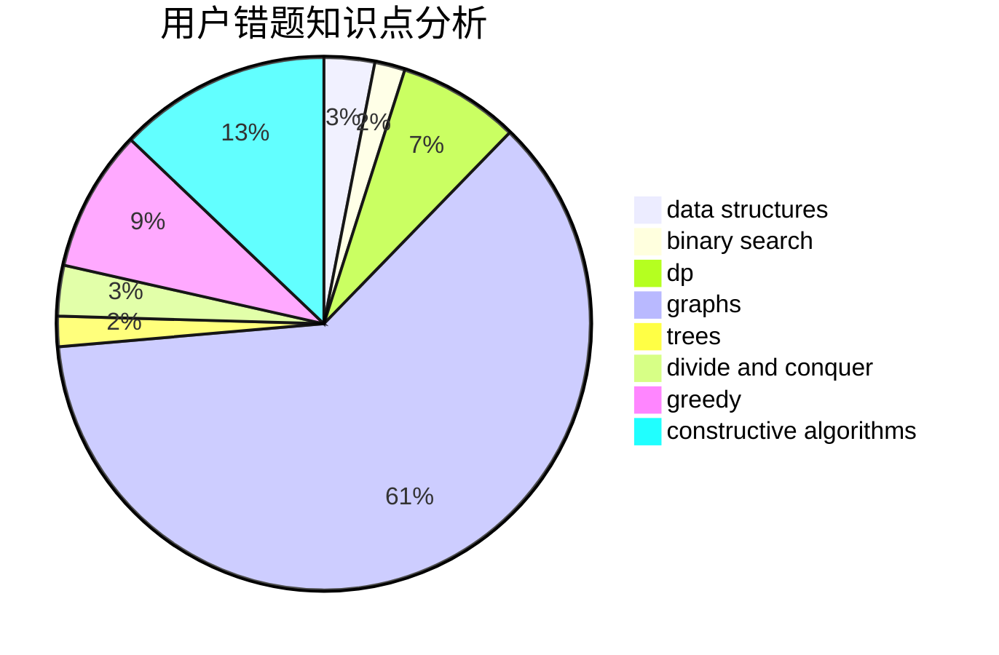

# WingsWings

<!-- tabs:start -->

#### **用户提交结果分析**

#### **用户做题类型偏好分析**

#### **用户错题知识点分析**

<!-- tabs:end -->
# 推荐题目
[1328D](https://codeforces.com/contest/1328/problem/D)		constructive algorithms,
                        dp,
                        graphs,
                        greedy,
                        math		  
[1298D](https://codeforces.com/contest/1298/problem/D)		dsu,graphs,sortings,trees		  
[605C](https://codeforces.com/contest/605/problem/C)		geometry		  
[1350E](https://codeforces.com/contest/1350/problem/E)		dsu,graphs,sortings,trees		  
[425E](https://codeforces.com/contest/425/problem/E)		dp		  
[263E](https://codeforces.com/contest/263/problem/E)		brute force,
                        data structures,
                        dp		  
[107A](https://codeforces.com/contest/107/problem/A)		dfs and similar,
                        graphs		  
[474B](https://codeforces.com/contest/474/problem/B)		binary search,
                        implementation		  
[956C](https://codeforces.com/contest/956/problem/C)		dsu,graphs,sortings,trees		  
[1362E](https://codeforces.com/contest/1362/problem/E)		dsu,graphs,sortings,trees		  
