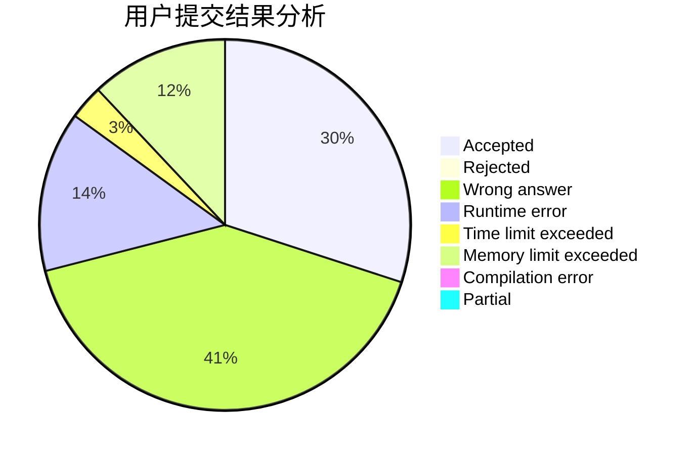
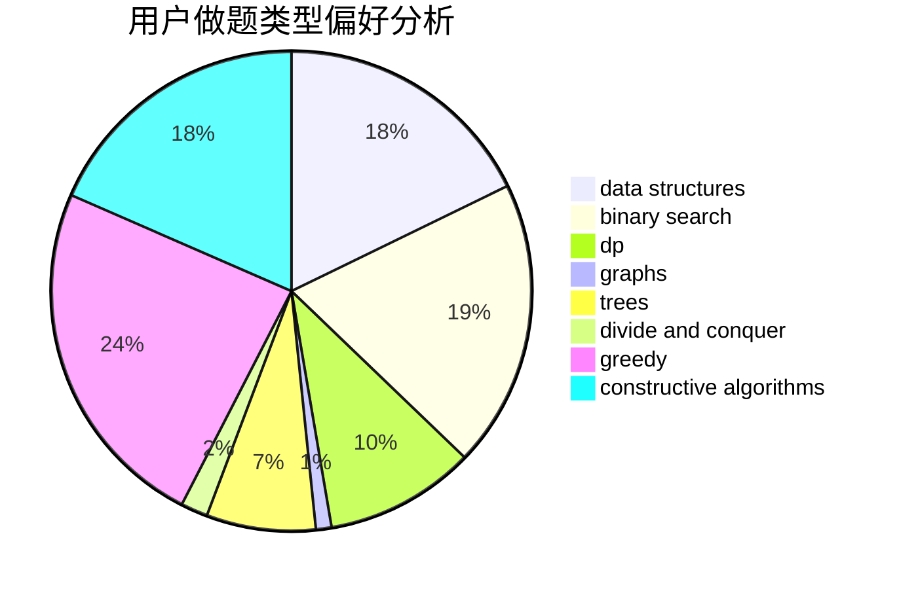
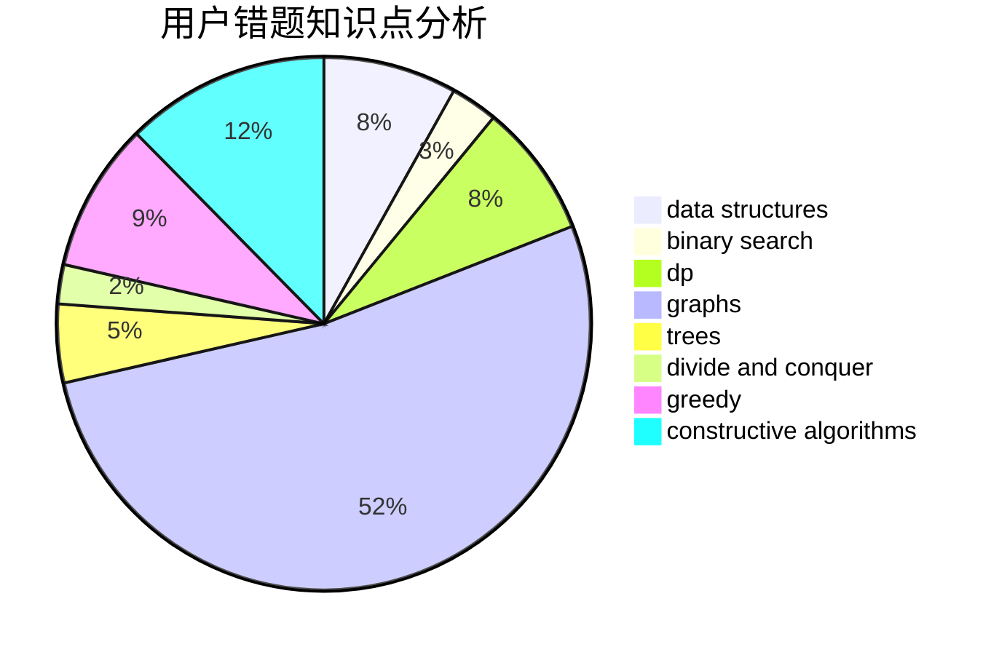

# WingsWings
<!-- tabs:start -->
#### **用户提交结果分析**

#### **用户做题类型偏好分析**

#### **用户错题知识点分析**

<!-- tabs:end -->
# 推荐题目
[Hilbert's Hotel](http://codeforces.com/problemset/problem/1344/A)		math,
                        number theory,
                        sortings		  
[Moon Craters](http://codeforces.com/problemset/problem/39/C)		dp,
                        sortings		  
[Prefix Enlightenment](https://codeforces.com/contest/1291/problem/E)		dfs and similar,
                        dsu,
                        graphs		  
[Phillip and Trains](http://codeforces.com/problemset/problem/585/B)		dfs and similar,
                        graphs,
                        shortest paths		  
[Guess Divisors Count](http://codeforces.com/problemset/problem/1355/F)		constructive algorithms,
                        interactive,
                        number theory		  
[Lucky Permutation Triple](https://codeforces.com/contest/304/problem/C)		constructive algorithms,
                        implementation,
                        math		  
[World of Darkraft: Battle for Azathoth](https://codeforces.com/contest/1321/problem/E)		brute force,
                        data structures,
                        sortings		  
[Plus and Square Root](http://codeforces.com/problemset/problem/715/A)		constructive algorithms,
                        math		  
[Little Elephant and Interval](https://codeforces.com/contest/205/problem/C)		binary search,
                        combinatorics,
                        dp		  
[Two Arrays](http://codeforces.com/problemset/problem/1288/C)		combinatorics,
                        dp		  
<!-- tabs:start -->
#### **data structures**
[Hilbert's Hotel](https://codeforces.com/contest/1321/problem/E)		brute force,
                        data structures,
                        sortings		  
[Moon Craters](http://codeforces.com/problemset/problem/226/E)		data structures,
                        trees		  
[Prefix Enlightenment](http://codeforces.com/problemset/problem/44/G)		data structures,
                        implementation		  
[Phillip and Trains](http://codeforces.com/problemset/problem/466/C)		binary search,
                        brute force,
                        data structures,
                        dp,
                        two pointers		  
[Guess Divisors Count](http://codeforces.com/problemset/problem/1252/C)		data structures,
                        implementation		  
[Lucky Permutation Triple](http://codeforces.com/problemset/problem/1304/E)		data structures,
                        dfs and similar,
                        shortest paths,
                        trees		  
[World of Darkraft: Battle for Azathoth](http://codeforces.com/problemset/problem/650/A)		data structures,
                        geometry,
                        math		  
[Plus and Square Root](http://codeforces.com/problemset/problem/1503/D)		2-sat,
                        constructive algorithms,
                        data structures,
                        greedy,
                        sortings,
                        two pointers		  
[Little Elephant and Interval](http://codeforces.com/problemset/problem/741/E)		data structures,
                        string suffix structures		  
[Two Arrays](http://codeforces.com/problemset/problem/242/E)		bitmasks,
                        data structures		  
#### **binary search**
[Hilbert's Hotel](https://codeforces.com/contest/205/problem/C)		binary search,
                        combinatorics,
                        dp		  
[Moon Craters](http://codeforces.com/problemset/problem/822/E)		binary search,
                        dp,
                        hashing,
                        string suffix structures		  
[Prefix Enlightenment](http://codeforces.com/problemset/problem/466/C)		binary search,
                        brute force,
                        data structures,
                        dp,
                        two pointers		  
[Phillip and Trains](http://codeforces.com/problemset/problem/896/B)		binary search,
                        constructive algorithms,
                        games,
                        greedy,
                        interactive		  
[Guess Divisors Count](http://codeforces.com/problemset/problem/883/D)		binary search,
                        dp,
                        math		  
[Lucky Permutation Triple](http://codeforces.com/problemset/problem/1486/C1)		binary search,
                        interactive		  
[World of Darkraft: Battle for Azathoth](http://codeforces.com/problemset/problem/1257/D)		binary search,
                        data structures,
                        dp,
                        greedy,
                        sortings,
                        two pointers		  
[Plus and Square Root](http://codeforces.com/problemset/problem/1100/C)		binary search,
                        geometry,
                        math		  
[Little Elephant and Interval](http://codeforces.com/problemset/problem/1474/B)		binary search,
                        constructive algorithms,
                        greedy,
                        math,
                        number theory		  
[Two Arrays](http://codeforces.com/problemset/problem/1492/C)		binary search,
                        data structures,
                        dp,
                        greedy,
                        two pointers		  
#### **dp**
[Hilbert's Hotel](http://codeforces.com/problemset/problem/39/C)		dp,
                        sortings		  
[Moon Craters](https://codeforces.com/contest/205/problem/C)		binary search,
                        combinatorics,
                        dp		  
[Prefix Enlightenment](http://codeforces.com/problemset/problem/1288/C)		combinatorics,
                        dp		  
[Phillip and Trains](http://codeforces.com/problemset/problem/212/C)		combinatorics,
                        dp,
                        math		  
[Guess Divisors Count](http://codeforces.com/problemset/problem/822/E)		binary search,
                        dp,
                        hashing,
                        string suffix structures		  
[Lucky Permutation Triple](http://codeforces.com/problemset/problem/982/C)		dfs and similar,
                        dp,
                        graphs,
                        greedy,
                        trees		  
[World of Darkraft: Battle for Azathoth](http://codeforces.com/problemset/problem/766/C)		brute force,
                        dp,
                        greedy,
                        strings		  
[Plus and Square Root](http://codeforces.com/problemset/problem/466/C)		binary search,
                        brute force,
                        data structures,
                        dp,
                        two pointers		  
[Little Elephant and Interval](http://codeforces.com/problemset/problem/883/D)		binary search,
                        dp,
                        math		  
[Two Arrays](http://codeforces.com/problemset/problem/1340/B)		bitmasks,
                        dp,
                        graphs,
                        greedy		  
#### **graph**
[Hilbert's Hotel](https://codeforces.com/contest/1291/problem/E)		dfs and similar,
                        dsu,
                        graphs		  
[Moon Craters](http://codeforces.com/problemset/problem/585/B)		dfs and similar,
                        graphs,
                        shortest paths		  
[Prefix Enlightenment](http://codeforces.com/problemset/problem/290/C)		*special problem,
                        graph matchings,
                        implementation,
                        trees		  
[Phillip and Trains](http://codeforces.com/problemset/problem/982/C)		dfs and similar,
                        dp,
                        graphs,
                        greedy,
                        trees		  
[Guess Divisors Count](http://codeforces.com/problemset/problem/1340/B)		bitmasks,
                        dp,
                        graphs,
                        greedy		  
[Lucky Permutation Triple](http://codeforces.com/problemset/problem/1498/E)		brute force,
                        graphs,
                        greedy,
                        interactive,
                        sortings		  
[World of Darkraft: Battle for Azathoth](http://codeforces.com/problemset/problem/711/D)		combinatorics,
                        dfs and similar,
                        graphs,
                        math		  
[Plus and Square Root](http://codeforces.com/problemset/problem/1487/C)		brute force,
                        constructive algorithms,
                        dfs and similar,
                        graphs,
                        greedy,
                        implementation,
                        math		  
[Little Elephant and Interval](http://codeforces.com/problemset/problem/1437/C)		dp,
                        flows,
                        graph matchings,
                        greedy,
                        math,
                        sortings		  
[Two Arrays](http://codeforces.com/problemset/problem/1470/D)		constructive algorithms,
                        dfs and similar,
                        graph matchings,
                        graphs,
                        greedy		  
#### **trees**
[Hilbert's Hotel](http://codeforces.com/problemset/problem/226/E)		data structures,
                        trees		  
[Moon Craters](http://codeforces.com/problemset/problem/452/B)		brute force,
                        constructive algorithms,
                        geometry,
                        trees		  
[Prefix Enlightenment](http://codeforces.com/problemset/problem/290/C)		*special problem,
                        graph matchings,
                        implementation,
                        trees		  
[Phillip and Trains](http://codeforces.com/problemset/problem/982/C)		dfs and similar,
                        dp,
                        graphs,
                        greedy,
                        trees		  
[Guess Divisors Count](http://codeforces.com/problemset/problem/792/D)		bitmasks,
                        trees		  
[Lucky Permutation Triple](http://codeforces.com/problemset/problem/1304/E)		data structures,
                        dfs and similar,
                        shortest paths,
                        trees		  
[World of Darkraft: Battle for Azathoth](http://codeforces.com/problemset/problem/1479/D)		binary search,
                        bitmasks,
                        brute force,
                        data structures,
                        probabilities,
                        trees		  
[Plus and Square Root](http://codeforces.com/problemset/problem/1511/C)		brute force,
                        data structures,
                        implementation,
                        trees		  
[Little Elephant and Interval](http://codeforces.com/problemset/problem/1499/F)		combinatorics,
                        dfs and similar,
                        dp,
                        trees		  
[Two Arrays](http://codeforces.com/problemset/problem/1491/E)		brute force,
                        dfs and similar,
                        divide and conquer,
                        number theory,
                        trees		  
#### **divide and conquer**
[Hilbert's Hotel](http://codeforces.com/problemset/problem/364/E)		divide and conquer,
                        two pointers		  
[Moon Craters](http://codeforces.com/problemset/problem/1461/D)		binary search,
                        brute force,
                        data structures,
                        divide and conquer,
                        implementation,
                        sortings		  
[Prefix Enlightenment](http://codeforces.com/problemset/problem/1466/G)		combinatorics,
                        divide and conquer,
                        hashing,
                        math,
                        string suffix structures,
                        strings		  
[Phillip and Trains](http://codeforces.com/problemset/problem/1490/D)		dfs and similar,
                        divide and conquer,
                        implementation		  
[Guess Divisors Count](https://codeforces.com/contest/1483/problem/C)		data structures,
                        divide and conquer,
                        dp		  
[Lucky Permutation Triple](http://codeforces.com/problemset/problem/1491/E)		brute force,
                        dfs and similar,
                        divide and conquer,
                        number theory,
                        trees		  
[World of Darkraft: Battle for Azathoth](http://codeforces.com/problemset/problem/1303/G)		data structures,
                        divide and conquer,
                        geometry,
                        trees		  
[Plus and Square Root](http://codeforces.com/problemset/problem/1494/D)		constructive algorithms,
                        data structures,
                        dfs and similar,
                        divide and conquer,
                        dsu,
                        greedy,
                        sortings,
                        trees		  
[Little Elephant and Interval](http://codeforces.com/problemset/problem/1482/E)		data structures,
                        divide and conquer,
                        dp		  
[Two Arrays](http://codeforces.com/problemset/problem/566/C)		dfs and similar,
                        divide and conquer,
                        trees		  
#### **greedy**
[Hilbert's Hotel](http://codeforces.com/problemset/problem/387/C)		greedy,
                        implementation		  
[Moon Craters](http://codeforces.com/problemset/problem/982/C)		dfs and similar,
                        dp,
                        graphs,
                        greedy,
                        trees		  
[Prefix Enlightenment](http://codeforces.com/problemset/problem/766/C)		brute force,
                        dp,
                        greedy,
                        strings		  
[Phillip and Trains](http://codeforces.com/problemset/problem/896/B)		binary search,
                        constructive algorithms,
                        games,
                        greedy,
                        interactive		  
[Guess Divisors Count](http://codeforces.com/problemset/problem/1340/B)		bitmasks,
                        dp,
                        graphs,
                        greedy		  
[Lucky Permutation Triple](https://codeforces.com/contest/1277/problem/C)		dp,
                        greedy		  
[World of Darkraft: Battle for Azathoth](http://codeforces.com/problemset/problem/1503/D)		2-sat,
                        constructive algorithms,
                        data structures,
                        greedy,
                        sortings,
                        two pointers		  
[Plus and Square Root](https://codeforces.com/contest/1397/problem/E)		dp,
                        greedy,
                        implementation		  
[Little Elephant and Interval](http://codeforces.com/problemset/problem/883/M)		greedy,
                        math		  
[Two Arrays](http://codeforces.com/problemset/problem/1310/A)		data structures,
                        greedy,
                        sortings		  
#### **constructive algorithms**
[Hilbert's Hotel](http://codeforces.com/problemset/problem/1355/F)		constructive algorithms,
                        interactive,
                        number theory		  
[Moon Craters](https://codeforces.com/contest/304/problem/C)		constructive algorithms,
                        implementation,
                        math		  
[Prefix Enlightenment](http://codeforces.com/problemset/problem/715/A)		constructive algorithms,
                        math		  
[Phillip and Trains](http://codeforces.com/problemset/problem/737/F)		constructive algorithms,
                        math		  
[Guess Divisors Count](http://codeforces.com/problemset/problem/452/B)		brute force,
                        constructive algorithms,
                        geometry,
                        trees		  
[Lucky Permutation Triple](http://codeforces.com/problemset/problem/286/E)		constructive algorithms,
                        fft,
                        math		  
[World of Darkraft: Battle for Azathoth](http://codeforces.com/problemset/problem/734/F)		bitmasks,
                        constructive algorithms,
                        implementation,
                        math		  
[Plus and Square Root](http://codeforces.com/problemset/problem/896/B)		binary search,
                        constructive algorithms,
                        games,
                        greedy,
                        interactive		  
[Little Elephant and Interval](http://codeforces.com/problemset/problem/11/A)		constructive algorithms,
                        implementation,
                        math		  
[Two Arrays](http://codeforces.com/problemset/problem/1503/D)		2-sat,
                        constructive algorithms,
                        data structures,
                        greedy,
                        sortings,
                        two pointers		  
#### **sortings**
[Hilbert's Hotel](http://codeforces.com/problemset/problem/1344/A)		math,
                        number theory,
                        sortings		  
[Moon Craters](http://codeforces.com/problemset/problem/39/C)		dp,
                        sortings		  
[Prefix Enlightenment](https://codeforces.com/contest/1321/problem/E)		brute force,
                        data structures,
                        sortings		  
[Phillip and Trains](http://codeforces.com/problemset/problem/1503/D)		2-sat,
                        constructive algorithms,
                        data structures,
                        greedy,
                        sortings,
                        two pointers		  
[Guess Divisors Count](http://codeforces.com/problemset/problem/1310/A)		data structures,
                        greedy,
                        sortings		  
[Lucky Permutation Triple](http://codeforces.com/problemset/problem/1498/E)		brute force,
                        graphs,
                        greedy,
                        interactive,
                        sortings		  
[World of Darkraft: Battle for Azathoth](http://codeforces.com/problemset/problem/1257/D)		binary search,
                        data structures,
                        dp,
                        greedy,
                        sortings,
                        two pointers		  
[Plus and Square Root](https://codeforces.com/contest/1496/problem/C)		geometry,
                        greedy,
                        math,
                        sortings		  
[Little Elephant and Interval](http://codeforces.com/problemset/problem/1495/A)		geometry,
                        greedy,
                        math,
                        sortings		  
[Two Arrays](http://codeforces.com/problemset/problem/1497/A)		brute force,
                        data structures,
                        greedy,
                        sortings		  
<!-- tabs:end -->
