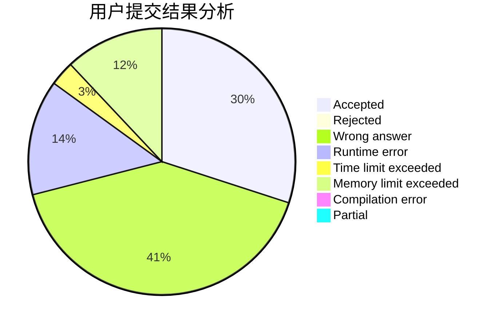
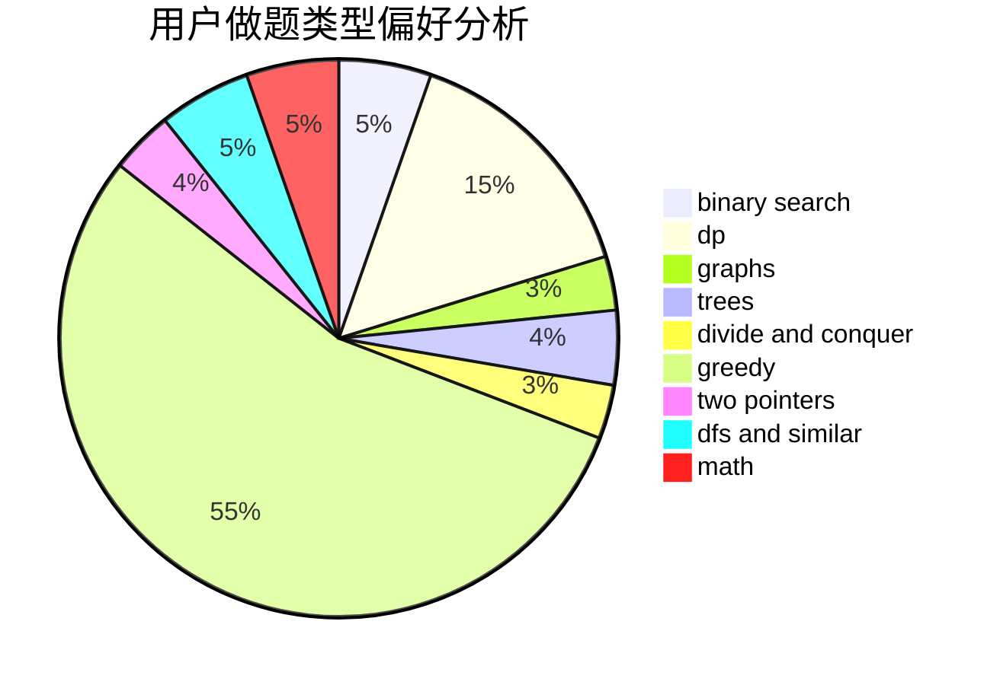

# WingsWings

<!-- tabs:start -->

#### **用户提交结果分析**

#### **用户做题类型偏好分析**

<!-- tabs:end -->
# 推荐题目
[1328D](https://codeforces.com/contest/1328/problem/D)
[1298D](https://codeforces.com/contest/1298/problem/D)
[605C](https://codeforces.com/contest/605/problem/C)
[1350E](https://codeforces.com/contest/1350/problem/E)
[425E](https://codeforces.com/contest/425/problem/E)
[263E](https://codeforces.com/contest/263/problem/E)
[107A](https://codeforces.com/contest/107/problem/A)
[474B](https://codeforces.com/contest/474/problem/B)
[956C](https://codeforces.com/contest/956/problem/C)
[1362E](https://codeforces.com/contest/1362/problem/E)
