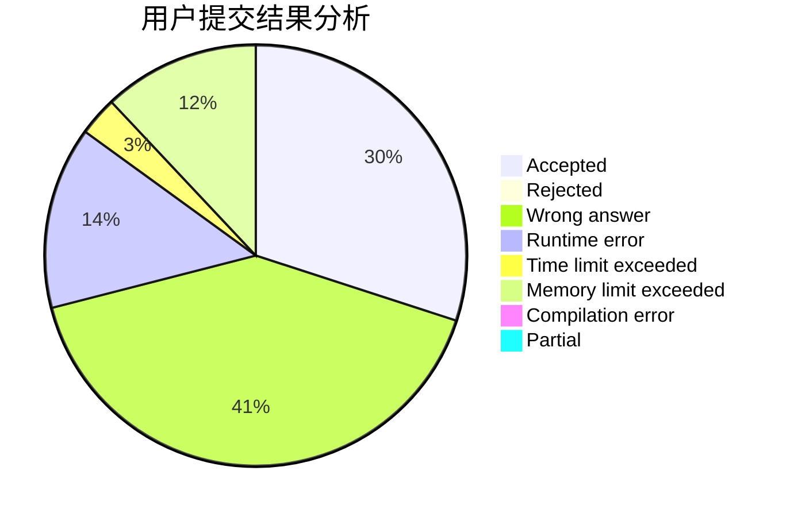
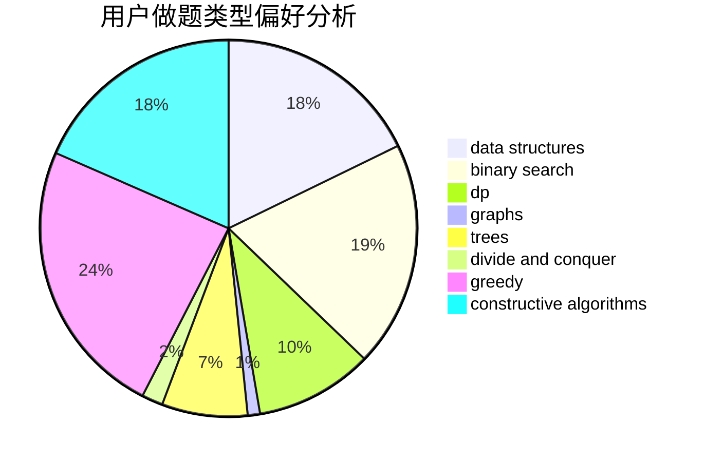
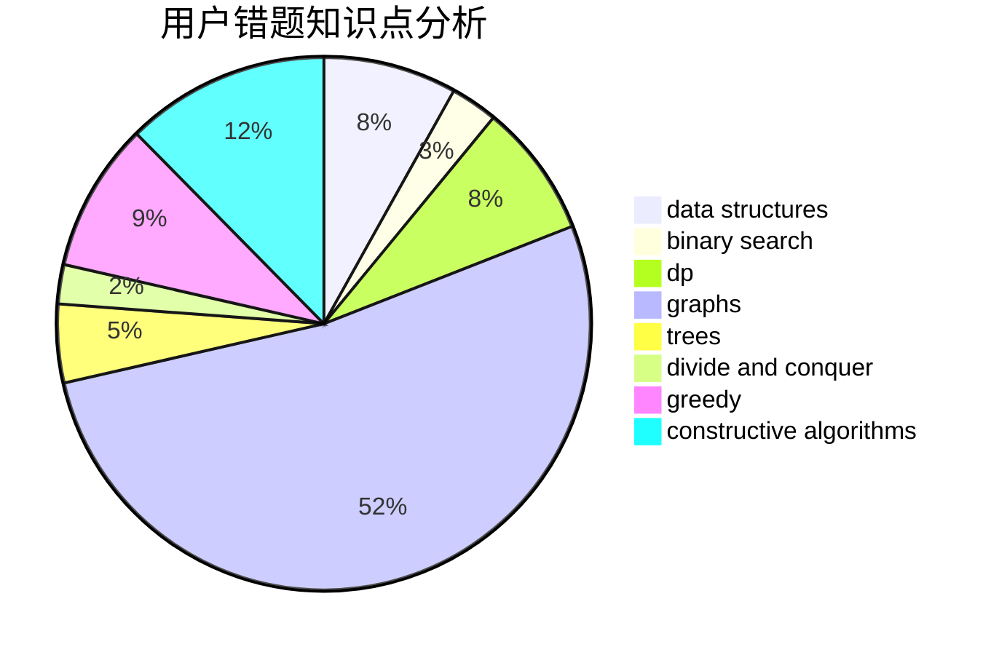

# WingsWings

<!-- tabs:start -->

#### **用户提交结果分析**

#### **用户做题类型偏好分析**

#### **用户错题知识点分析**

<!-- tabs:end -->
# 推荐题目
[1321E](https://codeforces.com/contest/1321/problem/E)		dsu,graphs,sortings,trees		  
[1291E](https://codeforces.com/contest/1291/problem/E)		dsu,graphs,sortings,trees		  
[585B](https://codeforces.com/contest/585/problem/B)		dfs and similar,
                        graphs,
                        shortest paths		  
[1344A](https://codeforces.com/contest/1344/problem/A)		math,
                        number theory,
                        sortings		  
[39C](https://codeforces.com/contest/39/problem/C)		dp,
                        sortings		  
[242E](https://codeforces.com/contest/242/problem/E)		bitmasks,
                        data structures		  
[1079B](https://codeforces.com/contest/1079/problem/B)		dsu,graphs,sortings,trees		  
[452B](https://codeforces.com/contest/452/problem/B)		brute force,
                        constructive algorithms,
                        geometry,
                        trees		  
[934D](https://codeforces.com/contest/934/problem/D)		dsu,graphs,sortings,trees		  
[1355F](https://codeforces.com/contest/1355/problem/F)		constructive algorithms,
                        interactive,
                        number theory		  
