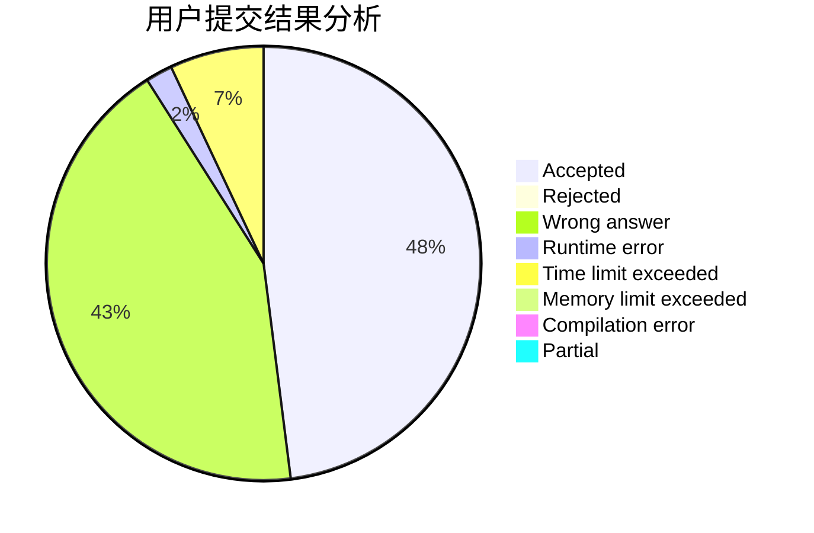
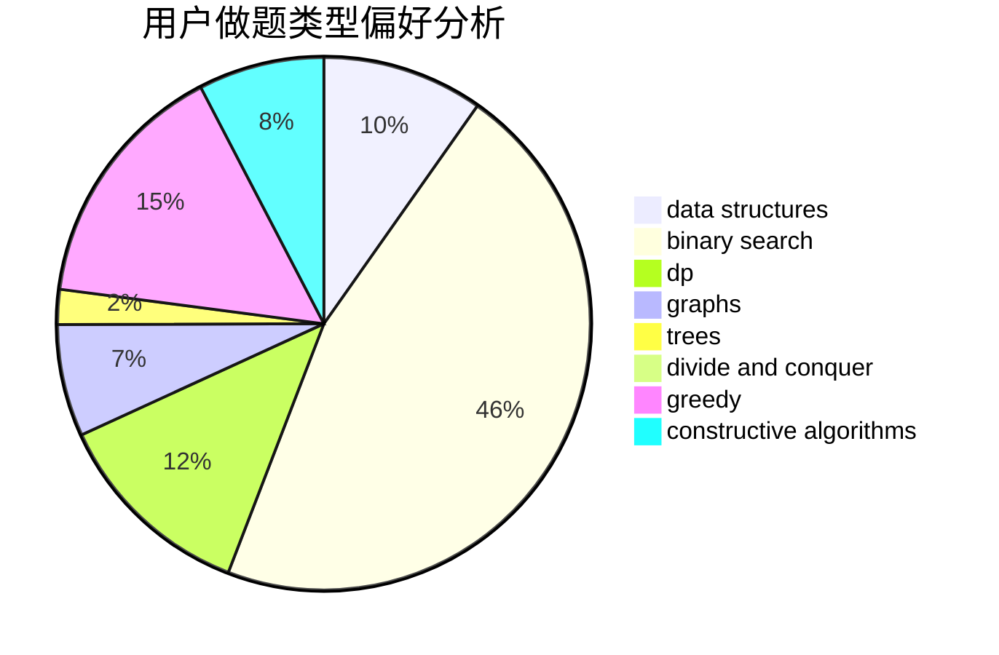
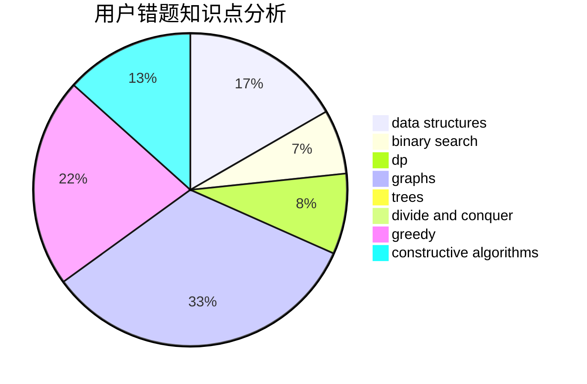

# WinterSpell

<!-- tabs:start -->

#### **用户提交结果分析**

#### **用户做题类型偏好分析**

#### **用户错题知识点分析**

<!-- tabs:end -->
# 推荐题目
[1488B](https://codeforces.com/contest/1488/problem/B)		*special problem,
                        greedy		  
[13563](https://codeforces.com/contest/1356/problem/3)		dsu,graphs,sortings,trees		  
[212E](https://codeforces.com/contest/212/problem/E)		dfs and similar,
                        dp,
                        trees		  
[1482H](https://codeforces.com/contest/1482/problem/H)		data structures,
                        string suffix structures,
                        trees		  
[519E](https://codeforces.com/contest/519/problem/E)		binary search,
                        data structures,
                        dfs and similar,
                        dp,
                        trees		  
[617B](https://codeforces.com/contest/617/problem/B)		combinatorics		  
[1250J](https://codeforces.com/contest/1250/problem/J)		binary search,
                        greedy		  
[784G](https://codeforces.com/contest/784/problem/G)		*special problem		  
[426B](https://codeforces.com/contest/426/problem/B)		implementation		  
[351E](https://codeforces.com/contest/351/problem/E)		greedy		  
