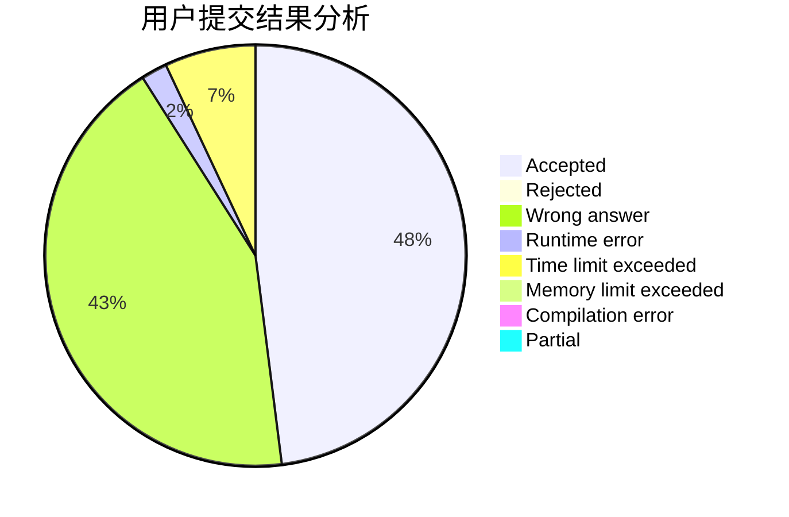
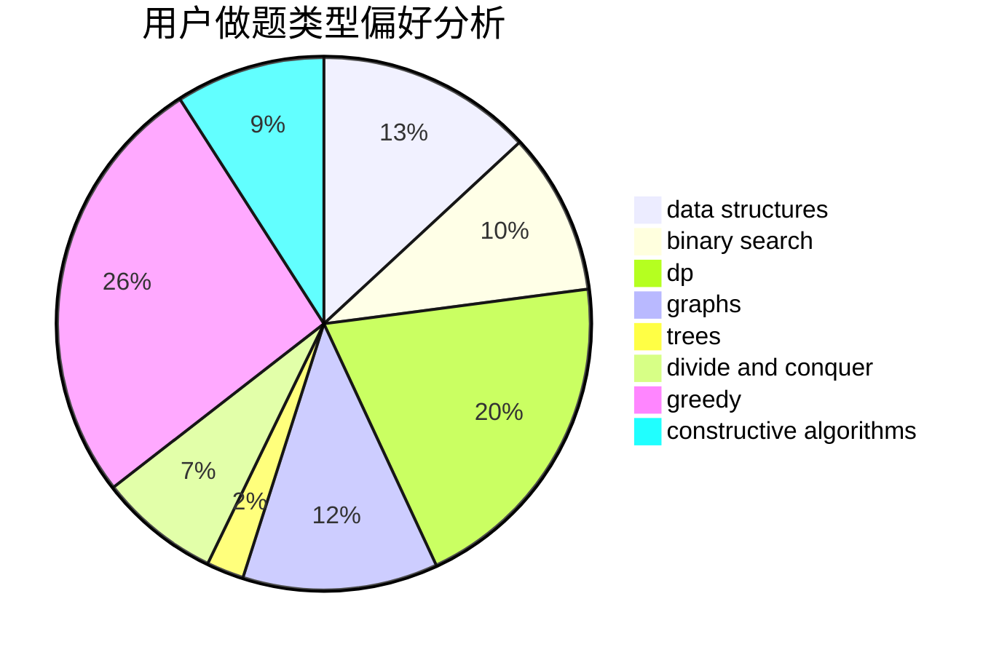
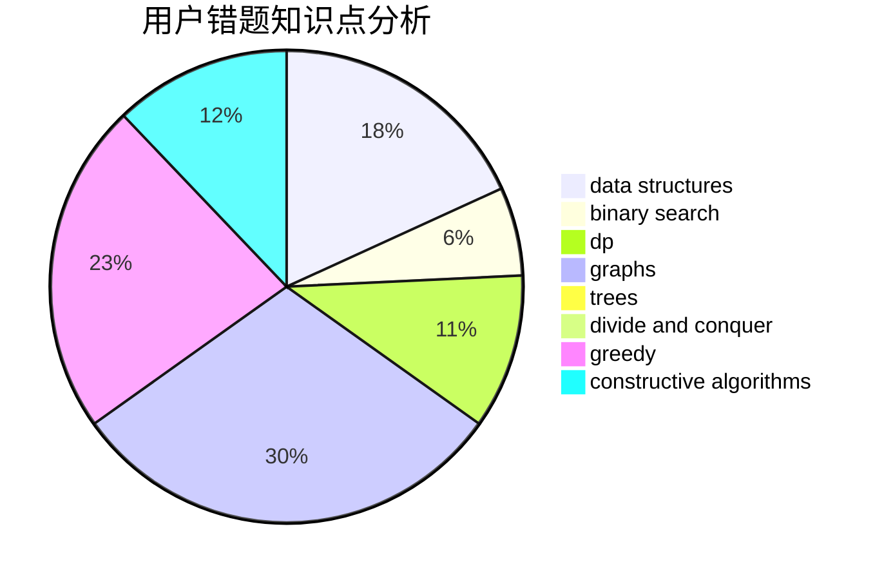

# WinterSpell

<!-- tabs:start -->

#### **用户提交结果分析**

#### **用户做题类型偏好分析**

#### **用户错题知识点分析**

<!-- tabs:end -->
# 推荐题目
[1479D](https://codeforces.com/contest/1479/problem/D)		binary search,
                        bitmasks,
                        brute force,
                        data structures,
                        probabilities,
                        trees		  
[1349E](https://codeforces.com/contest/1349/problem/E)		constructive algorithms,
                        dp,
                        greedy		  
[189A](https://codeforces.com/contest/189/problem/A)		brute force,
                        dp		  
[1474C](https://codeforces.com/contest/1474/problem/C)		brute force,
                        constructive algorithms,
                        data structures,
                        greedy,
                        implementation,
                        sortings		  
[498E](https://codeforces.com/contest/498/problem/E)		dp,
                        matrices		  
[599C](https://codeforces.com/contest/599/problem/C)		sortings		  
[1246B](https://codeforces.com/contest/1246/problem/B)		dsu,graphs,sortings,trees		  
[765D](https://codeforces.com/contest/765/problem/D)		constructive algorithms,
                        dsu,
                        math		  
[39D](https://codeforces.com/contest/39/problem/D)		math		  
[321A](https://codeforces.com/contest/321/problem/A)		binary search,
                        implementation,
                        math		  
