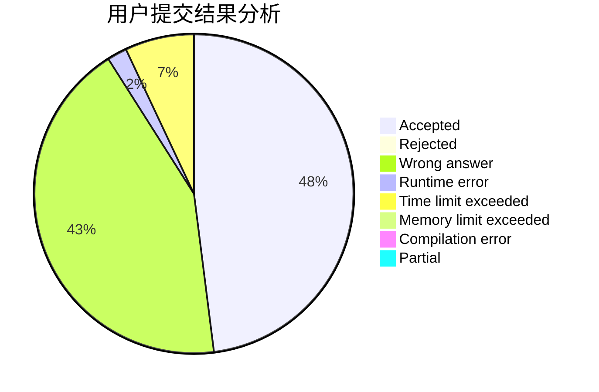
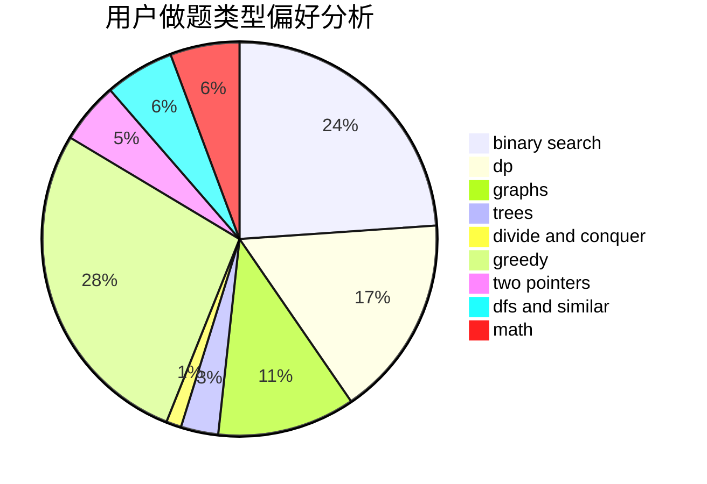

# WinterSpell

<!-- tabs:start -->

#### **用户提交结果分析**

#### **用户做题类型偏好分析**

<!-- tabs:end -->
# 推荐题目
[1488B](https://codeforces.com/contest/1488/problem/B)
[13563](https://codeforces.com/contest/1356/problem/3)
[212E](https://codeforces.com/contest/212/problem/E)
[1482H](https://codeforces.com/contest/1482/problem/H)
[519E](https://codeforces.com/contest/519/problem/E)
[617B](https://codeforces.com/contest/617/problem/B)
[1250J](https://codeforces.com/contest/1250/problem/J)
[784G](https://codeforces.com/contest/784/problem/G)
[426B](https://codeforces.com/contest/426/problem/B)
[351E](https://codeforces.com/contest/351/problem/E)
