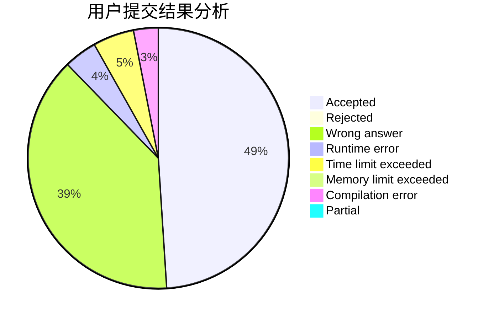
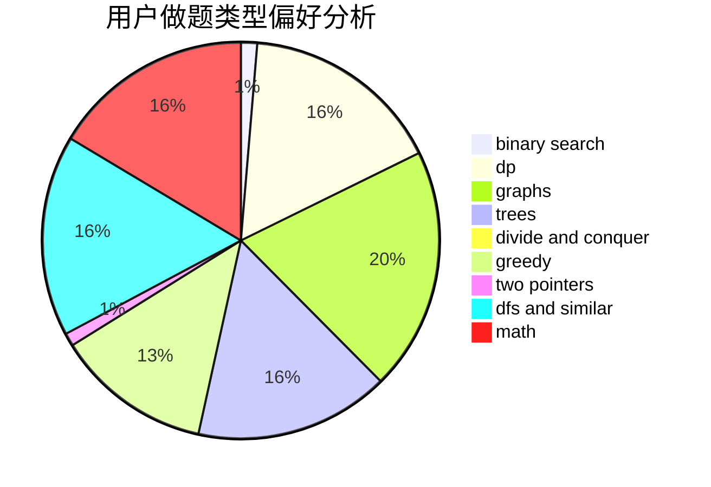

# Wintermorning

<!-- tabs:start -->

#### **用户提交结果分析**

#### **用户做题类型偏好分析**

<!-- tabs:end -->
# 推荐题目
[581A](https://codeforces.com/contest/581/problem/A)
[1152A](https://codeforces.com/contest/1152/problem/A)
[931A](https://codeforces.com/contest/931/problem/A)
[1136D](https://codeforces.com/contest/1136/problem/D)
[461B](https://codeforces.com/contest/461/problem/B)
[920E](https://codeforces.com/contest/920/problem/E)
[402A](https://codeforces.com/contest/402/problem/A)
[47A](https://codeforces.com/contest/47/problem/A)
[1488E](https://codeforces.com/contest/1488/problem/E)
[888A](https://codeforces.com/contest/888/problem/A)
