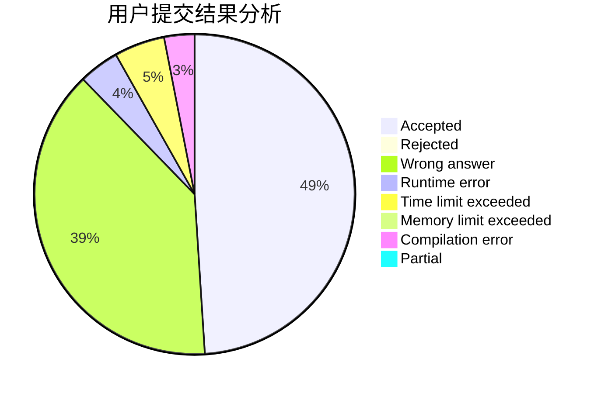
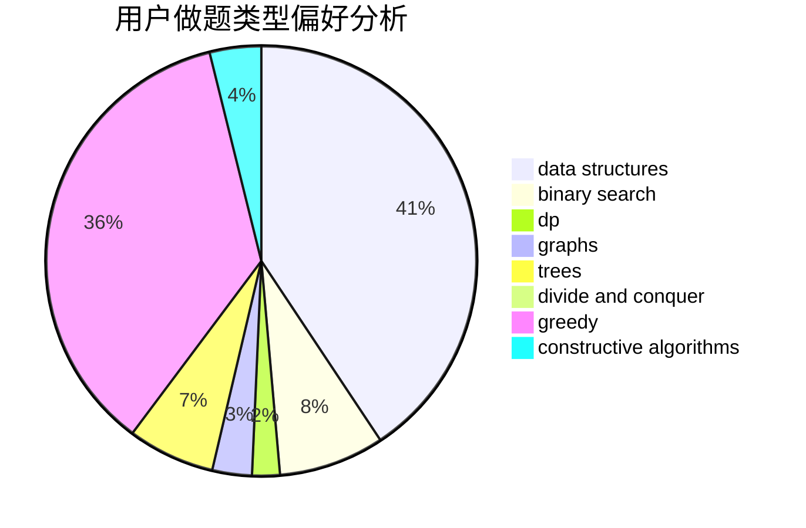
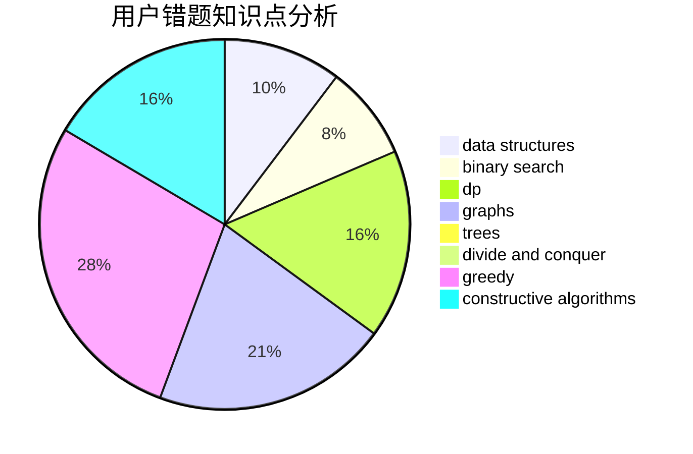

# Wintermorning

<!-- tabs:start -->

#### **用户提交结果分析**

#### **用户做题类型偏好分析**

#### **用户错题知识点分析**

<!-- tabs:end -->
# 推荐题目
[558A](https://codeforces.com/contest/558/problem/A)		brute force,
                        implementation,
                        sortings		  
[1150A](https://codeforces.com/contest/1150/problem/A)		greedy,
                        implementation		  
[912C](https://codeforces.com/contest/912/problem/C)		brute force,
                        greedy,
                        sortings		  
[1132E](https://codeforces.com/contest/1132/problem/E)		dfs and similar,
                        dp,
                        greedy		  
[43A](https://codeforces.com/contest/43/problem/A)		strings		  
[907A](https://codeforces.com/contest/907/problem/A)		brute force,
                        implementation		  
[372A](https://codeforces.com/contest/372/problem/A)		binary search,
                        greedy,
                        sortings,
                        two pointers		  
[460C](https://codeforces.com/contest/460/problem/C)		binary search,
                        data structures,
                        greedy		  
[1480A](https://codeforces.com/contest/1480/problem/A)		games,
                        greedy,
                        strings		  
[868E](https://codeforces.com/contest/868/problem/E)		dp,
                        graphs,
                        trees		  
