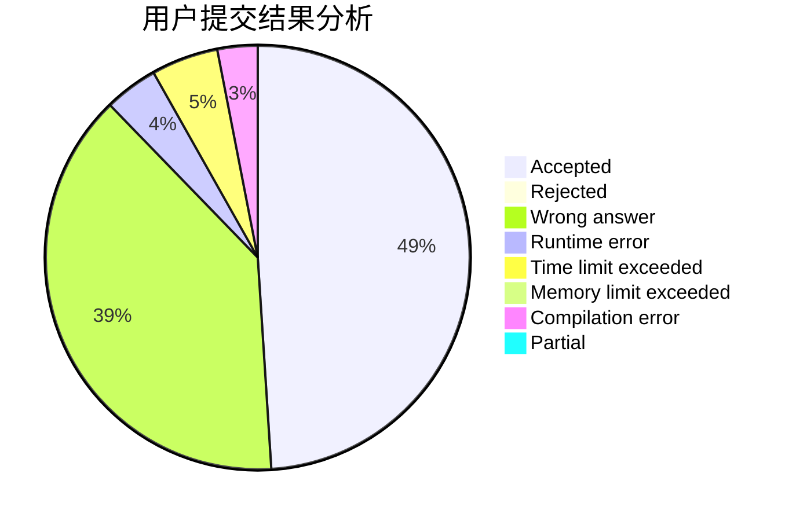
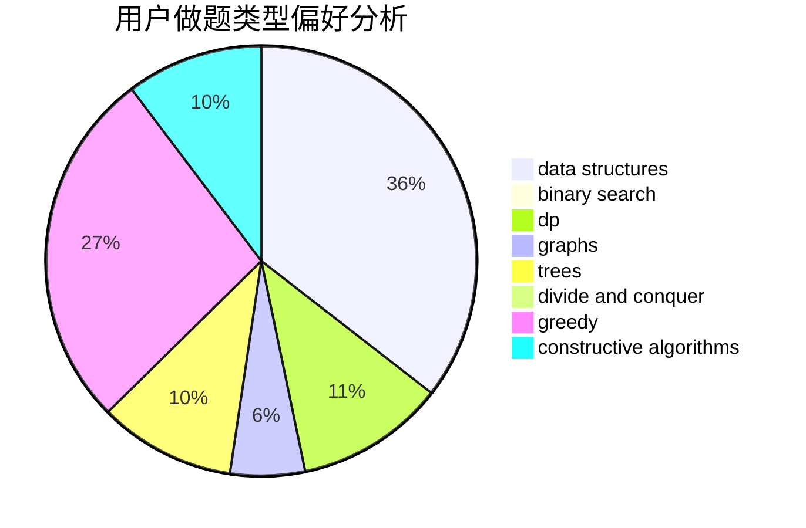
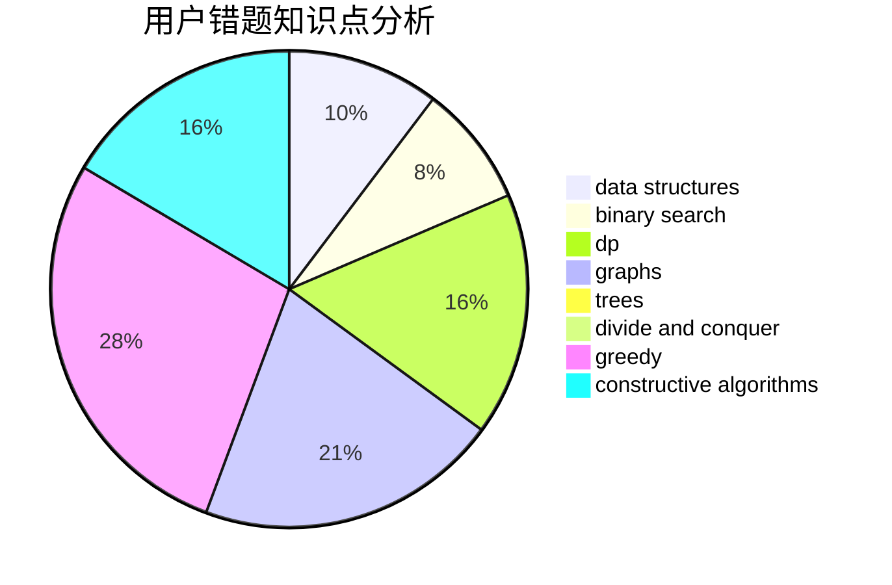

# Wintermorning

<!-- tabs:start -->

#### **用户提交结果分析**

#### **用户做题类型偏好分析**

#### **用户错题知识点分析**

<!-- tabs:end -->
# 推荐题目
[581A](https://codeforces.com/contest/581/problem/A)		implementation,
                        math		  
[1152A](https://codeforces.com/contest/1152/problem/A)		greedy,
                        implementation,
                        math		  
[931A](https://codeforces.com/contest/931/problem/A)		brute force,
                        greedy,
                        implementation,
                        math		  
[1136D](https://codeforces.com/contest/1136/problem/D)		greedy		  
[461B](https://codeforces.com/contest/461/problem/B)		dfs and similar,
                        dp,
                        trees		  
[920E](https://codeforces.com/contest/920/problem/E)		data structures,
                        dfs and similar,
                        dsu,
                        graphs		  
[402A](https://codeforces.com/contest/402/problem/A)		greedy,
                        math		  
[47A](https://codeforces.com/contest/47/problem/A)		brute force,
                        math		  
[1488E](https://codeforces.com/contest/1488/problem/E)		*special problem,
                        data structures,
                        dp		  
[888A](https://codeforces.com/contest/888/problem/A)		brute force,
                        implementation		  
