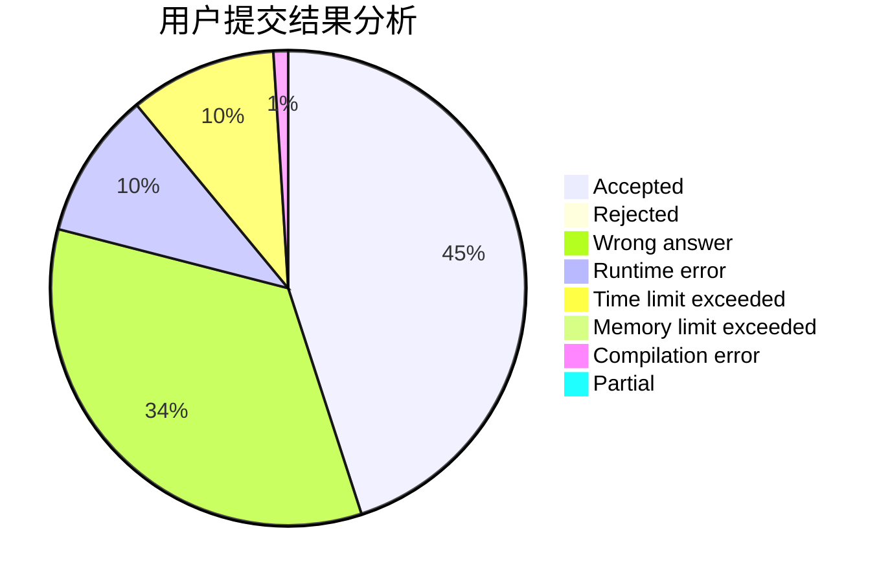
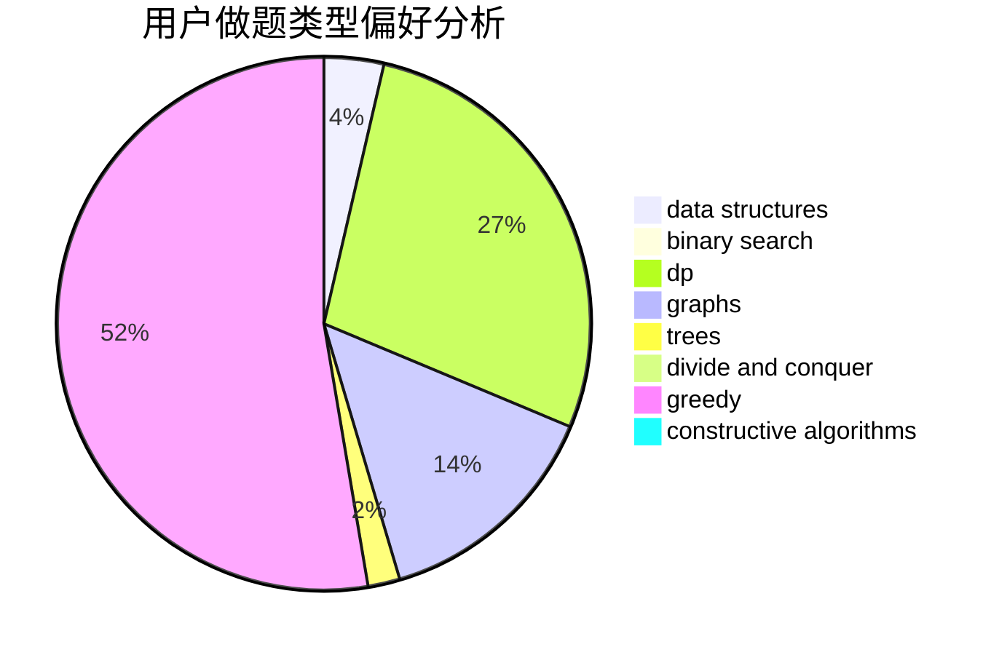

# Wise_4

<!-- tabs:start -->

#### **用户提交结果分析**

#### **用户做题类型偏好分析**

#### **用户错题知识点分析**

<!-- tabs:end -->
# 推荐题目
[1116C3](https://codeforces.com/contest/1116C/problem/3)		nan		  
[946A](https://codeforces.com/contest/946/problem/A)		greedy		  
[768E](https://codeforces.com/contest/768/problem/E)		bitmasks,
                        dp,
                        games		  
[747B](https://codeforces.com/contest/747/problem/B)		implementation,
                        strings		  
[965A](https://codeforces.com/contest/965/problem/A)		math		  
[1013B](https://codeforces.com/contest/1013/problem/B)		greedy		  
[238A](https://codeforces.com/contest/238/problem/A)		constructive algorithms,
                        math		  
[360A](https://codeforces.com/contest/360/problem/A)		greedy,
                        implementation		  
[591C](https://codeforces.com/contest/591/problem/C)		dsu,graphs,sortings,trees		  
[866D](https://codeforces.com/contest/866/problem/D)		dsu,graphs,sortings,trees		  
