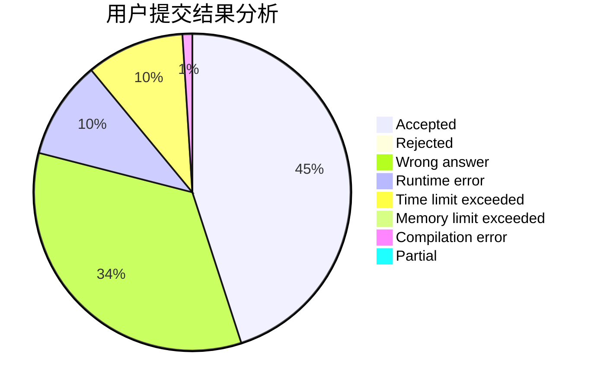
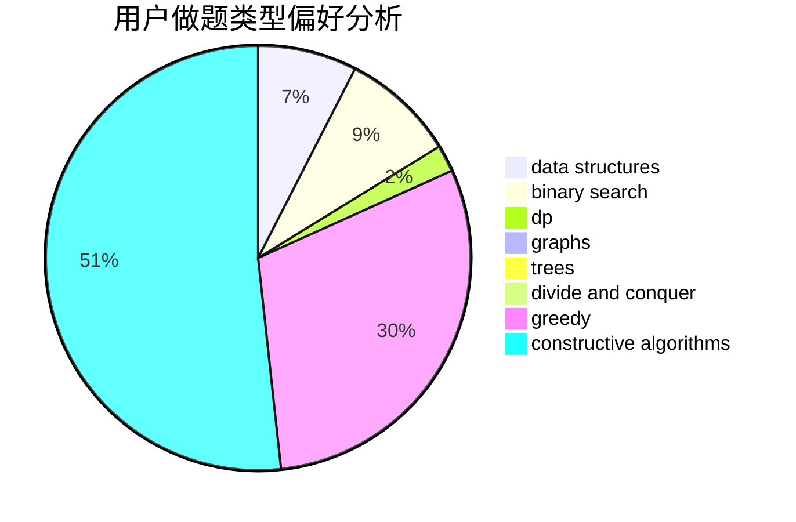

# Wise_4

<!-- tabs:start -->

#### **用户提交结果分析**

#### **用户做题类型偏好分析**

#### **用户错题知识点分析**

<!-- tabs:end -->
# 推荐题目
[11182](https://codeforces.com/contest/1118/problem/2)		dsu,graphs,sortings,trees		  
[962D](https://codeforces.com/contest/962/problem/D)		data structures,
                        implementation		  
[788D](https://codeforces.com/contest/788/problem/D)		constructive algorithms,
                        divide and conquer,
                        interactive		  
[766E](https://codeforces.com/contest/766/problem/E)		bitmasks,
                        constructive algorithms,
                        data structures,
                        dfs and similar,
                        dp,
                        math,
                        trees		  
[987A](https://codeforces.com/contest/987/problem/A)		implementation		  
[1013E](https://codeforces.com/contest/1013/problem/E)		dsu,graphs,sortings,trees		  
[25D](https://codeforces.com/contest/25/problem/D)		dsu,
                        graphs,
                        trees		  
[388B](https://codeforces.com/contest/388/problem/B)		bitmasks,
                        constructive algorithms,
                        graphs,
                        implementation,
                        math		  
[611A](https://codeforces.com/contest/611/problem/A)		implementation		  
[886F](https://codeforces.com/contest/886/problem/F)		geometry		  
