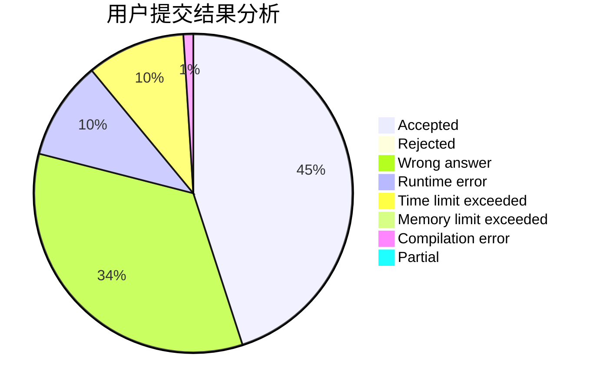
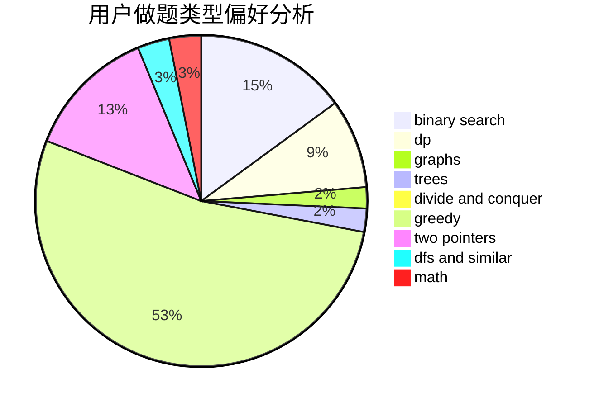

# Wise_4

<!-- tabs:start -->

#### **用户提交结果分析**

#### **用户做题类型偏好分析**

<!-- tabs:end -->
# 推荐题目
[11182](https://codeforces.com/contest/1118/problem/2)
[962D](https://codeforces.com/contest/962/problem/D)
[788D](https://codeforces.com/contest/788/problem/D)
[766E](https://codeforces.com/contest/766/problem/E)
[987A](https://codeforces.com/contest/987/problem/A)
[1013E](https://codeforces.com/contest/1013/problem/E)
[25D](https://codeforces.com/contest/25/problem/D)
[388B](https://codeforces.com/contest/388/problem/B)
[611A](https://codeforces.com/contest/611/problem/A)
[886F](https://codeforces.com/contest/886/problem/F)
