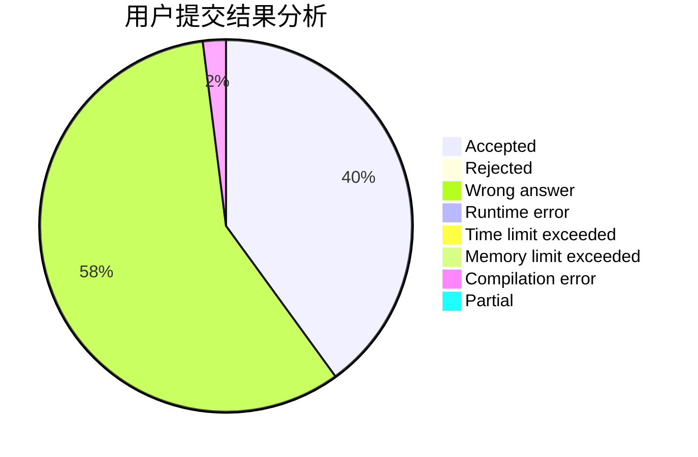
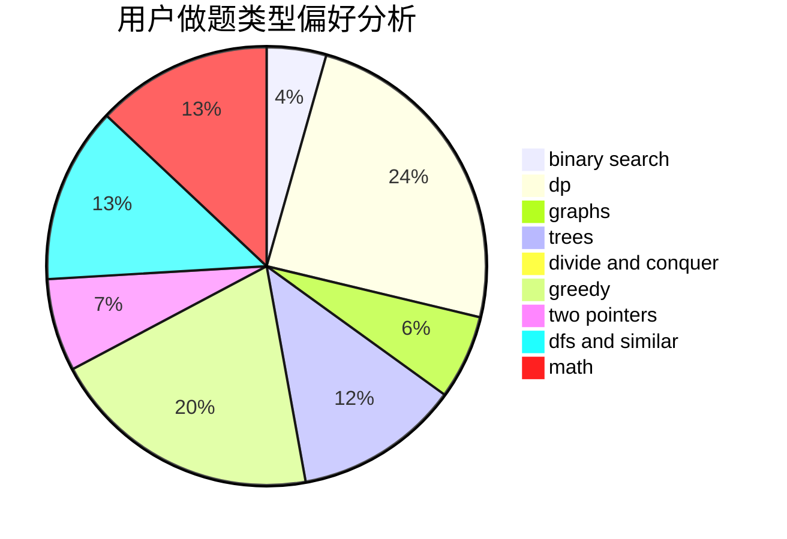

# Wogua_boy

<!-- tabs:start -->

#### **用户提交结果分析**

#### **用户做题类型偏好分析**

<!-- tabs:end -->
# 推荐题目
[1444E](https://codeforces.com/contest/1444/problem/E)
[611D](https://codeforces.com/contest/611/problem/D)
[701C](https://codeforces.com/contest/701/problem/C)
[653C](https://codeforces.com/contest/653/problem/C)
[463D](https://codeforces.com/contest/463/problem/D)
[653A](https://codeforces.com/contest/653/problem/A)
[956C](https://codeforces.com/contest/956/problem/C)
[377D](https://codeforces.com/contest/377/problem/D)
[1342C](https://codeforces.com/contest/1342/problem/C)
[282A](https://codeforces.com/contest/282/problem/A)
