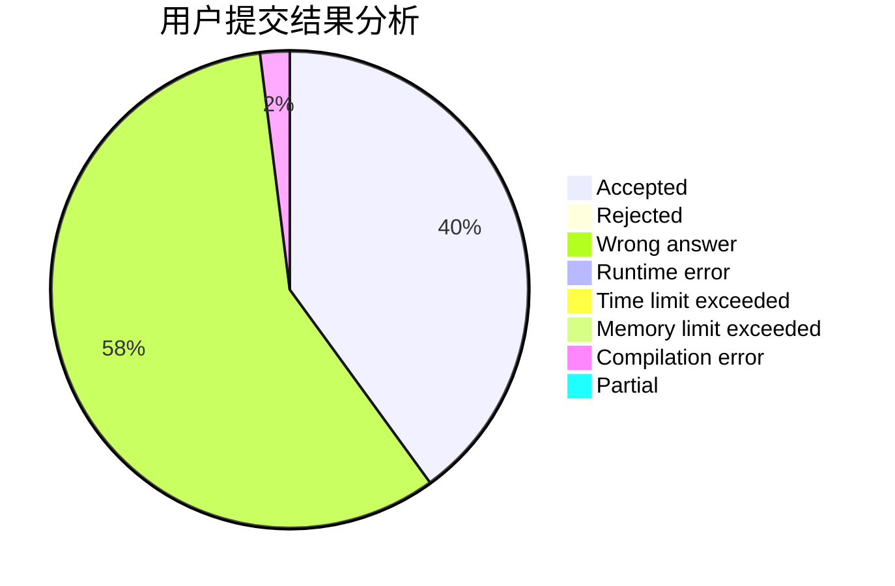
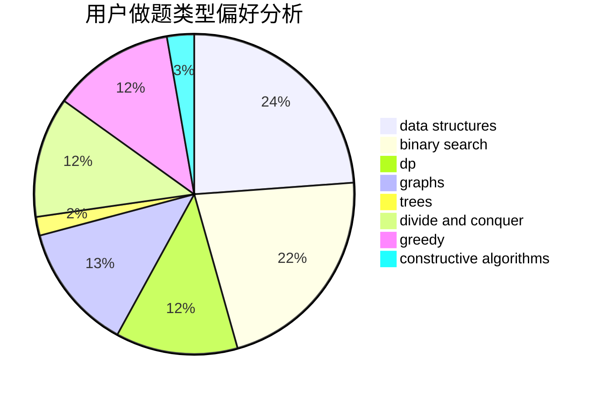
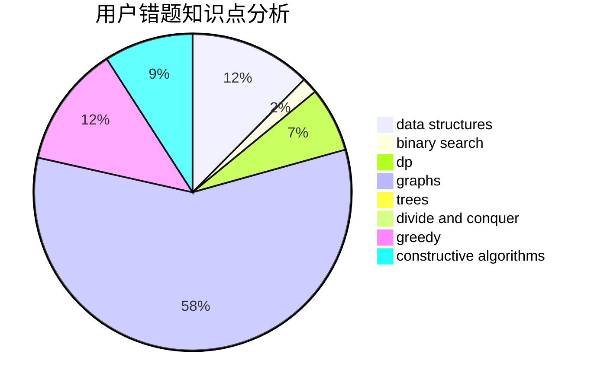

# Wogua_boy

<!-- tabs:start -->

#### **用户提交结果分析**

#### **用户做题类型偏好分析**

#### **用户错题知识点分析**

<!-- tabs:end -->
# 推荐题目
[1434E](https://codeforces.com/contest/1434/problem/E)		dsu,
                        games		  
[592B](https://codeforces.com/contest/592/problem/B)		math		  
[677C](https://codeforces.com/contest/677/problem/C)		bitmasks,
                        combinatorics,
                        implementation,
                        strings		  
[627C](https://codeforces.com/contest/627/problem/C)		data structures,
                        divide and conquer,
                        greedy		  
[443A](https://codeforces.com/contest/443/problem/A)		constructive algorithms,
                        implementation		  
[626F](https://codeforces.com/contest/626/problem/F)		dp		  
[934D](https://codeforces.com/contest/934/problem/D)		dsu,graphs,sortings,trees		  
[351B](https://codeforces.com/contest/351/problem/B)		combinatorics,
                        dp,
                        probabilities		  
[1335C](https://codeforces.com/contest/1335/problem/C)		binary search,
                        greedy,
                        implementation,
                        sortings		  
[266B](https://codeforces.com/contest/266/problem/B)		constructive algorithms,
                        graph matchings,
                        implementation,
                        shortest paths		  
