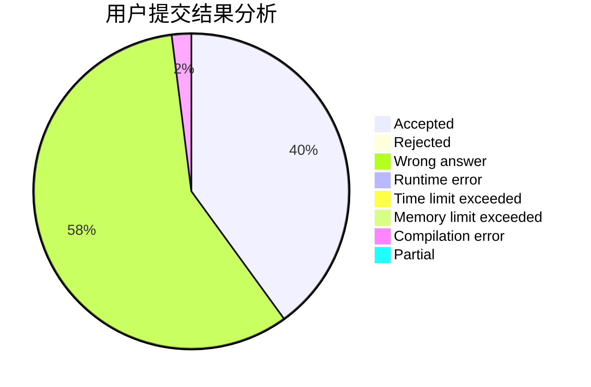
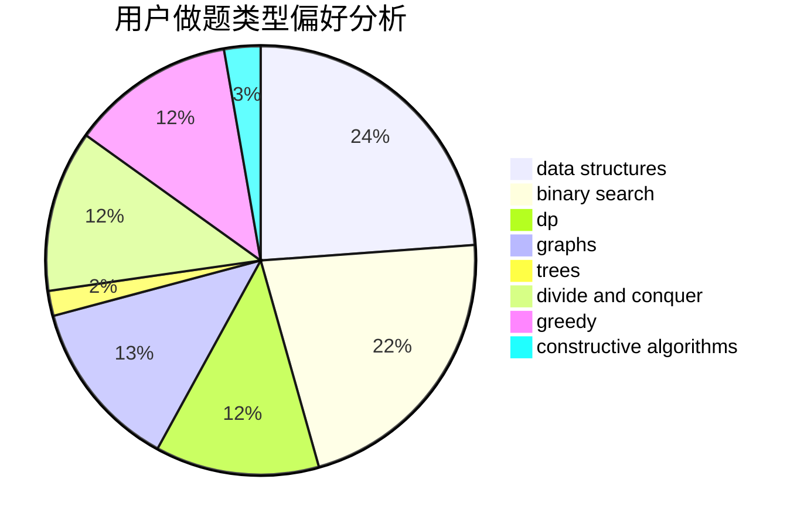
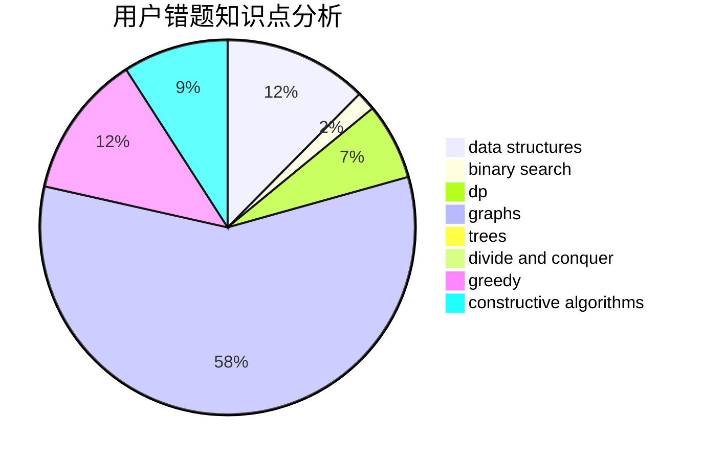

# Wogua_boy
<!-- tabs:start -->
#### **用户提交结果分析**

#### **用户做题类型偏好分析**

#### **用户错题知识点分析**

<!-- tabs:end -->
# 推荐题目
[Avoid Trygub](http://codeforces.com/problemset/problem/1450/A)		constructive algorithms,
                        sortings		  
[The Great Hero](http://codeforces.com/problemset/problem/1480/B)		greedy,
                        implementation,
                        sortings		  
[Destroy it!](http://codeforces.com/problemset/problem/1176/F)		dp,
                        implementation,
                        sortings		  
[Powers Of Two](http://codeforces.com/problemset/problem/1095/C)		bitmasks,
                        greedy		  
[Jeff and Furik](http://codeforces.com/problemset/problem/351/B)		combinatorics,
                        dp,
                        probabilities		  
[A Convex Game](http://codeforces.com/problemset/problem/1434/E)		dsu,
                        games		  
[Group Projects](http://codeforces.com/problemset/problem/626/F)		dp		  
[Package Delivery](http://codeforces.com/problemset/problem/627/C)		data structures,
                        divide and conquer,
                        greedy		  
[Destroying Array](http://codeforces.com/problemset/problem/722/C)		data structures,
                        dsu		  
[Two Teams Composing](http://codeforces.com/problemset/problem/1335/C)		binary search,
                        greedy,
                        implementation,
                        sortings		  
<!-- tabs:start -->
#### **data structures**
[Avoid Trygub](http://codeforces.com/problemset/problem/627/C)		data structures,
                        divide and conquer,
                        greedy		  
[The Great Hero](http://codeforces.com/problemset/problem/722/C)		data structures,
                        dsu		  
[Destroy it!](http://codeforces.com/problemset/problem/362/C)		data structures,
                        dp,
                        implementation,
                        math		  
[Powers Of Two](http://codeforces.com/problemset/problem/1129/C)		binary search,
                        data structures,
                        dp,
                        hashing,
                        sortings,
                        string suffix structures,
                        strings		  
[Jeff and Furik](http://codeforces.com/problemset/problem/748/D)		constructive algorithms,
                        data structures,
                        greedy		  
[A Convex Game](https://codeforces.com/contest/1269/problem/E)		binary search,
                        data structures		  
[Group Projects](http://codeforces.com/problemset/problem/263/E)		brute force,
                        data structures,
                        dp		  
[Package Delivery](http://codeforces.com/problemset/problem/877/F)		data structures,
                        flows,
                        hashing		  
[Destroying Array](http://codeforces.com/problemset/problem/979/D)		binary search,
                        bitmasks,
                        brute force,
                        data structures,
                        dp,
                        dsu,
                        greedy,
                        math,
                        number theory,
                        strings,
                        trees		  
[Two Teams Composing](http://codeforces.com/problemset/problem/400/E)		binary search,
                        bitmasks,
                        data structures		  
#### **binary search**
[Avoid Trygub](http://codeforces.com/problemset/problem/1335/C)		binary search,
                        greedy,
                        implementation,
                        sortings		  
[The Great Hero](http://codeforces.com/problemset/problem/1129/C)		binary search,
                        data structures,
                        dp,
                        hashing,
                        sortings,
                        string suffix structures,
                        strings		  
[Destroy it!](https://codeforces.com/contest/1269/problem/E)		binary search,
                        data structures		  
[Powers Of Two](http://codeforces.com/problemset/problem/939/E)		binary search,
                        greedy,
                        ternary search,
                        two pointers		  
[Jeff and Furik](http://codeforces.com/problemset/problem/1156/C)		binary search,
                        greedy,
                        sortings,
                        ternary search,
                        two pointers		  
[A Convex Game](http://codeforces.com/problemset/problem/979/D)		binary search,
                        bitmasks,
                        brute force,
                        data structures,
                        dp,
                        dsu,
                        greedy,
                        math,
                        number theory,
                        strings,
                        trees		  
[Group Projects](http://codeforces.com/problemset/problem/400/E)		binary search,
                        bitmasks,
                        data structures		  
[Package Delivery](http://codeforces.com/problemset/problem/567/D)		binary search,
                        data structures,
                        greedy,
                        sortings		  
[Destroying Array](http://codeforces.com/problemset/problem/1305/H)		binary search,
                        greedy		  
[Two Teams Composing](http://codeforces.com/problemset/problem/1202/F)		binary search,
                        implementation,
                        math		  
#### **dp**
[Avoid Trygub](http://codeforces.com/problemset/problem/1176/F)		dp,
                        implementation,
                        sortings		  
[The Great Hero](http://codeforces.com/problemset/problem/351/B)		combinatorics,
                        dp,
                        probabilities		  
[Destroy it!](http://codeforces.com/problemset/problem/626/F)		dp		  
[Powers Of Two](http://codeforces.com/problemset/problem/362/C)		data structures,
                        dp,
                        implementation,
                        math		  
[Jeff and Furik](http://codeforces.com/problemset/problem/1129/C)		binary search,
                        data structures,
                        dp,
                        hashing,
                        sortings,
                        string suffix structures,
                        strings		  
[A Convex Game](https://codeforces.com/contest/1397/problem/E)		dp,
                        greedy,
                        implementation		  
[Group Projects](http://codeforces.com/problemset/problem/263/E)		brute force,
                        data structures,
                        dp		  
[Package Delivery](http://codeforces.com/problemset/problem/979/D)		binary search,
                        bitmasks,
                        brute force,
                        data structures,
                        dp,
                        dsu,
                        greedy,
                        math,
                        number theory,
                        strings,
                        trees		  
[Destroying Array](http://codeforces.com/problemset/problem/1202/B)		brute force,
                        dp,
                        shortest paths		  
[Two Teams Composing](http://codeforces.com/problemset/problem/977/F)		dp		  
#### **graph**
[Avoid Trygub](http://codeforces.com/problemset/problem/46/F)		dsu,
                        graphs		  
[The Great Hero](http://codeforces.com/problemset/problem/266/B)		constructive algorithms,
                        graph matchings,
                        implementation,
                        shortest paths		  
[Destroy it!](http://codeforces.com/problemset/problem/1468/M)		data structures,
                        graphs,
                        implementation		  
[Powers Of Two](http://codeforces.com/problemset/problem/76/A)		dsu,
                        graphs,
                        sortings,
                        trees		  
[Jeff and Furik](http://codeforces.com/problemset/problem/1242/B)		dfs and similar,
                        dsu,
                        graphs,
                        sortings		  
[A Convex Game](http://codeforces.com/problemset/problem/1487/C)		brute force,
                        constructive algorithms,
                        dfs and similar,
                        graphs,
                        greedy,
                        implementation,
                        math		  
[Group Projects](http://codeforces.com/problemset/problem/1437/C)		dp,
                        flows,
                        graph matchings,
                        greedy,
                        math,
                        sortings		  
[Package Delivery](http://codeforces.com/problemset/problem/1470/D)		constructive algorithms,
                        dfs and similar,
                        graph matchings,
                        graphs,
                        greedy		  
[Destroying Array](http://codeforces.com/problemset/problem/1476/C)		dp,
                        graphs,
                        greedy		  
[Two Teams Composing](http://codeforces.com/problemset/problem/1304/D)		constructive algorithms,
                        graphs,
                        greedy,
                        two pointers		  
#### **trees**
[Avoid Trygub](http://codeforces.com/problemset/problem/979/D)		binary search,
                        bitmasks,
                        brute force,
                        data structures,
                        dp,
                        dsu,
                        greedy,
                        math,
                        number theory,
                        strings,
                        trees		  
[The Great Hero](http://codeforces.com/problemset/problem/76/A)		dsu,
                        graphs,
                        sortings,
                        trees		  
[Destroy it!](http://codeforces.com/problemset/problem/1479/D)		binary search,
                        bitmasks,
                        brute force,
                        data structures,
                        probabilities,
                        trees		  
[Powers Of Two](http://codeforces.com/problemset/problem/1511/C)		brute force,
                        data structures,
                        implementation,
                        trees		  
[Jeff and Furik](http://codeforces.com/problemset/problem/1499/F)		combinatorics,
                        dfs and similar,
                        dp,
                        trees		  
[A Convex Game](http://codeforces.com/problemset/problem/1491/E)		brute force,
                        dfs and similar,
                        divide and conquer,
                        number theory,
                        trees		  
[Group Projects](http://codeforces.com/problemset/problem/1466/D)		data structures,
                        greedy,
                        sortings,
                        trees		  
[Package Delivery](http://codeforces.com/problemset/problem/1495/D)		combinatorics,
                        dfs and similar,
                        graphs,
                        math,
                        shortest paths,
                        trees		  
[Destroying Array](http://codeforces.com/problemset/problem/1303/G)		data structures,
                        divide and conquer,
                        geometry,
                        trees		  
[Two Teams Composing](http://codeforces.com/problemset/problem/1454/E)		combinatorics,
                        dfs and similar,
                        graphs,
                        trees		  
#### **divide and conquer**
[Avoid Trygub](http://codeforces.com/problemset/problem/627/C)		data structures,
                        divide and conquer,
                        greedy		  
[The Great Hero](http://codeforces.com/problemset/problem/1400/E)		data structures,
                        divide and conquer,
                        dp,
                        greedy		  
[Destroy it!](http://codeforces.com/problemset/problem/662/C)		bitmasks,
                        brute force,
                        divide and conquer,
                        dp,
                        fft,
                        math		  
[Powers Of Two](http://codeforces.com/problemset/problem/1461/D)		binary search,
                        brute force,
                        data structures,
                        divide and conquer,
                        implementation,
                        sortings		  
[Jeff and Furik](http://codeforces.com/problemset/problem/1466/G)		combinatorics,
                        divide and conquer,
                        hashing,
                        math,
                        string suffix structures,
                        strings		  
[A Convex Game](http://codeforces.com/problemset/problem/1490/D)		dfs and similar,
                        divide and conquer,
                        implementation		  
[Group Projects](https://codeforces.com/contest/1483/problem/C)		data structures,
                        divide and conquer,
                        dp		  
[Package Delivery](http://codeforces.com/problemset/problem/1491/E)		brute force,
                        dfs and similar,
                        divide and conquer,
                        number theory,
                        trees		  
[Destroying Array](http://codeforces.com/problemset/problem/1303/G)		data structures,
                        divide and conquer,
                        geometry,
                        trees		  
[Two Teams Composing](http://codeforces.com/problemset/problem/1494/D)		constructive algorithms,
                        data structures,
                        dfs and similar,
                        divide and conquer,
                        dsu,
                        greedy,
                        sortings,
                        trees		  
#### **greedy**
[Avoid Trygub](http://codeforces.com/problemset/problem/1480/B)		greedy,
                        implementation,
                        sortings		  
[The Great Hero](http://codeforces.com/problemset/problem/1095/C)		bitmasks,
                        greedy		  
[Destroy it!](http://codeforces.com/problemset/problem/627/C)		data structures,
                        divide and conquer,
                        greedy		  
[Powers Of Two](http://codeforces.com/problemset/problem/1335/C)		binary search,
                        greedy,
                        implementation,
                        sortings		  
[Jeff and Furik](http://codeforces.com/problemset/problem/864/C)		greedy,
                        implementation,
                        math		  
[A Convex Game](http://codeforces.com/problemset/problem/748/D)		constructive algorithms,
                        data structures,
                        greedy		  
[Group Projects](https://codeforces.com/contest/1397/problem/E)		dp,
                        greedy,
                        implementation		  
[Package Delivery](http://codeforces.com/problemset/problem/939/E)		binary search,
                        greedy,
                        ternary search,
                        two pointers		  
[Destroying Array](http://codeforces.com/problemset/problem/1156/C)		binary search,
                        greedy,
                        sortings,
                        ternary search,
                        two pointers		  
[Two Teams Composing](http://codeforces.com/problemset/problem/979/D)		binary search,
                        bitmasks,
                        brute force,
                        data structures,
                        dp,
                        dsu,
                        greedy,
                        math,
                        number theory,
                        strings,
                        trees		  
#### **constructive algorithms**
[Avoid Trygub](http://codeforces.com/problemset/problem/1450/A)		constructive algorithms,
                        sortings		  
[The Great Hero](http://codeforces.com/problemset/problem/443/A)		constructive algorithms,
                        implementation		  
[Destroy it!](http://codeforces.com/problemset/problem/748/D)		constructive algorithms,
                        data structures,
                        greedy		  
[Powers Of Two](http://codeforces.com/problemset/problem/725/C)		brute force,
                        constructive algorithms,
                        implementation,
                        strings		  
[Jeff and Furik](http://codeforces.com/problemset/problem/266/B)		constructive algorithms,
                        graph matchings,
                        implementation,
                        shortest paths		  
[A Convex Game](http://codeforces.com/problemset/problem/1493/A)		constructive algorithms,
                        greedy		  
[Group Projects](http://codeforces.com/problemset/problem/1463/D)		binary search,
                        constructive algorithms,
                        greedy,
                        two pointers		  
[Package Delivery](https://codeforces.com/contest/1456/problem/B)		bitmasks,
                        brute force,
                        constructive algorithms		  
[Destroying Array](http://codeforces.com/problemset/problem/1492/D)		bitmasks,
                        constructive algorithms,
                        greedy,
                        math		  
[Two Teams Composing](https://codeforces.com/contest/1504/problem/D)		constructive algorithms,
                        games,
                        interactive		  
#### **sortings**
[Avoid Trygub](http://codeforces.com/problemset/problem/1450/A)		constructive algorithms,
                        sortings		  
[The Great Hero](http://codeforces.com/problemset/problem/1480/B)		greedy,
                        implementation,
                        sortings		  
[Destroy it!](http://codeforces.com/problemset/problem/1176/F)		dp,
                        implementation,
                        sortings		  
[Powers Of Two](http://codeforces.com/problemset/problem/1335/C)		binary search,
                        greedy,
                        implementation,
                        sortings		  
[Jeff and Furik](http://codeforces.com/problemset/problem/599/C)		sortings		  
[A Convex Game](http://codeforces.com/problemset/problem/1129/C)		binary search,
                        data structures,
                        dp,
                        hashing,
                        sortings,
                        string suffix structures,
                        strings		  
[Group Projects](http://codeforces.com/problemset/problem/1156/C)		binary search,
                        greedy,
                        sortings,
                        ternary search,
                        two pointers		  
[Package Delivery](http://codeforces.com/problemset/problem/567/D)		binary search,
                        data structures,
                        greedy,
                        sortings		  
[Destroying Array](http://codeforces.com/problemset/problem/157/B)		geometry,
                        sortings		  
[Two Teams Composing](http://codeforces.com/problemset/problem/76/A)		dsu,
                        graphs,
                        sortings,
                        trees		  
<!-- tabs:end -->
