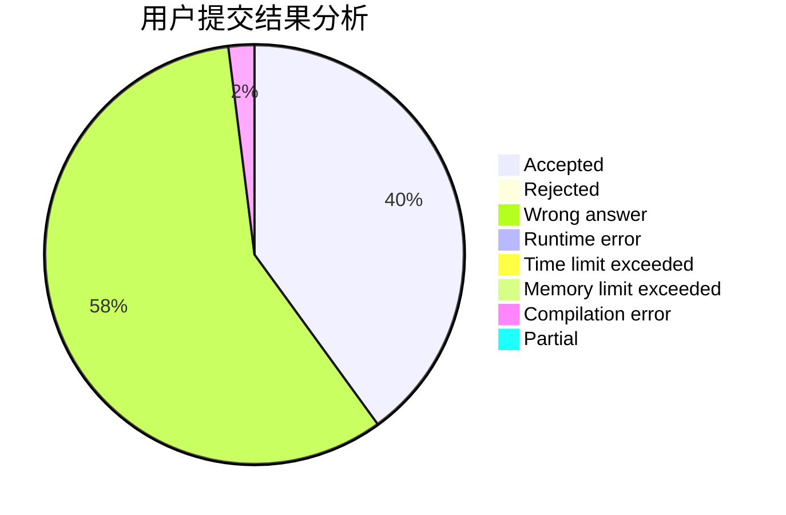
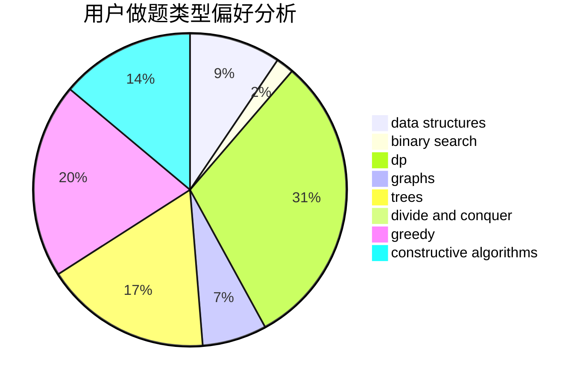
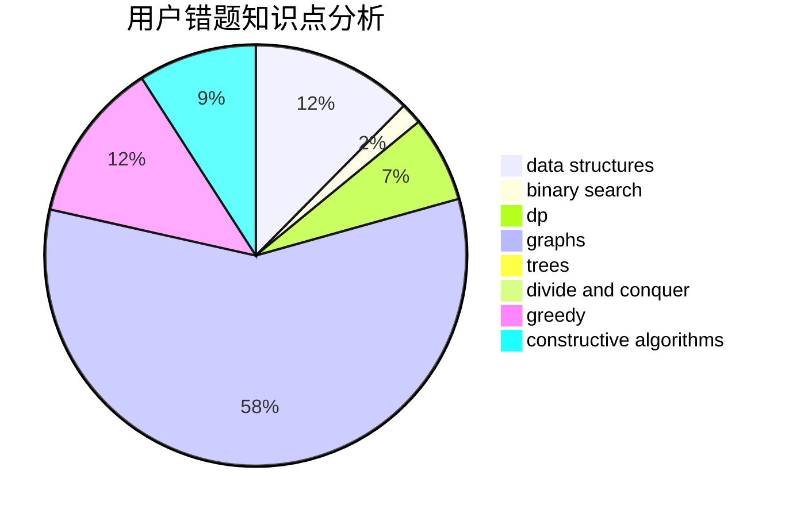

# Wogua_boy

<!-- tabs:start -->

#### **用户提交结果分析**

#### **用户做题类型偏好分析**

#### **用户错题知识点分析**

<!-- tabs:end -->
# 推荐题目
[1444E](https://codeforces.com/contest/1444/problem/E)		brute force,
                        dfs and similar,
                        dp,
                        interactive,
                        trees		  
[611D](https://codeforces.com/contest/611/problem/D)		dp,
                        hashing,
                        strings		  
[701C](https://codeforces.com/contest/701/problem/C)		binary search,
                        strings,
                        two pointers		  
[653C](https://codeforces.com/contest/653/problem/C)		brute force,
                        implementation		  
[463D](https://codeforces.com/contest/463/problem/D)		dfs and similar,
                        dp,
                        graphs,
                        implementation		  
[653A](https://codeforces.com/contest/653/problem/A)		brute force,
                        implementation,
                        sortings		  
[956C](https://codeforces.com/contest/956/problem/C)		dsu,graphs,sortings,trees		  
[377D](https://codeforces.com/contest/377/problem/D)		data structures		  
[1342C](https://codeforces.com/contest/1342/problem/C)		math,
                        number theory		  
[282A](https://codeforces.com/contest/282/problem/A)		implementation		  
