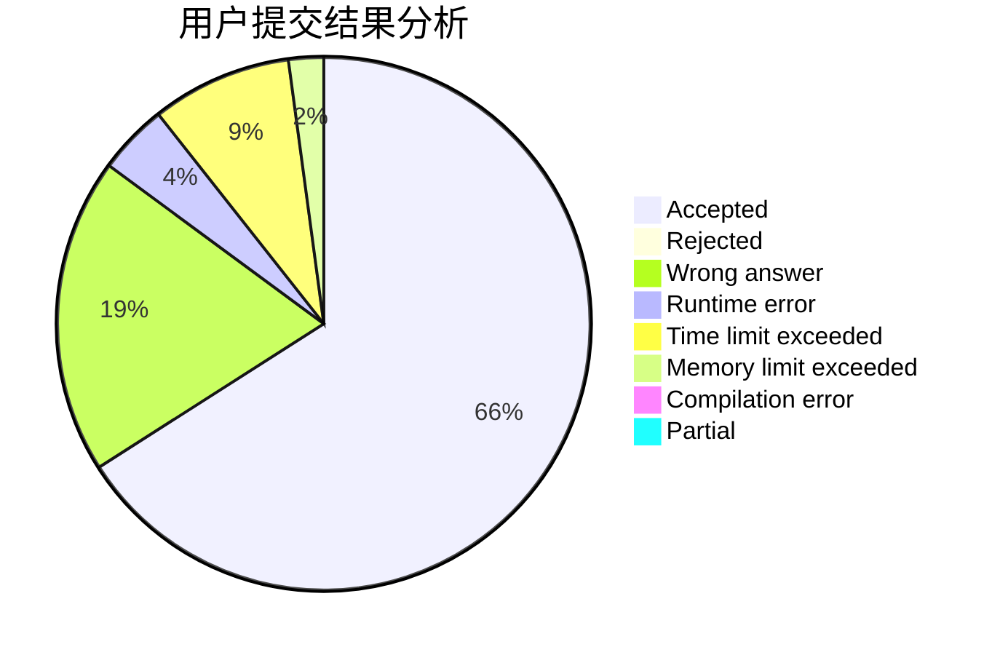
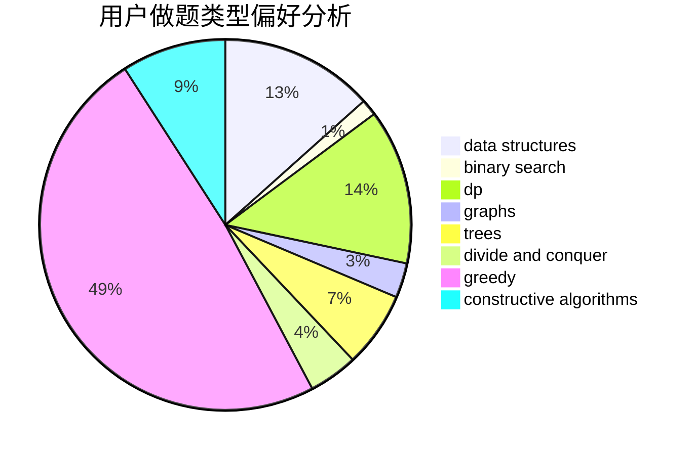
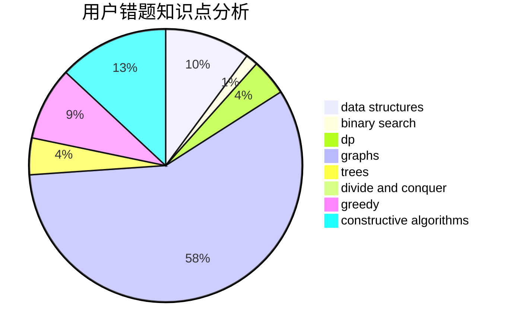

# Akemi-Homura-

<!-- tabs:start -->

#### **用户提交结果分析**

#### **用户做题类型偏好分析**

#### **用户错题知识点分析**

<!-- tabs:end -->
# 推荐题目
[1404E](https://codeforces.com/contest/1404/problem/E)		flows,
                        graph matchings,
                        graphs		  
[24D](https://codeforces.com/contest/24/problem/D)		dp,
                        math,
                        probabilities		  
[24E](https://codeforces.com/contest/24/problem/E)		binary search		  
[1297D](https://codeforces.com/contest/1297/problem/D)		*special problem,
                        binary search,
                        greedy,
                        sortings		  
[1312E](https://codeforces.com/contest/1312/problem/E)		dp,
                        greedy		  
[251D](https://codeforces.com/contest/251/problem/D)		bitmasks,
                        math		  
[1095F](https://codeforces.com/contest/1095/problem/F)		dsu,
                        graphs,
                        greedy		  
[11732](https://codeforces.com/contest/1173/problem/2)		dsu,graphs,sortings,trees		  
[254A](https://codeforces.com/contest/254/problem/A)		constructive algorithms,
                        sortings		  
[251A](https://codeforces.com/contest/251/problem/A)		binary search,
                        combinatorics,
                        two pointers		  
