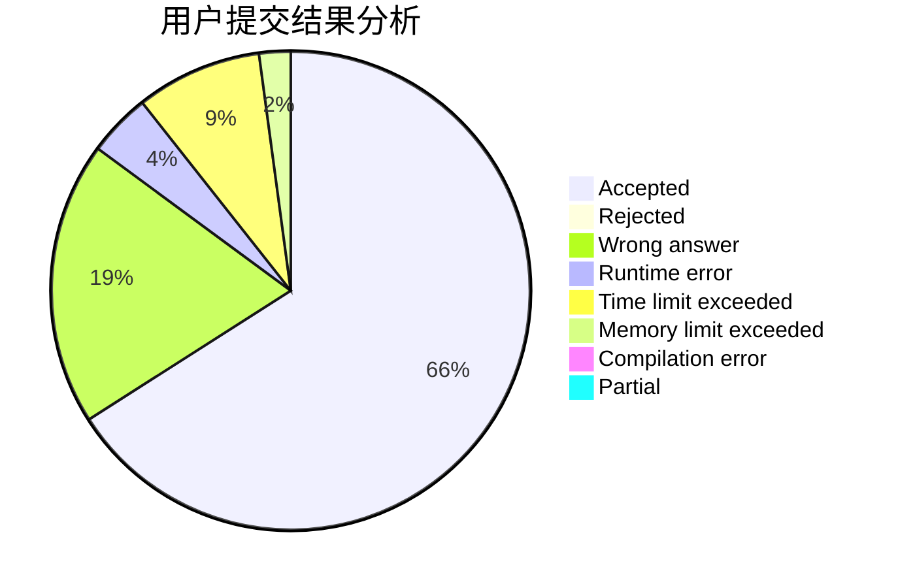
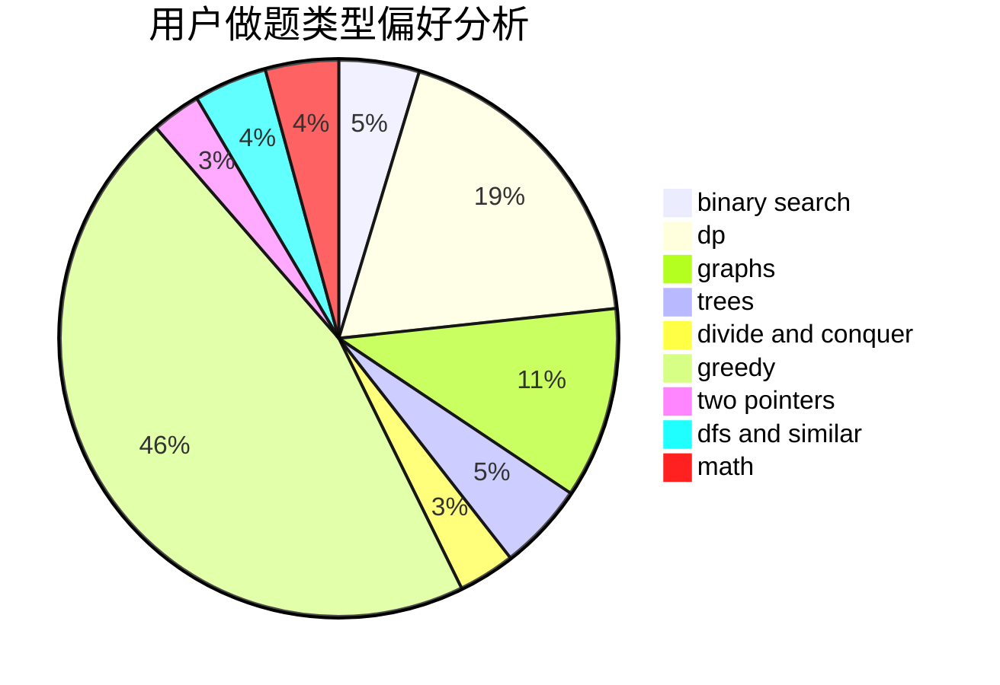

# Akemi-Homura-

<!-- tabs:start -->

#### **用户提交结果分析**

#### **用户做题类型偏好分析**

<!-- tabs:end -->
# 推荐题目
[1404E](https://codeforces.com/contest/1404/problem/E)
[24D](https://codeforces.com/contest/24/problem/D)
[24E](https://codeforces.com/contest/24/problem/E)
[1297D](https://codeforces.com/contest/1297/problem/D)
[1312E](https://codeforces.com/contest/1312/problem/E)
[251D](https://codeforces.com/contest/251/problem/D)
[1095F](https://codeforces.com/contest/1095/problem/F)
[11732](https://codeforces.com/contest/1173/problem/2)
[254A](https://codeforces.com/contest/254/problem/A)
[251A](https://codeforces.com/contest/251/problem/A)
