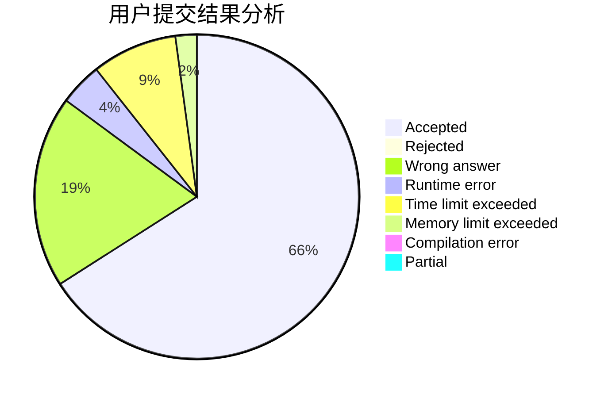
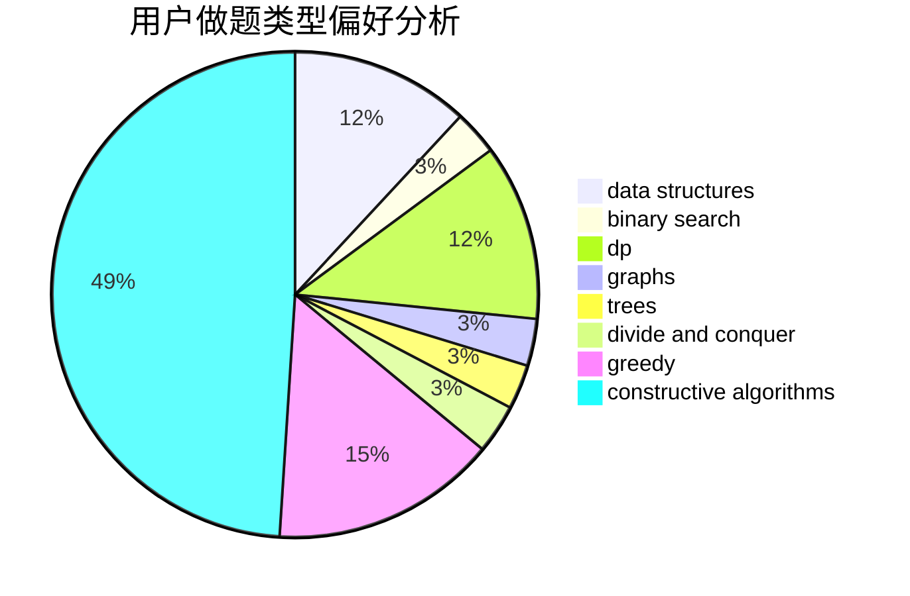
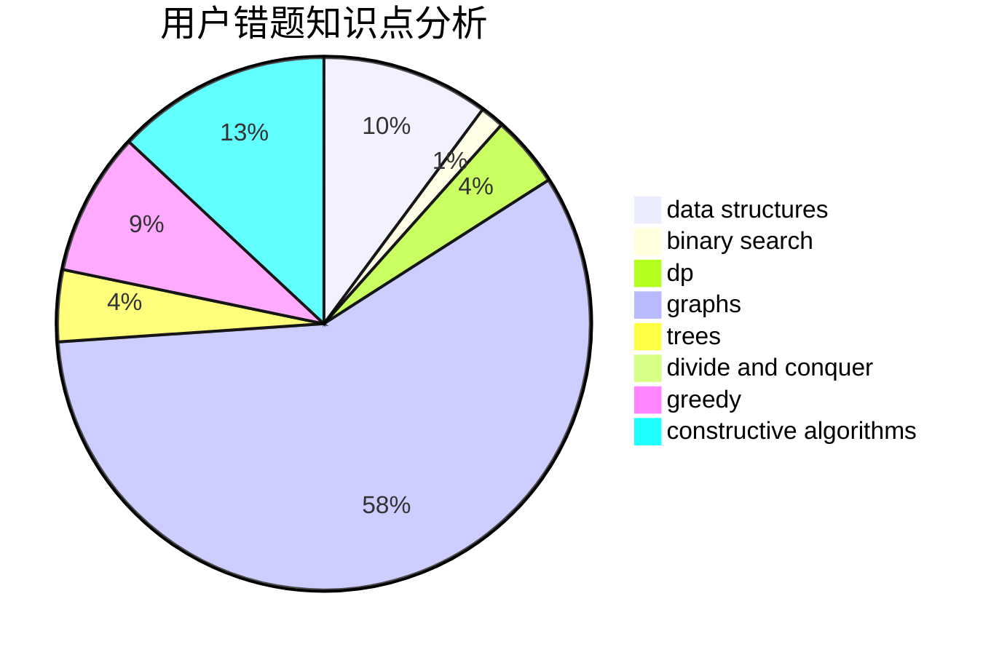

# Akemi-Homura-

<!-- tabs:start -->

#### **用户提交结果分析**

#### **用户做题类型偏好分析**

#### **用户错题知识点分析**

<!-- tabs:end -->
# 推荐题目
[1396A](https://codeforces.com/contest/1396/problem/A)		constructive algorithms,
                        greedy,
                        number theory		  
[22A](https://codeforces.com/contest/22/problem/A)		brute force		  
[22B](https://codeforces.com/contest/22/problem/B)		brute force,
                        dp		  
[1291A](https://codeforces.com/contest/1291/problem/A)		greedy,
                        math,
                        strings		  
[1303G](https://codeforces.com/contest/1303/problem/G)		data structures,
                        divide and conquer,
                        geometry,
                        trees		  
[231A](https://codeforces.com/contest/231/problem/A)		brute force,
                        greedy		  
[1095C](https://codeforces.com/contest/1095/problem/C)		bitmasks,
                        greedy		  
[1168C](https://codeforces.com/contest/1168/problem/C)		bitmasks,
                        dp		  
[232B](https://codeforces.com/contest/232/problem/B)		bitmasks,
                        combinatorics,
                        dp,
                        math		  
[22C](https://codeforces.com/contest/22/problem/C)		graphs		  
