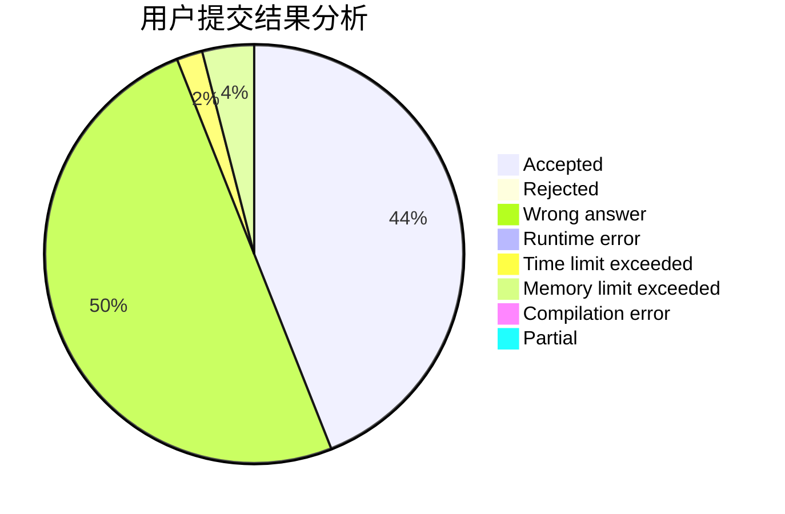
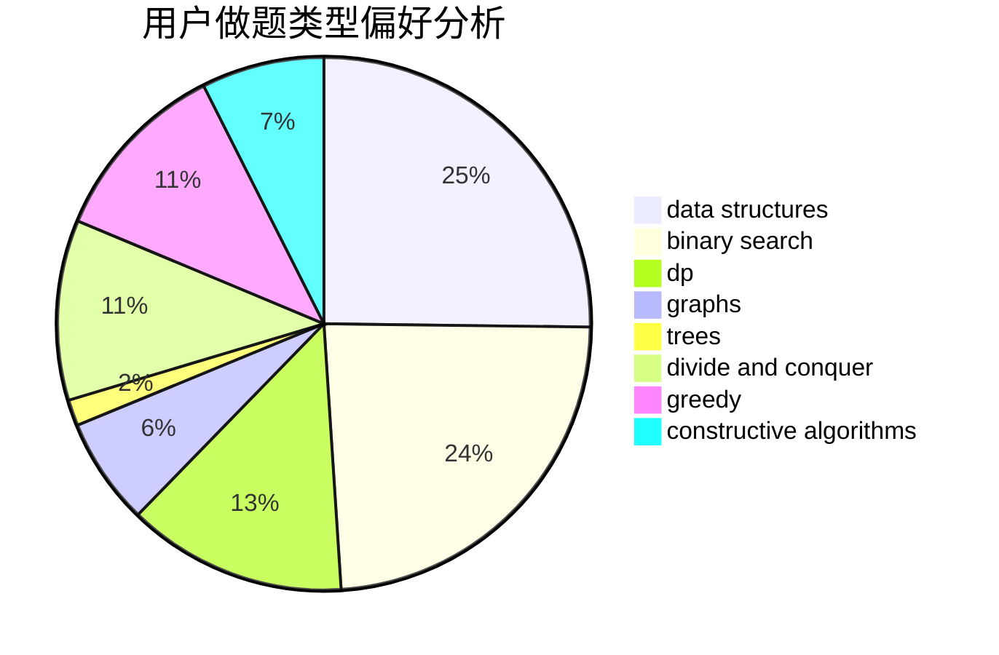
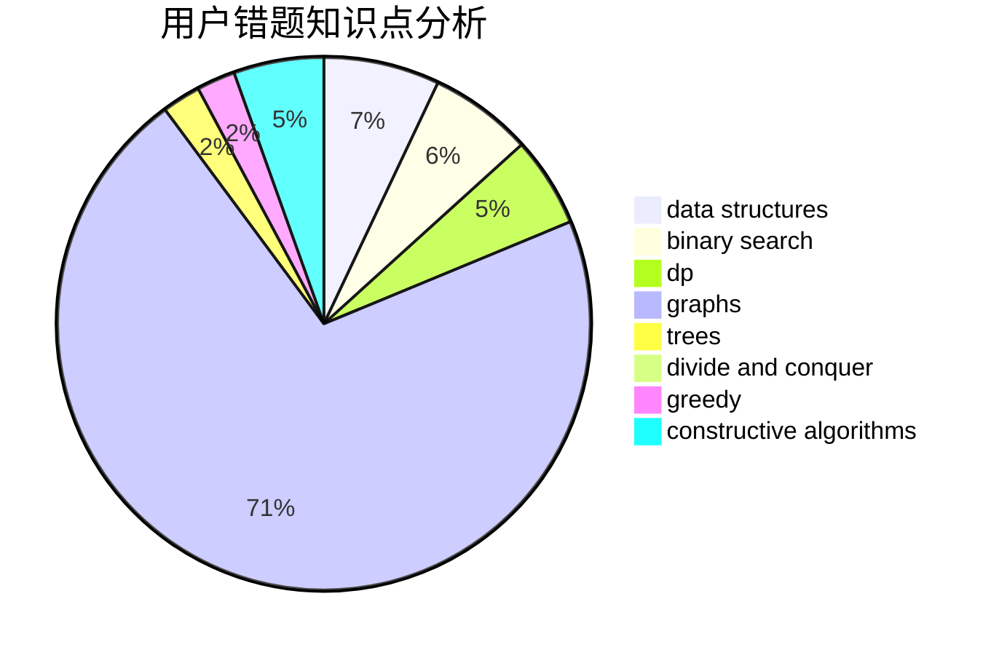

# Wolf-Reiser

<!-- tabs:start -->

#### **用户提交结果分析**

#### **用户做题类型偏好分析**

#### **用户错题知识点分析**

<!-- tabs:end -->
# 推荐题目
[1455F](https://codeforces.com/contest/1455/problem/F)		dp,
                        greedy		  
[7C](https://codeforces.com/contest/7/problem/C)		math,
                        number theory		  
[55D](https://codeforces.com/contest/55/problem/D)		dp,
                        number theory		  
[1056A](https://codeforces.com/contest/1056/problem/A)		implementation		  
[1510I](https://codeforces.com/contest/1510/problem/I)		greedy,
                        interactive,
                        math,
                        probabilities		  
[930B](https://codeforces.com/contest/930/problem/B)		implementation,
                        probabilities,
                        strings		  
[906D](https://codeforces.com/contest/906/problem/D)		chinese remainder theorem,
                        math,
                        number theory		  
[1241B](https://codeforces.com/contest/1241/problem/B)		dsu,graphs,sortings,trees		  
[666A](https://codeforces.com/contest/666/problem/A)		dp,
                        implementation,
                        strings		  
[509C](https://codeforces.com/contest/509/problem/C)		dp,
                        greedy,
                        implementation		  
