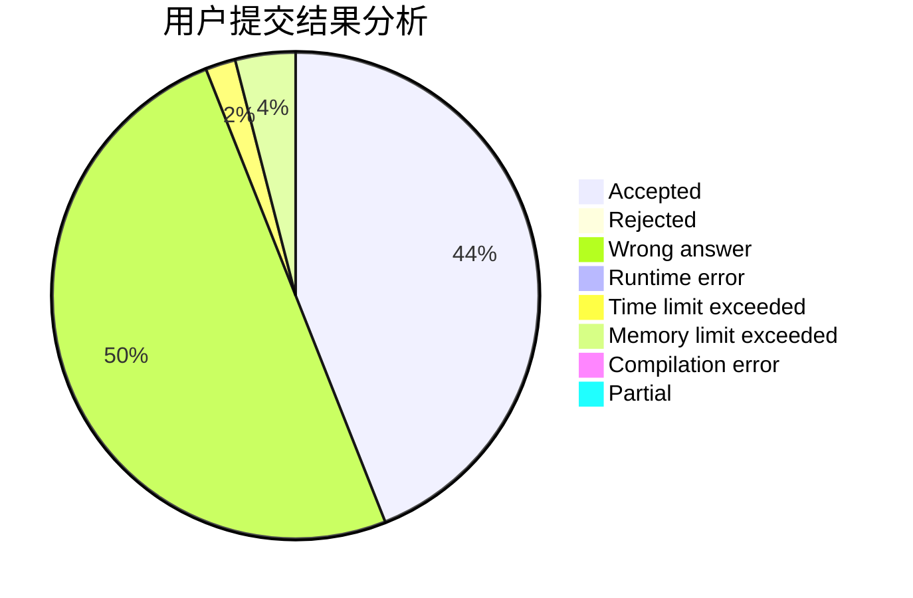
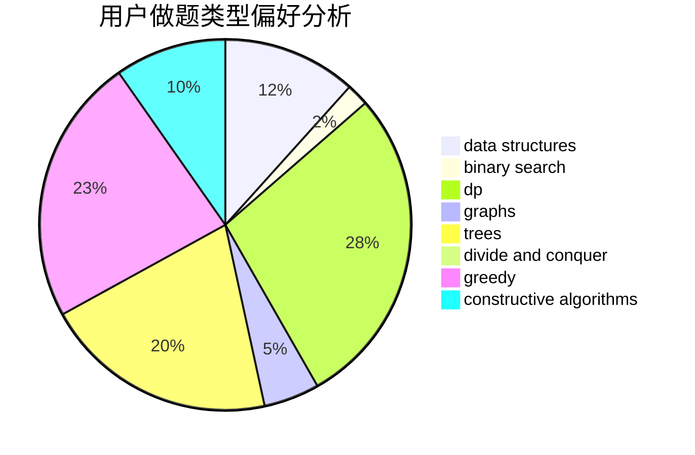
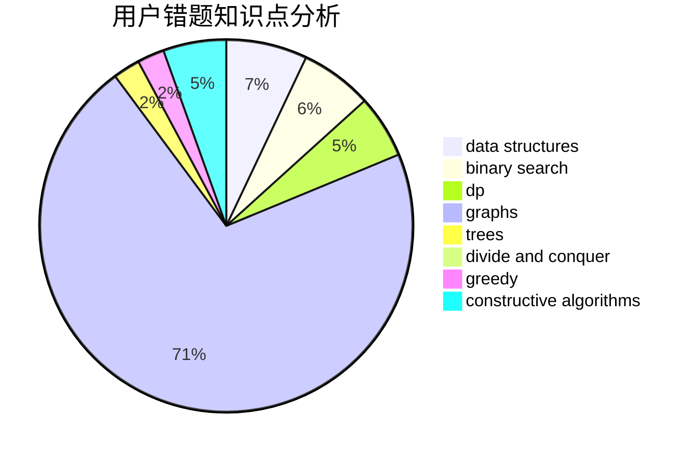

# Wolf-Reiser

<!-- tabs:start -->

#### **用户提交结果分析**

#### **用户做题类型偏好分析**

#### **用户错题知识点分析**

<!-- tabs:end -->
# 推荐题目
[1465C](https://codeforces.com/contest/1465/problem/C)		dsu,graphs,sortings,trees		  
[814D](https://codeforces.com/contest/814/problem/D)		dfs and similar,
                        dp,
                        geometry,
                        greedy,
                        trees		  
[584B](https://codeforces.com/contest/584/problem/B)		combinatorics		  
[1056D](https://codeforces.com/contest/1056/problem/D)		constructive algorithms,
                        dfs and similar,
                        dp,
                        graphs,
                        greedy,
                        sortings,
                        trees		  
[166A](https://codeforces.com/contest/166/problem/A)		binary search,
                        implementation,
                        sortings		  
[950A](https://codeforces.com/contest/950/problem/A)		implementation,
                        math		  
[920B](https://codeforces.com/contest/920/problem/B)		implementation		  
[1246F](https://codeforces.com/contest/1246/problem/F)		nan		  
[687A](https://codeforces.com/contest/687/problem/A)		dfs and similar,
                        graphs		  
[52B](https://codeforces.com/contest/52/problem/B)		combinatorics		  
