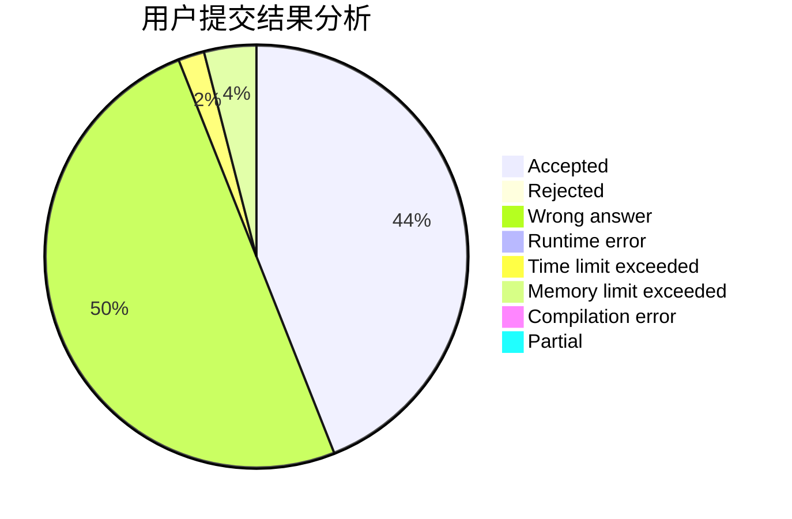
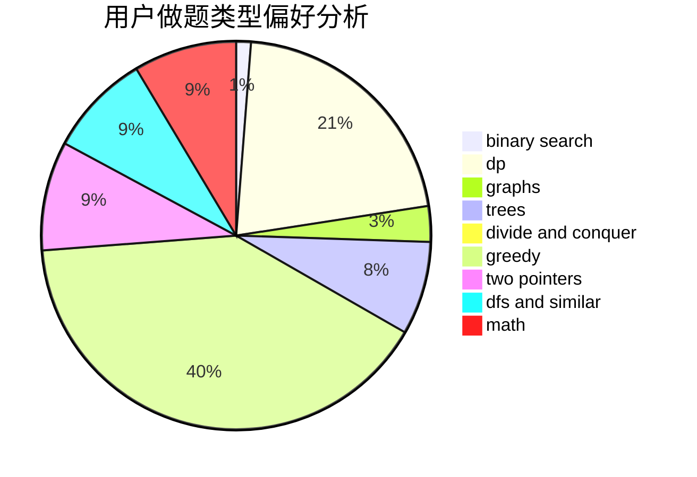

# Wolf-Reiser

<!-- tabs:start -->

#### **用户提交结果分析**

#### **用户做题类型偏好分析**

<!-- tabs:end -->
# 推荐题目
[1465C](https://codeforces.com/contest/1465/problem/C)
[814D](https://codeforces.com/contest/814/problem/D)
[584B](https://codeforces.com/contest/584/problem/B)
[1056D](https://codeforces.com/contest/1056/problem/D)
[166A](https://codeforces.com/contest/166/problem/A)
[950A](https://codeforces.com/contest/950/problem/A)
[920B](https://codeforces.com/contest/920/problem/B)
[1246F](https://codeforces.com/contest/1246/problem/F)
[687A](https://codeforces.com/contest/687/problem/A)
[52B](https://codeforces.com/contest/52/problem/B)
