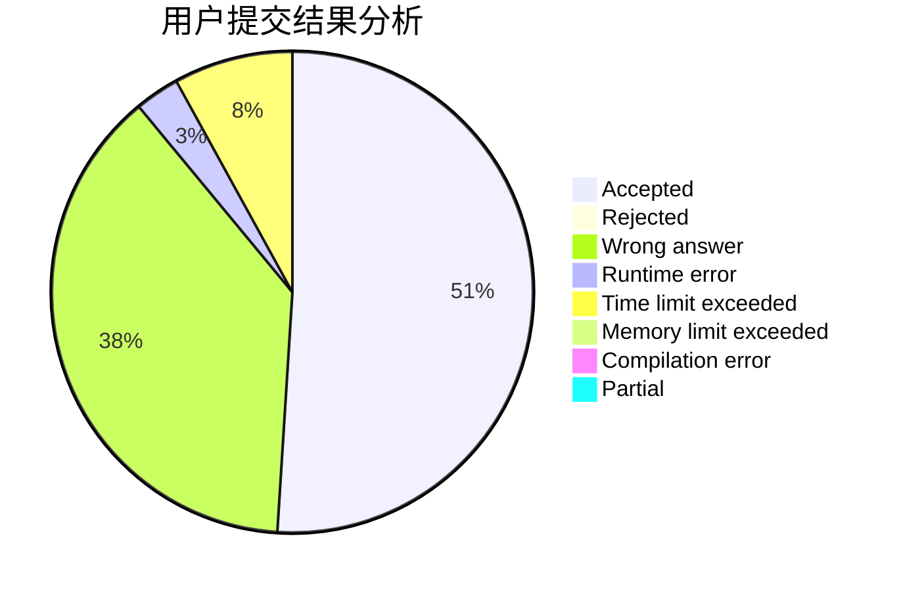
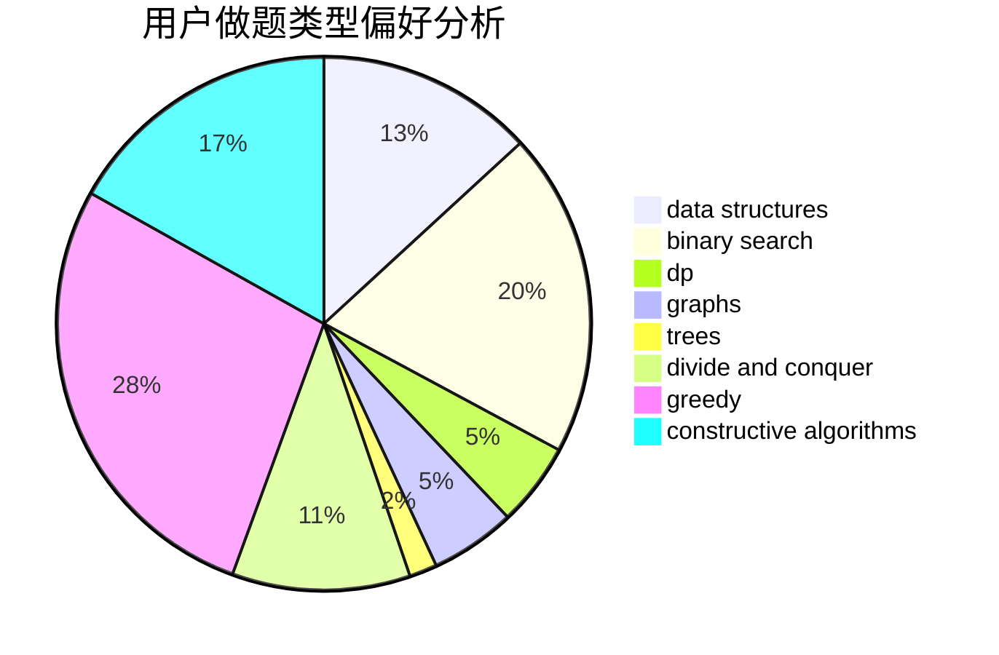
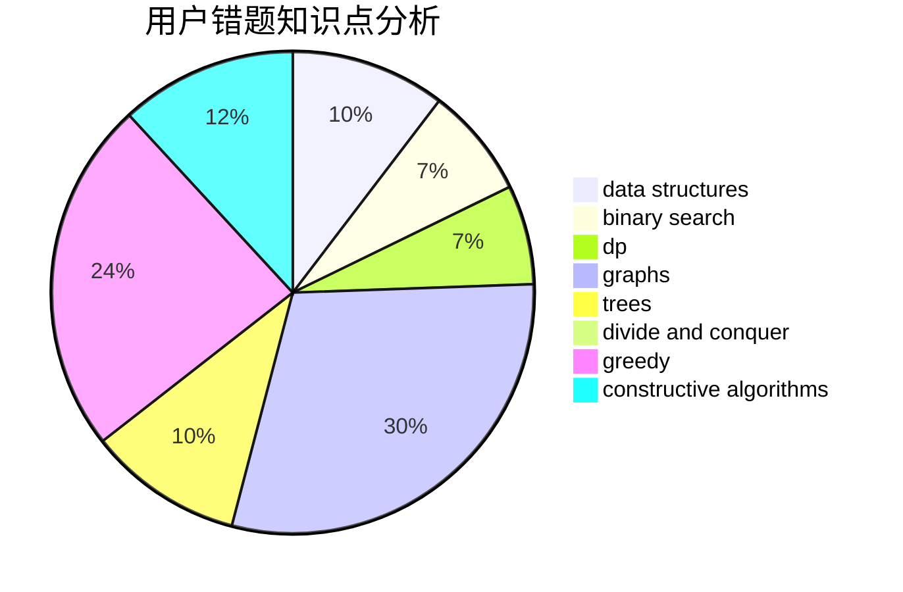

# Wolfycz
<!-- tabs:start -->
#### **用户提交结果分析**

#### **用户做题类型偏好分析**

#### **用户错题知识点分析**

<!-- tabs:end -->
# 推荐题目
[Steps to One](http://codeforces.com/problemset/problem/1139/D)		dp,
                        math,
                        number theory,
                        probabilities		  
[Unordered Subsequence](http://codeforces.com/problemset/problem/27/C)		constructive algorithms,
                        greedy		  
[Not Same](https://codeforces.com/contest/1261/problem/E)		constructive algorithms		  
[Cd and pwd commands](http://codeforces.com/problemset/problem/158/C)		*special problem,
                        data structures,
                        implementation		  
[Stars Drawing (Hard Edition)](http://codeforces.com/problemset/problem/1015/E2)		binary search,
                        dp,
                        greedy		  
[Bug in Code](http://codeforces.com/problemset/problem/420/C)		data structures,
                        graphs,
                        implementation,
                        two pointers		  
[Tokitsukaze and Duel](http://codeforces.com/problemset/problem/1190/C)		brute force,
                        games,
                        greedy		  
[Shawarma Tent](http://codeforces.com/problemset/problem/1271/C)		brute force,
                        geometry,
                        greedy,
                        implementation		  
[Armistice Area Apportionment](http://codeforces.com/problemset/problem/645/G)		binary search,
                        geometry		  
[Books Queries](https://codeforces.com/contest/1489/problem/E)		implementation		  
<!-- tabs:start -->
#### **data structures**
[Steps to One](http://codeforces.com/problemset/problem/158/C)		*special problem,
                        data structures,
                        implementation		  
[Unordered Subsequence](http://codeforces.com/problemset/problem/420/C)		data structures,
                        graphs,
                        implementation,
                        two pointers		  
[Not Same](http://codeforces.com/problemset/problem/174/C)		data structures,
                        greedy		  
[Cd and pwd commands](http://codeforces.com/problemset/problem/633/C)		data structures,
                        dp,
                        hashing,
                        implementation,
                        sortings,
                        string suffix structures,
                        strings		  
[Stars Drawing (Hard Edition)](http://codeforces.com/problemset/problem/930/D)		data structures,
                        games,
                        implementation		  
[Bug in Code](http://codeforces.com/problemset/problem/263/E)		brute force,
                        data structures,
                        dp		  
[Tokitsukaze and Duel](http://codeforces.com/problemset/problem/793/G)		data structures,
                        divide and conquer,
                        flows,
                        graph matchings		  
[Shawarma Tent](http://codeforces.com/problemset/problem/1234/D)		data structures		  
[Armistice Area Apportionment](http://codeforces.com/problemset/problem/1340/F)		brute force,
                        data structures,
                        hashing		  
[Books Queries](http://codeforces.com/problemset/problem/777/E)		brute force,
                        data structures,
                        dp,
                        greedy,
                        sortings		  
#### **binary search**
[Steps to One](http://codeforces.com/problemset/problem/1015/E2)		binary search,
                        dp,
                        greedy		  
[Unordered Subsequence](http://codeforces.com/problemset/problem/645/G)		binary search,
                        geometry		  
[Not Same](http://codeforces.com/problemset/problem/1293/A)		binary search,
                        brute force,
                        implementation		  
[Cd and pwd commands](http://codeforces.com/problemset/problem/776/C)		binary search,
                        brute force,
                        data structures,
                        implementation,
                        math		  
[Stars Drawing (Hard Edition)](http://codeforces.com/problemset/problem/1366/E)		binary search,
                        brute force,
                        combinatorics,
                        constructive algorithms,
                        dp,
                        two pointers		  
[Bug in Code](http://codeforces.com/problemset/problem/1301/C)		binary search,
                        combinatorics,
                        greedy,
                        math,
                        strings		  
[Tokitsukaze and Duel](http://codeforces.com/problemset/problem/1492/C)		binary search,
                        data structures,
                        dp,
                        greedy,
                        two pointers		  
[Shawarma Tent](http://codeforces.com/problemset/problem/1463/D)		binary search,
                        constructive algorithms,
                        greedy,
                        two pointers		  
[Armistice Area Apportionment](http://codeforces.com/problemset/problem/1490/G)		binary search,
                        data structures,
                        math		  
[Books Queries](http://codeforces.com/problemset/problem/1479/D)		binary search,
                        bitmasks,
                        brute force,
                        data structures,
                        probabilities,
                        trees		  
#### **dp**
[Steps to One](http://codeforces.com/problemset/problem/1139/D)		dp,
                        math,
                        number theory,
                        probabilities		  
[Unordered Subsequence](http://codeforces.com/problemset/problem/1015/E2)		binary search,
                        dp,
                        greedy		  
[Not Same](http://codeforces.com/problemset/problem/599/E)		bitmasks,
                        dp,
                        trees		  
[Cd and pwd commands](http://codeforces.com/problemset/problem/733/C)		constructive algorithms,
                        dp,
                        greedy,
                        two pointers		  
[Stars Drawing (Hard Edition)](http://codeforces.com/problemset/problem/1403/C)		*special problem,
                        combinatorics,
                        dp,
                        implementation,
                        math		  
[Bug in Code](http://codeforces.com/problemset/problem/633/C)		data structures,
                        dp,
                        hashing,
                        implementation,
                        sortings,
                        string suffix structures,
                        strings		  
[Tokitsukaze and Duel](http://codeforces.com/problemset/problem/1066/F)		dp		  
[Shawarma Tent](http://codeforces.com/problemset/problem/547/C)		bitmasks,
                        combinatorics,
                        dp,
                        math,
                        number theory		  
[Armistice Area Apportionment](http://codeforces.com/problemset/problem/263/E)		brute force,
                        data structures,
                        dp		  
[Books Queries](http://codeforces.com/problemset/problem/1423/J)		bitmasks,
                        constructive algorithms,
                        dp,
                        math		  
#### **graph**
[Steps to One](http://codeforces.com/problemset/problem/420/C)		data structures,
                        graphs,
                        implementation,
                        two pointers		  
[Unordered Subsequence](http://codeforces.com/problemset/problem/25/C)		graphs,
                        shortest paths		  
[Not Same](http://codeforces.com/problemset/problem/1473/E)		graphs,
                        shortest paths		  
[Cd and pwd commands](http://codeforces.com/problemset/problem/793/G)		data structures,
                        divide and conquer,
                        flows,
                        graph matchings		  
[Stars Drawing (Hard Edition)](https://codeforces.com/contest/1104/problem/E)		constructive algorithms,
                        dfs and similar,
                        graphs,
                        math		  
[Bug in Code](http://codeforces.com/problemset/problem/730/I)		dp,
                        flows,
                        graphs,
                        greedy		  
[Tokitsukaze and Duel](http://codeforces.com/problemset/problem/1487/C)		brute force,
                        constructive algorithms,
                        dfs and similar,
                        graphs,
                        greedy,
                        implementation,
                        math		  
[Shawarma Tent](http://codeforces.com/problemset/problem/1437/C)		dp,
                        flows,
                        graph matchings,
                        greedy,
                        math,
                        sortings		  
[Armistice Area Apportionment](http://codeforces.com/problemset/problem/1470/D)		constructive algorithms,
                        dfs and similar,
                        graph matchings,
                        graphs,
                        greedy		  
[Books Queries](http://codeforces.com/problemset/problem/1476/C)		dp,
                        graphs,
                        greedy		  
#### **trees**
[Steps to One](http://codeforces.com/problemset/problem/599/E)		bitmasks,
                        dp,
                        trees		  
[Unordered Subsequence](http://codeforces.com/problemset/problem/516/D)		dfs and similar,
                        dp,
                        dsu,
                        trees,
                        two pointers		  
[Not Same](http://codeforces.com/problemset/problem/1479/D)		binary search,
                        bitmasks,
                        brute force,
                        data structures,
                        probabilities,
                        trees		  
[Cd and pwd commands](http://codeforces.com/problemset/problem/1511/C)		brute force,
                        data structures,
                        implementation,
                        trees		  
[Stars Drawing (Hard Edition)](http://codeforces.com/problemset/problem/1499/F)		combinatorics,
                        dfs and similar,
                        dp,
                        trees		  
[Bug in Code](http://codeforces.com/problemset/problem/1491/E)		brute force,
                        dfs and similar,
                        divide and conquer,
                        number theory,
                        trees		  
[Tokitsukaze and Duel](http://codeforces.com/problemset/problem/1466/D)		data structures,
                        greedy,
                        sortings,
                        trees		  
[Shawarma Tent](http://codeforces.com/problemset/problem/1495/D)		combinatorics,
                        dfs and similar,
                        graphs,
                        math,
                        shortest paths,
                        trees		  
[Armistice Area Apportionment](http://codeforces.com/problemset/problem/1303/G)		data structures,
                        divide and conquer,
                        geometry,
                        trees		  
[Books Queries](http://codeforces.com/problemset/problem/1454/E)		combinatorics,
                        dfs and similar,
                        graphs,
                        trees		  
#### **divide and conquer**
[Steps to One](http://codeforces.com/problemset/problem/793/G)		data structures,
                        divide and conquer,
                        flows,
                        graph matchings		  
[Unordered Subsequence](http://codeforces.com/problemset/problem/1316/F)		data structures,
                        divide and conquer,
                        probabilities		  
[Not Same](http://codeforces.com/problemset/problem/1461/D)		binary search,
                        brute force,
                        data structures,
                        divide and conquer,
                        implementation,
                        sortings		  
[Cd and pwd commands](http://codeforces.com/problemset/problem/1466/G)		combinatorics,
                        divide and conquer,
                        hashing,
                        math,
                        string suffix structures,
                        strings		  
[Stars Drawing (Hard Edition)](http://codeforces.com/problemset/problem/1490/D)		dfs and similar,
                        divide and conquer,
                        implementation		  
[Bug in Code](https://codeforces.com/contest/1483/problem/C)		data structures,
                        divide and conquer,
                        dp		  
[Tokitsukaze and Duel](http://codeforces.com/problemset/problem/1491/E)		brute force,
                        dfs and similar,
                        divide and conquer,
                        number theory,
                        trees		  
[Shawarma Tent](http://codeforces.com/problemset/problem/1303/G)		data structures,
                        divide and conquer,
                        geometry,
                        trees		  
[Armistice Area Apportionment](http://codeforces.com/problemset/problem/1494/D)		constructive algorithms,
                        data structures,
                        dfs and similar,
                        divide and conquer,
                        dsu,
                        greedy,
                        sortings,
                        trees		  
[Books Queries](http://codeforces.com/problemset/problem/1482/E)		data structures,
                        divide and conquer,
                        dp		  
#### **greedy**
[Steps to One](http://codeforces.com/problemset/problem/27/C)		constructive algorithms,
                        greedy		  
[Unordered Subsequence](http://codeforces.com/problemset/problem/1015/E2)		binary search,
                        dp,
                        greedy		  
[Not Same](http://codeforces.com/problemset/problem/1190/C)		brute force,
                        games,
                        greedy		  
[Cd and pwd commands](http://codeforces.com/problemset/problem/1271/C)		brute force,
                        geometry,
                        greedy,
                        implementation		  
[Stars Drawing (Hard Edition)](http://codeforces.com/problemset/problem/174/C)		data structures,
                        greedy		  
[Bug in Code](http://codeforces.com/problemset/problem/67/B)		greedy		  
[Tokitsukaze and Duel](http://codeforces.com/problemset/problem/733/C)		constructive algorithms,
                        dp,
                        greedy,
                        two pointers		  
[Shawarma Tent](http://codeforces.com/problemset/problem/468/A)		constructive algorithms,
                        greedy,
                        math		  
[Armistice Area Apportionment](http://codeforces.com/problemset/problem/3/A)		greedy,
                        shortest paths		  
[Books Queries](http://codeforces.com/problemset/problem/1474/E)		constructive algorithms,
                        greedy		  
#### **constructive algorithms**
[Steps to One](http://codeforces.com/problemset/problem/27/C)		constructive algorithms,
                        greedy		  
[Unordered Subsequence](https://codeforces.com/contest/1261/problem/E)		constructive algorithms		  
[Not Same](http://codeforces.com/problemset/problem/733/C)		constructive algorithms,
                        dp,
                        greedy,
                        two pointers		  
[Cd and pwd commands](http://codeforces.com/problemset/problem/468/A)		constructive algorithms,
                        greedy,
                        math		  
[Stars Drawing (Hard Edition)](https://codeforces.com/contest/1113/problem/D)		constructive algorithms,
                        hashing,
                        strings		  
[Bug in Code](http://codeforces.com/problemset/problem/1474/E)		constructive algorithms,
                        greedy		  
[Tokitsukaze and Duel](http://codeforces.com/problemset/problem/1423/J)		bitmasks,
                        constructive algorithms,
                        dp,
                        math		  
[Shawarma Tent](http://codeforces.com/problemset/problem/268/C)		constructive algorithms,
                        implementation		  
[Armistice Area Apportionment](https://codeforces.com/contest/1104/problem/E)		constructive algorithms,
                        dfs and similar,
                        graphs,
                        math		  
[Books Queries](http://codeforces.com/problemset/problem/339/E)		constructive algorithms,
                        dfs and similar,
                        greedy		  
#### **sortings**
[Steps to One](http://codeforces.com/problemset/problem/633/C)		data structures,
                        dp,
                        hashing,
                        implementation,
                        sortings,
                        string suffix structures,
                        strings		  
[Unordered Subsequence](http://codeforces.com/problemset/problem/792/A)		implementation,
                        sortings		  
[Not Same](http://codeforces.com/problemset/problem/777/E)		brute force,
                        data structures,
                        dp,
                        greedy,
                        sortings		  
[Cd and pwd commands](http://codeforces.com/problemset/problem/1270/D)		constructive algorithms,
                        interactive,
                        math,
                        sortings		  
[Stars Drawing (Hard Edition)](https://codeforces.com/contest/1496/problem/C)		geometry,
                        greedy,
                        math,
                        sortings		  
[Bug in Code](http://codeforces.com/problemset/problem/1495/A)		geometry,
                        greedy,
                        math,
                        sortings		  
[Tokitsukaze and Duel](http://codeforces.com/problemset/problem/1497/A)		brute force,
                        data structures,
                        greedy,
                        sortings		  
[Shawarma Tent](http://codeforces.com/problemset/problem/1427/A)		math,
                        sortings		  
[Armistice Area Apportionment](http://codeforces.com/problemset/problem/1461/D)		binary search,
                        brute force,
                        data structures,
                        divide and conquer,
                        implementation,
                        sortings		  
[Books Queries](http://codeforces.com/problemset/problem/1437/C)		dp,
                        flows,
                        graph matchings,
                        greedy,
                        math,
                        sortings		  
<!-- tabs:end -->
