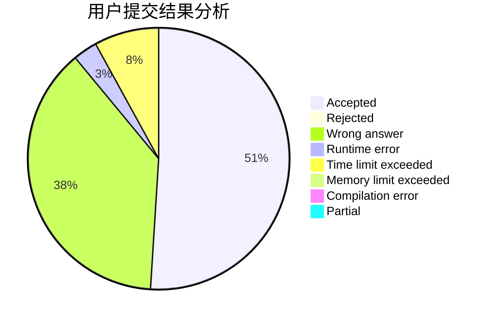
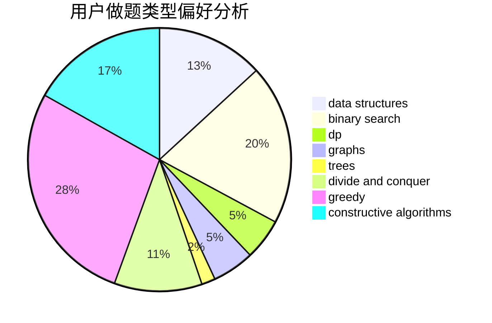
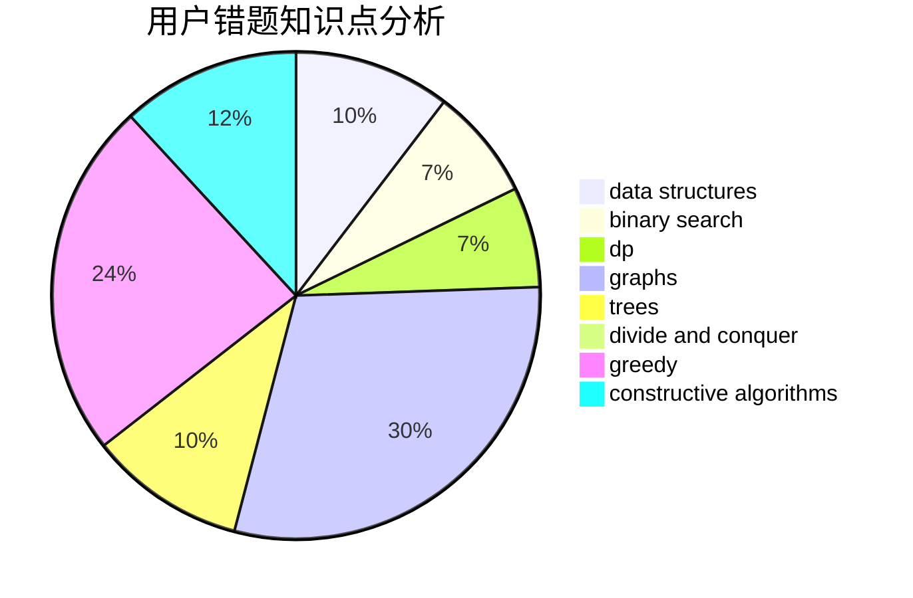

# Wolfycz

<!-- tabs:start -->

#### **用户提交结果分析**

#### **用户做题类型偏好分析**

#### **用户错题知识点分析**

<!-- tabs:end -->
# 推荐题目
[1473C](https://codeforces.com/contest/1473/problem/C)		constructive algorithms,
                        math		  
[1139D](https://codeforces.com/contest/1139/problem/D)		dp,
                        math,
                        number theory,
                        probabilities		  
[3A](https://codeforces.com/contest/3/problem/A)		greedy,
                        shortest paths		  
[645G](https://codeforces.com/contest/645/problem/G)		binary search,
                        geometry		  
[420C](https://codeforces.com/contest/420/problem/C)		data structures,
                        graphs,
                        implementation,
                        two pointers		  
[1015E2](https://codeforces.com/contest/1015E/problem/2)		binary search,
                        dp,
                        greedy		  
[1340F](https://codeforces.com/contest/1340/problem/F)		brute force,
                        data structures,
                        hashing		  
[27C](https://codeforces.com/contest/27/problem/C)		constructive algorithms,
                        greedy		  
[1473E](https://codeforces.com/contest/1473/problem/E)		graphs,
                        shortest paths		  
[1261E](https://codeforces.com/contest/1261/problem/E)		dsu,graphs,sortings,trees		  
