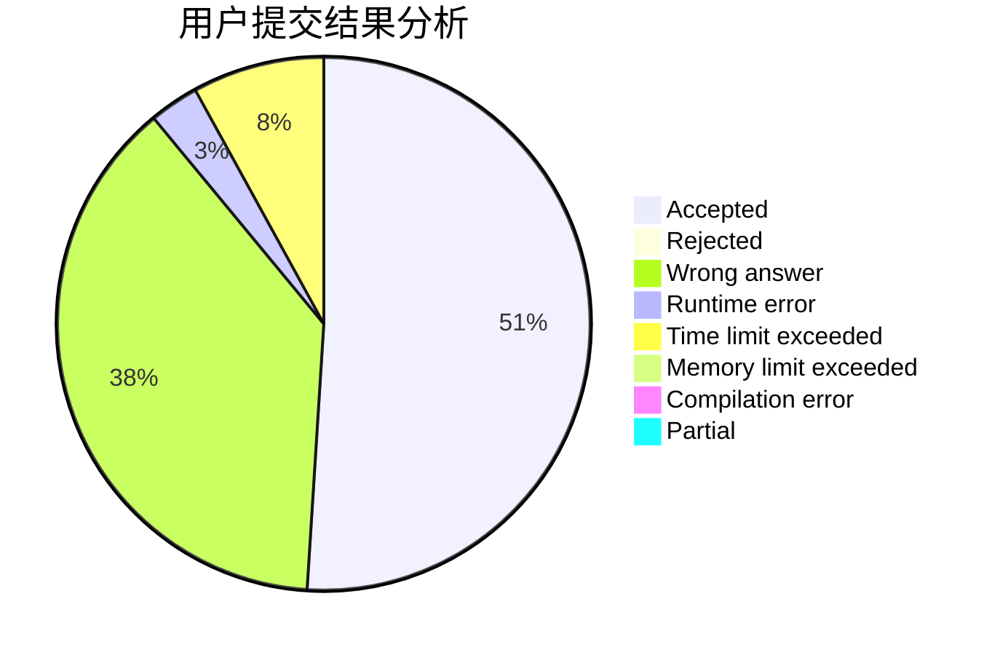
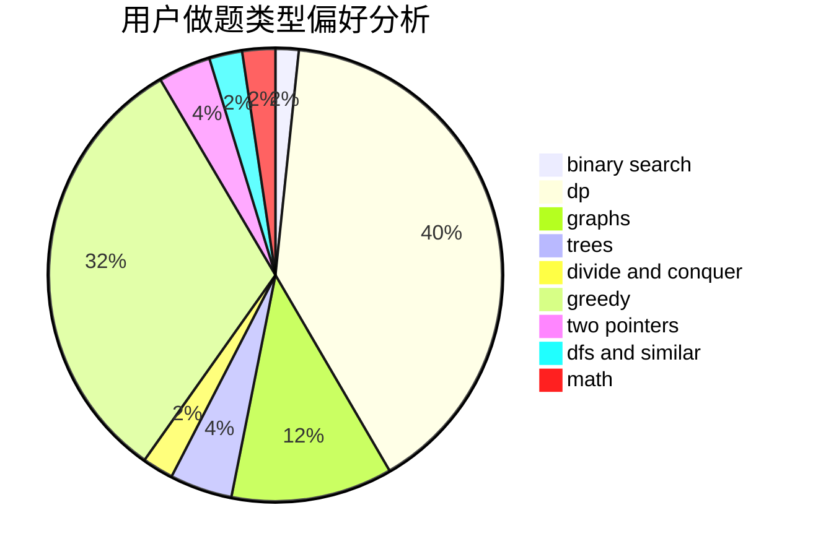

# Wolfycz

<!-- tabs:start -->

#### **用户提交结果分析**

#### **用户做题类型偏好分析**

<!-- tabs:end -->
# 推荐题目
[1481F](https://codeforces.com/contest/1481/problem/F)
[11411](https://codeforces.com/contest/1141/problem/1)
[429B](https://codeforces.com/contest/429/problem/B)
[672C](https://codeforces.com/contest/672/problem/C)
[446A](https://codeforces.com/contest/446/problem/A)
[1016B](https://codeforces.com/contest/1016/problem/B)
[1347E](https://codeforces.com/contest/1347/problem/E)
[295B](https://codeforces.com/contest/295/problem/B)
[1482B](https://codeforces.com/contest/1482/problem/B)
[1267F](https://codeforces.com/contest/1267/problem/F)
