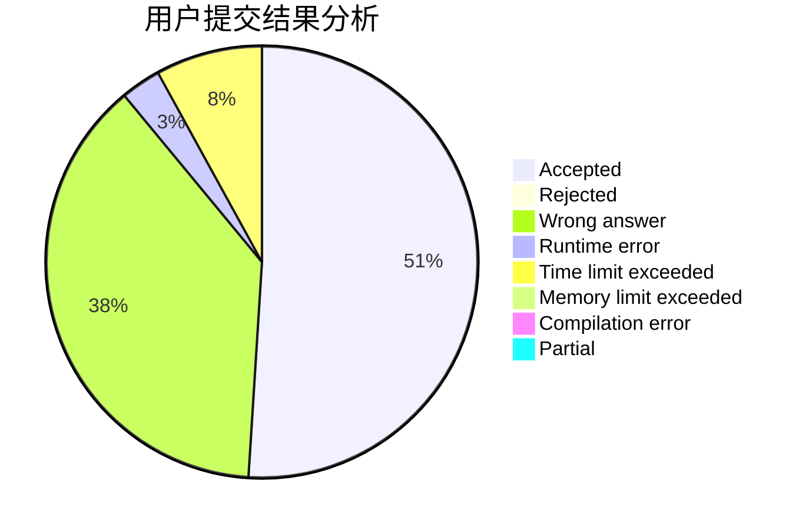
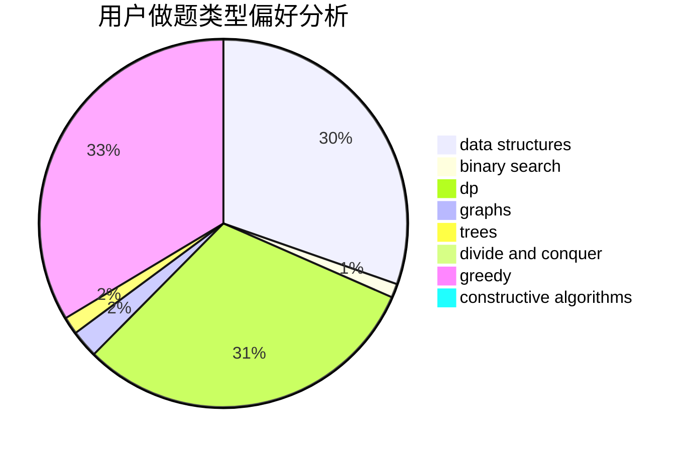
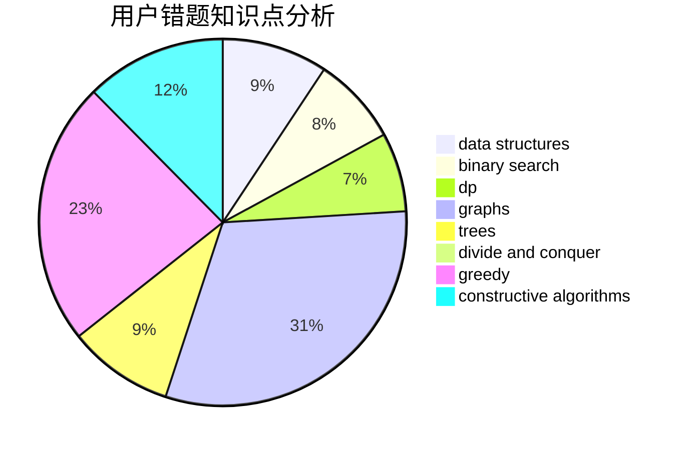

# Wolfycz

<!-- tabs:start -->

#### **用户提交结果分析**

#### **用户做题类型偏好分析**

#### **用户错题知识点分析**

<!-- tabs:end -->
# 推荐题目
[1481F](https://codeforces.com/contest/1481/problem/F)		dp,
                        greedy,
                        trees		  
[11411](https://codeforces.com/contest/1141/problem/1)		dsu,graphs,sortings,trees		  
[429B](https://codeforces.com/contest/429/problem/B)		dp		  
[672C](https://codeforces.com/contest/672/problem/C)		dsu,graphs,sortings,trees		  
[446A](https://codeforces.com/contest/446/problem/A)		dp,
                        implementation,
                        two pointers		  
[1016B](https://codeforces.com/contest/1016/problem/B)		brute force,
                        implementation		  
[1347E](https://codeforces.com/contest/1347/problem/E)		dsu,graphs,sortings,trees		  
[295B](https://codeforces.com/contest/295/problem/B)		dp,
                        graphs,
                        shortest paths		  
[1482B](https://codeforces.com/contest/1482/problem/B)		implementation,
                        math		  
[1267F](https://codeforces.com/contest/1267/problem/F)		graphs		  
