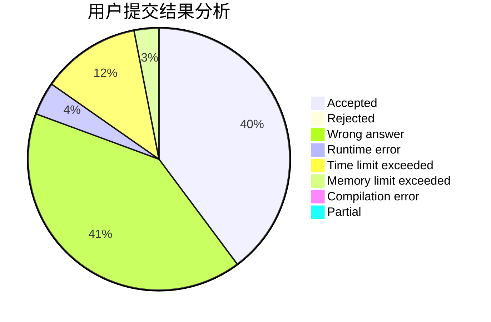
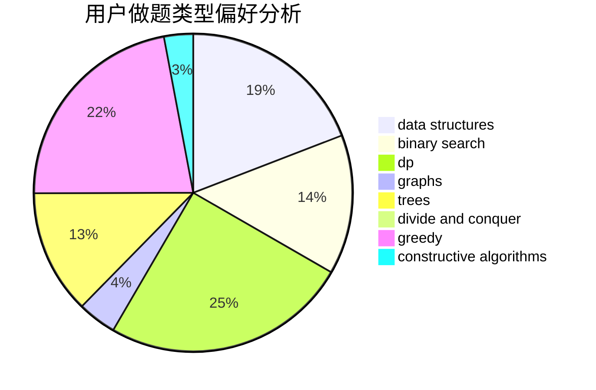
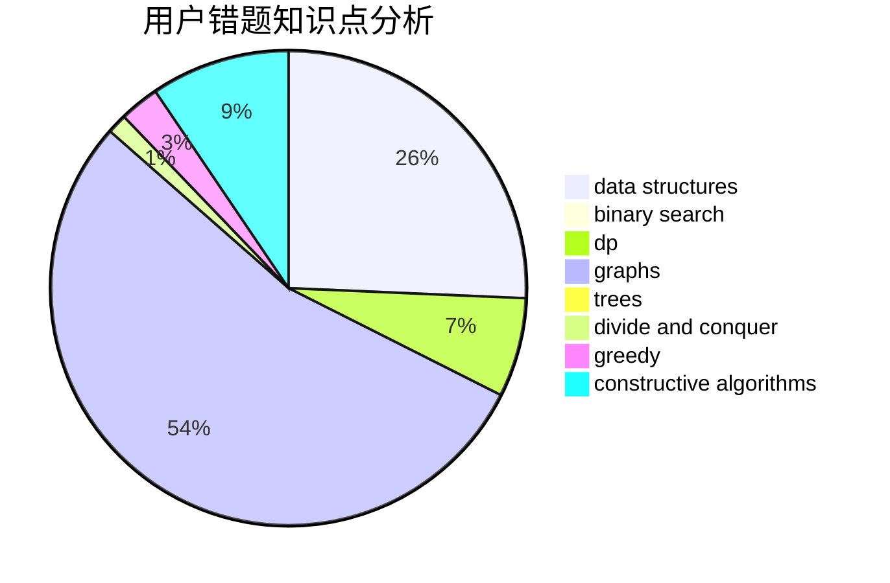

# WorldPigSuperman

<!-- tabs:start -->

#### **用户提交结果分析**

#### **用户做题类型偏好分析**

#### **用户错题知识点分析**

<!-- tabs:end -->
# 推荐题目
[600D](https://codeforces.com/contest/600/problem/D)		geometry		  
[15C](https://codeforces.com/contest/15/problem/C)		games		  
[1349C](https://codeforces.com/contest/1349/problem/C)		dfs and similar,
                        graphs,
                        implementation,
                        shortest paths		  
[664A](https://codeforces.com/contest/664/problem/A)		math,
                        number theory		  
[1201B](https://codeforces.com/contest/1201/problem/B)		greedy,
                        math		  
[847E](https://codeforces.com/contest/847/problem/E)		binary search,
                        dp		  
[843B](https://codeforces.com/contest/843/problem/B)		brute force,
                        interactive,
                        probabilities		  
[441C](https://codeforces.com/contest/441/problem/C)		constructive algorithms,
                        dfs and similar,
                        implementation		  
[908B](https://codeforces.com/contest/908/problem/B)		brute force,
                        implementation		  
[1140F](https://codeforces.com/contest/1140/problem/F)		data structures,
                        divide and conquer,
                        dsu		  
