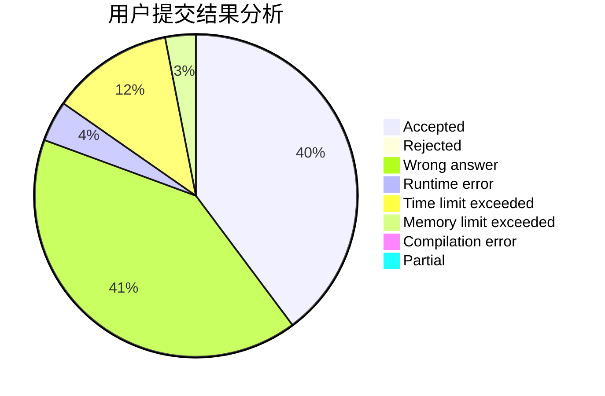
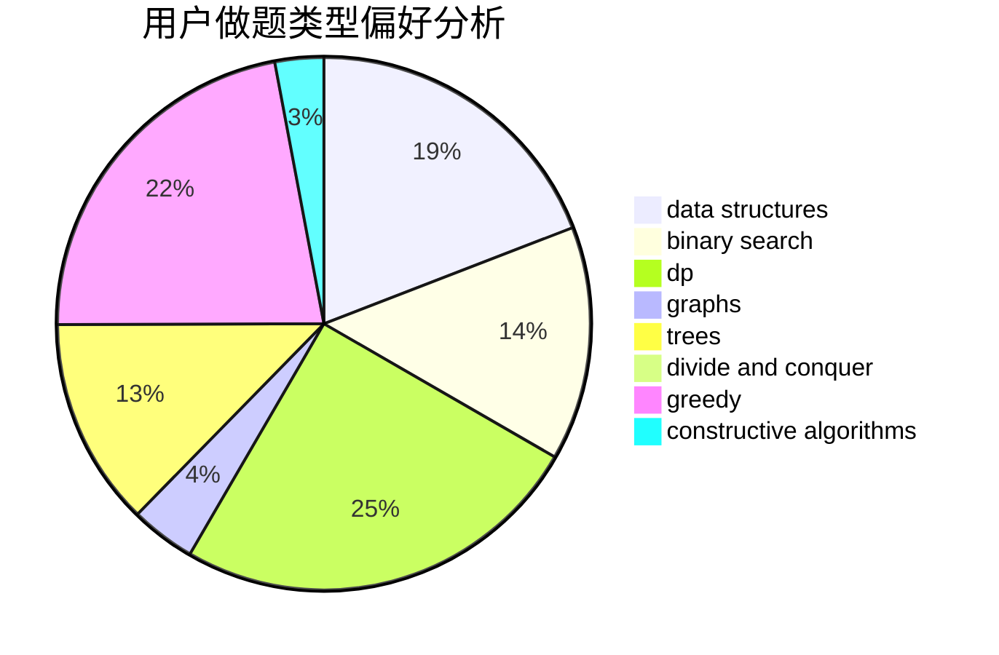
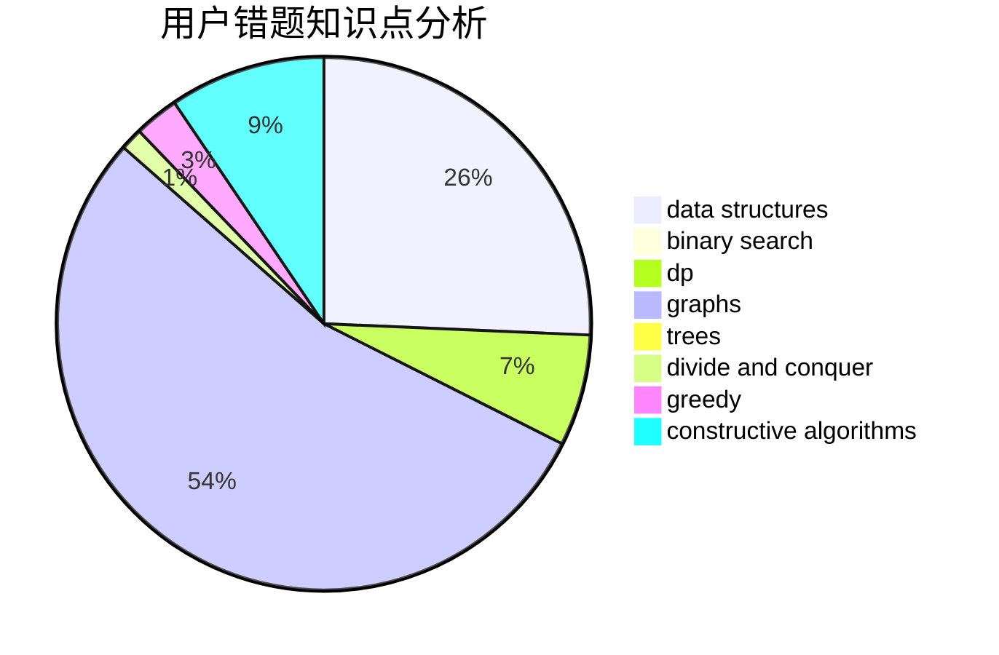

# WorldPigSuperman
<!-- tabs:start -->
#### **用户提交结果分析**

#### **用户做题类型偏好分析**

#### **用户错题知识点分析**

<!-- tabs:end -->
# 推荐题目
[Area of Two Circles' Intersection](http://codeforces.com/problemset/problem/600/D)		geometry		  
[Fools and Roads](http://codeforces.com/problemset/problem/191/C)		data structures,
                        dfs and similar,
                        trees		  
[Industrial Nim](http://codeforces.com/problemset/problem/15/C)		games		  
[Complicated GCD](http://codeforces.com/problemset/problem/664/A)		math,
                        number theory		  
[Packmen](http://codeforces.com/problemset/problem/847/E)		binary search,
                        dp		  
[Two-Paths](http://codeforces.com/problemset/problem/1000/G)		data structures,
                        dp,
                        trees		  
[Red-Black Cobweb](http://codeforces.com/problemset/problem/833/D)		data structures,
                        divide and conquer,
                        implementation,
                        trees		  
[Interactive LowerBound](http://codeforces.com/problemset/problem/843/B)		brute force,
                        interactive,
                        probabilities		  
[Death Stars (medium)](http://codeforces.com/problemset/problem/958/A2)		hashing,
                        strings		  
[New Year and Buggy Bot](http://codeforces.com/problemset/problem/908/B)		brute force,
                        implementation		  
<!-- tabs:start -->
#### **data structures**
[Area of Two Circles' Intersection](http://codeforces.com/problemset/problem/191/C)		data structures,
                        dfs and similar,
                        trees		  
[Fools and Roads](http://codeforces.com/problemset/problem/1000/G)		data structures,
                        dp,
                        trees		  
[Industrial Nim](http://codeforces.com/problemset/problem/833/D)		data structures,
                        divide and conquer,
                        implementation,
                        trees		  
[Complicated GCD](http://codeforces.com/problemset/problem/1140/F)		data structures,
                        divide and conquer,
                        dsu		  
[Packmen](http://codeforces.com/problemset/problem/720/D)		data structures,
                        dp,
                        sortings		  
[Two-Paths](http://codeforces.com/problemset/problem/1223/F)		data structures,
                        divide and conquer,
                        dp,
                        hashing		  
[Red-Black Cobweb](http://codeforces.com/problemset/problem/266/E)		data structures,
                        math		  
[Interactive LowerBound](http://codeforces.com/problemset/problem/954/G)		binary search,
                        data structures,
                        greedy,
                        two pointers		  
[Death Stars (medium)](http://codeforces.com/problemset/problem/620/F)		data structures,
                        strings,
                        trees		  
[New Year and Buggy Bot](http://codeforces.com/problemset/problem/235/C)		data structures,
                        string suffix structures,
                        strings		  
#### **binary search**
[Area of Two Circles' Intersection](http://codeforces.com/problemset/problem/847/E)		binary search,
                        dp		  
[Fools and Roads](http://codeforces.com/problemset/problem/613/A)		binary search,
                        geometry,
                        ternary search		  
[Industrial Nim](http://codeforces.com/problemset/problem/785/C)		binary search,
                        math		  
[Complicated GCD](http://codeforces.com/problemset/problem/1370/D)		binary search,
                        dp,
                        dsu,
                        greedy,
                        implementation		  
[Packmen](http://codeforces.com/problemset/problem/525/E)		binary search,
                        bitmasks,
                        brute force,
                        dp,
                        math,
                        meet-in-the-middle		  
[Two-Paths](http://codeforces.com/problemset/problem/954/G)		binary search,
                        data structures,
                        greedy,
                        two pointers		  
[Red-Black Cobweb](http://codeforces.com/problemset/problem/1492/C)		binary search,
                        data structures,
                        dp,
                        greedy,
                        two pointers		  
[Interactive LowerBound](http://codeforces.com/problemset/problem/1463/D)		binary search,
                        constructive algorithms,
                        greedy,
                        two pointers		  
[Death Stars (medium)](http://codeforces.com/problemset/problem/1490/G)		binary search,
                        data structures,
                        math		  
[New Year and Buggy Bot](http://codeforces.com/problemset/problem/1479/D)		binary search,
                        bitmasks,
                        brute force,
                        data structures,
                        probabilities,
                        trees		  
#### **dp**
[Area of Two Circles' Intersection](http://codeforces.com/problemset/problem/847/E)		binary search,
                        dp		  
[Fools and Roads](http://codeforces.com/problemset/problem/1000/G)		data structures,
                        dp,
                        trees		  
[Industrial Nim](http://codeforces.com/problemset/problem/1256/E)		dp,
                        greedy,
                        sortings		  
[Complicated GCD](http://codeforces.com/problemset/problem/856/D)		dp,
                        trees		  
[Packmen](http://codeforces.com/problemset/problem/1234/F)		bitmasks,
                        dp		  
[Two-Paths](http://codeforces.com/problemset/problem/720/D)		data structures,
                        dp,
                        sortings		  
[Red-Black Cobweb](http://codeforces.com/problemset/problem/1223/F)		data structures,
                        divide and conquer,
                        dp,
                        hashing		  
[Interactive LowerBound](http://codeforces.com/problemset/problem/1370/D)		binary search,
                        dp,
                        dsu,
                        greedy,
                        implementation		  
[Death Stars (medium)](http://codeforces.com/problemset/problem/407/B)		dp,
                        implementation		  
[New Year and Buggy Bot](https://codeforces.com/contest/259/problem/D)		brute force,
                        combinatorics,
                        dp		  
#### **graph**
[Area of Two Circles' Intersection](http://codeforces.com/problemset/problem/1205/B)		bitmasks,
                        brute force,
                        graphs,
                        shortest paths		  
[Fools and Roads](http://codeforces.com/problemset/problem/1082/D)		constructive algorithms,
                        graphs,
                        implementation		  
[Industrial Nim](http://codeforces.com/problemset/problem/884/F)		flows,
                        graphs,
                        greedy		  
[Complicated GCD](http://codeforces.com/problemset/problem/762/F)		combinatorics,
                        graphs,
                        trees		  
[Packmen](http://codeforces.com/problemset/problem/915/D)		dfs and similar,
                        graphs		  
[Two-Paths](http://codeforces.com/problemset/problem/1349/C)		dfs and similar,
                        graphs,
                        implementation,
                        shortest paths		  
[Red-Black Cobweb](http://codeforces.com/problemset/problem/1268/D)		brute force,
                        divide and conquer,
                        graphs,
                        math		  
[Interactive LowerBound](http://codeforces.com/problemset/problem/1487/C)		brute force,
                        constructive algorithms,
                        dfs and similar,
                        graphs,
                        greedy,
                        implementation,
                        math		  
[Death Stars (medium)](http://codeforces.com/problemset/problem/1437/C)		dp,
                        flows,
                        graph matchings,
                        greedy,
                        math,
                        sortings		  
[New Year and Buggy Bot](http://codeforces.com/problemset/problem/1470/D)		constructive algorithms,
                        dfs and similar,
                        graph matchings,
                        graphs,
                        greedy		  
#### **trees**
[Area of Two Circles' Intersection](http://codeforces.com/problemset/problem/191/C)		data structures,
                        dfs and similar,
                        trees		  
[Fools and Roads](http://codeforces.com/problemset/problem/1000/G)		data structures,
                        dp,
                        trees		  
[Industrial Nim](http://codeforces.com/problemset/problem/833/D)		data structures,
                        divide and conquer,
                        implementation,
                        trees		  
[Complicated GCD](http://codeforces.com/problemset/problem/856/D)		dp,
                        trees		  
[Packmen](http://codeforces.com/problemset/problem/762/F)		combinatorics,
                        graphs,
                        trees		  
[Two-Paths](http://codeforces.com/problemset/problem/620/F)		data structures,
                        strings,
                        trees		  
[Red-Black Cobweb](http://codeforces.com/problemset/problem/1479/D)		binary search,
                        bitmasks,
                        brute force,
                        data structures,
                        probabilities,
                        trees		  
[Interactive LowerBound](http://codeforces.com/problemset/problem/1511/C)		brute force,
                        data structures,
                        implementation,
                        trees		  
[Death Stars (medium)](http://codeforces.com/problemset/problem/1499/F)		combinatorics,
                        dfs and similar,
                        dp,
                        trees		  
[New Year and Buggy Bot](http://codeforces.com/problemset/problem/1491/E)		brute force,
                        dfs and similar,
                        divide and conquer,
                        number theory,
                        trees		  
#### **divide and conquer**
[Area of Two Circles' Intersection](http://codeforces.com/problemset/problem/833/D)		data structures,
                        divide and conquer,
                        implementation,
                        trees		  
[Fools and Roads](http://codeforces.com/problemset/problem/1140/F)		data structures,
                        divide and conquer,
                        dsu		  
[Industrial Nim](http://codeforces.com/problemset/problem/1223/F)		data structures,
                        divide and conquer,
                        dp,
                        hashing		  
[Complicated GCD](http://codeforces.com/problemset/problem/1268/D)		brute force,
                        divide and conquer,
                        graphs,
                        math		  
[Packmen](http://codeforces.com/problemset/problem/1461/D)		binary search,
                        brute force,
                        data structures,
                        divide and conquer,
                        implementation,
                        sortings		  
[Two-Paths](http://codeforces.com/problemset/problem/1466/G)		combinatorics,
                        divide and conquer,
                        hashing,
                        math,
                        string suffix structures,
                        strings		  
[Red-Black Cobweb](http://codeforces.com/problemset/problem/1490/D)		dfs and similar,
                        divide and conquer,
                        implementation		  
[Interactive LowerBound](https://codeforces.com/contest/1483/problem/C)		data structures,
                        divide and conquer,
                        dp		  
[Death Stars (medium)](http://codeforces.com/problemset/problem/1491/E)		brute force,
                        dfs and similar,
                        divide and conquer,
                        number theory,
                        trees		  
[New Year and Buggy Bot](http://codeforces.com/problemset/problem/1303/G)		data structures,
                        divide and conquer,
                        geometry,
                        trees		  
#### **greedy**
[Area of Two Circles' Intersection](http://codeforces.com/problemset/problem/1256/E)		dp,
                        greedy,
                        sortings		  
[Fools and Roads](http://codeforces.com/problemset/problem/884/F)		flows,
                        graphs,
                        greedy		  
[Industrial Nim](http://codeforces.com/problemset/problem/1370/D)		binary search,
                        dp,
                        dsu,
                        greedy,
                        implementation		  
[Complicated GCD](http://codeforces.com/problemset/problem/1201/B)		greedy,
                        math		  
[Packmen](http://codeforces.com/problemset/problem/1009/C)		greedy,
                        math		  
[Two-Paths](http://codeforces.com/problemset/problem/1388/B)		greedy,
                        math		  
[Red-Black Cobweb](http://codeforces.com/problemset/problem/954/G)		binary search,
                        data structures,
                        greedy,
                        two pointers		  
[Interactive LowerBound](http://codeforces.com/problemset/problem/1493/A)		constructive algorithms,
                        greedy		  
[Death Stars (medium)](http://codeforces.com/problemset/problem/490/A)		greedy,
                        implementation,
                        sortings		  
[New Year and Buggy Bot](http://codeforces.com/problemset/problem/1326/C)		combinatorics,
                        greedy,
                        math		  
#### **constructive algorithms**
[Area of Two Circles' Intersection](http://codeforces.com/problemset/problem/1082/D)		constructive algorithms,
                        graphs,
                        implementation		  
[Fools and Roads](http://codeforces.com/problemset/problem/441/C)		constructive algorithms,
                        dfs and similar,
                        implementation		  
[Industrial Nim](http://codeforces.com/problemset/problem/1136/C)		constructive algorithms,
                        sortings		  
[Complicated GCD](http://codeforces.com/problemset/problem/1423/J)		bitmasks,
                        constructive algorithms,
                        dp,
                        math		  
[Packmen](http://codeforces.com/problemset/problem/1493/A)		constructive algorithms,
                        greedy		  
[Two-Paths](http://codeforces.com/problemset/problem/1493/A)		constructive algorithms,
                        greedy		  
[Red-Black Cobweb](http://codeforces.com/problemset/problem/1463/D)		binary search,
                        constructive algorithms,
                        greedy,
                        two pointers		  
[Interactive LowerBound](https://codeforces.com/contest/1456/problem/B)		bitmasks,
                        brute force,
                        constructive algorithms		  
[Death Stars (medium)](http://codeforces.com/problemset/problem/1492/D)		bitmasks,
                        constructive algorithms,
                        greedy,
                        math		  
[New Year and Buggy Bot](https://codeforces.com/contest/1504/problem/D)		constructive algorithms,
                        games,
                        interactive		  
#### **sortings**
[Area of Two Circles' Intersection](http://codeforces.com/problemset/problem/1256/E)		dp,
                        greedy,
                        sortings		  
[Fools and Roads](http://codeforces.com/problemset/problem/1136/C)		constructive algorithms,
                        sortings		  
[Industrial Nim](http://codeforces.com/problemset/problem/720/D)		data structures,
                        dp,
                        sortings		  
[Complicated GCD](http://codeforces.com/problemset/problem/490/A)		greedy,
                        implementation,
                        sortings		  
[Packmen](https://codeforces.com/contest/1496/problem/C)		geometry,
                        greedy,
                        math,
                        sortings		  
[Two-Paths](http://codeforces.com/problemset/problem/1495/A)		geometry,
                        greedy,
                        math,
                        sortings		  
[Red-Black Cobweb](http://codeforces.com/problemset/problem/1497/A)		brute force,
                        data structures,
                        greedy,
                        sortings		  
[Interactive LowerBound](http://codeforces.com/problemset/problem/1427/A)		math,
                        sortings		  
[Death Stars (medium)](http://codeforces.com/problemset/problem/1461/D)		binary search,
                        brute force,
                        data structures,
                        divide and conquer,
                        implementation,
                        sortings		  
[New Year and Buggy Bot](http://codeforces.com/problemset/problem/1437/C)		dp,
                        flows,
                        graph matchings,
                        greedy,
                        math,
                        sortings		  
<!-- tabs:end -->
