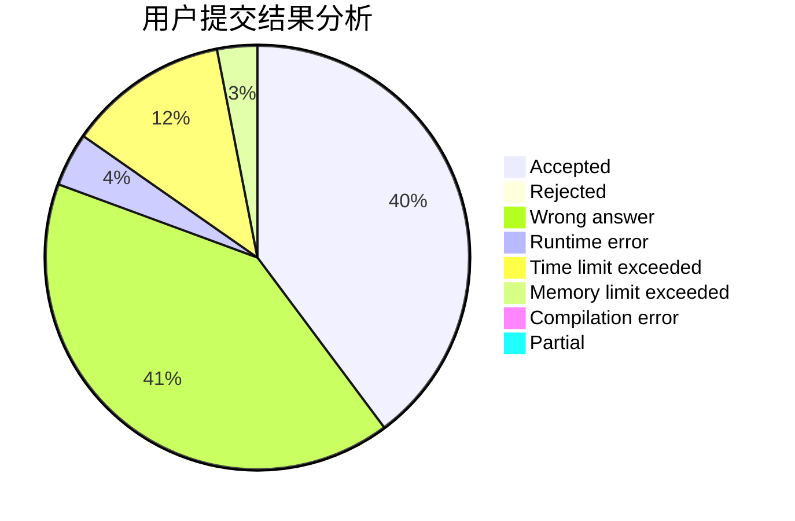
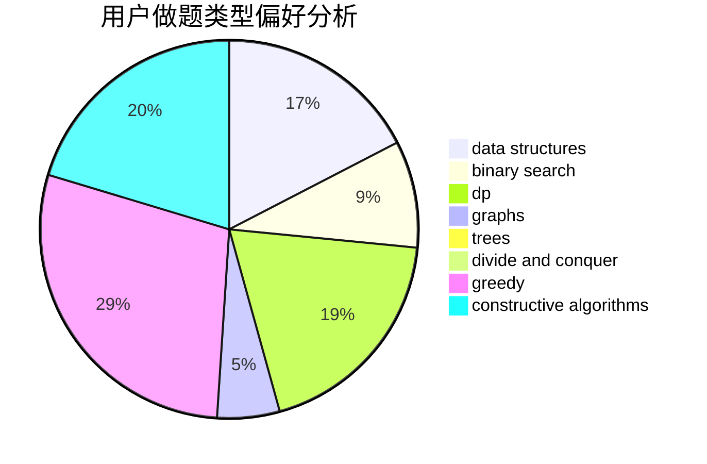
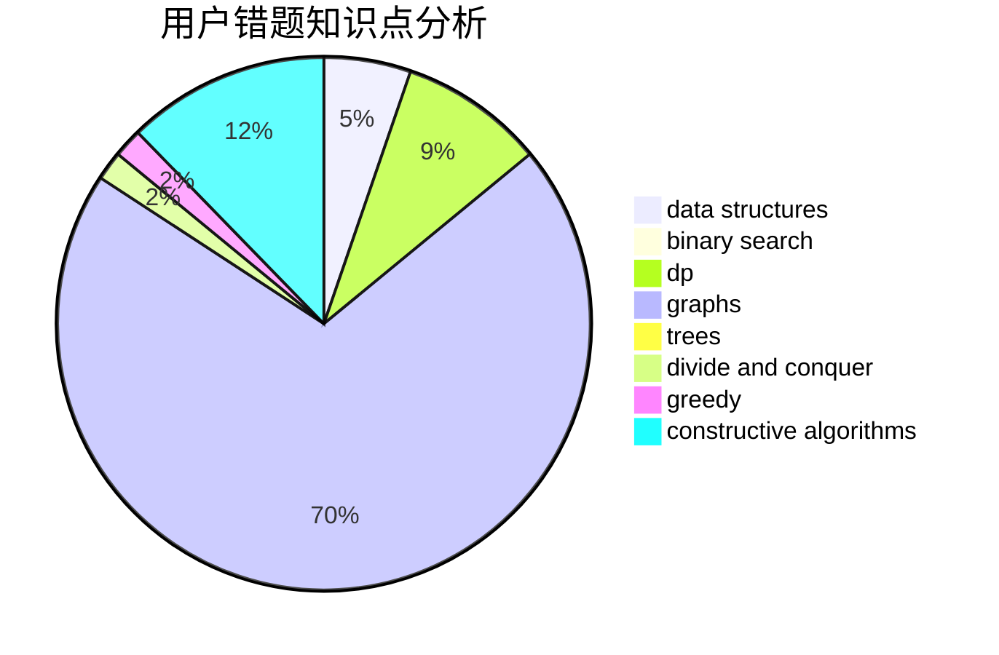

# WorldPigSuperman

<!-- tabs:start -->

#### **用户提交结果分析**

#### **用户做题类型偏好分析**

#### **用户错题知识点分析**

<!-- tabs:end -->
# 推荐题目
[61E](https://codeforces.com/contest/61/problem/E)		data structures,
                        trees		  
[182D](https://codeforces.com/contest/182/problem/D)		brute force,
                        hashing,
                        implementation,
                        math,
                        strings		  
[13561](https://codeforces.com/contest/1356/problem/1)		dsu,graphs,sortings,trees		  
[683B](https://codeforces.com/contest/683/problem/B)		*special problem		  
[1205F](https://codeforces.com/contest/1205/problem/F)		constructive algorithms,
                        math		  
[865D](https://codeforces.com/contest/865/problem/D)		constructive algorithms,
                        data structures,
                        greedy		  
[862D](https://codeforces.com/contest/862/problem/D)		binary search,
                        divide and conquer,
                        interactive		  
[462A](https://codeforces.com/contest/462/problem/A)		brute force,
                        implementation		  
[922C](https://codeforces.com/contest/922/problem/C)		brute force,
                        number theory		  
[1142D](https://codeforces.com/contest/1142/problem/D)		dp		  
