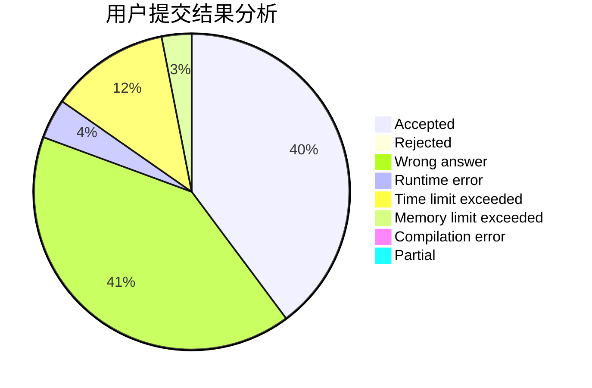
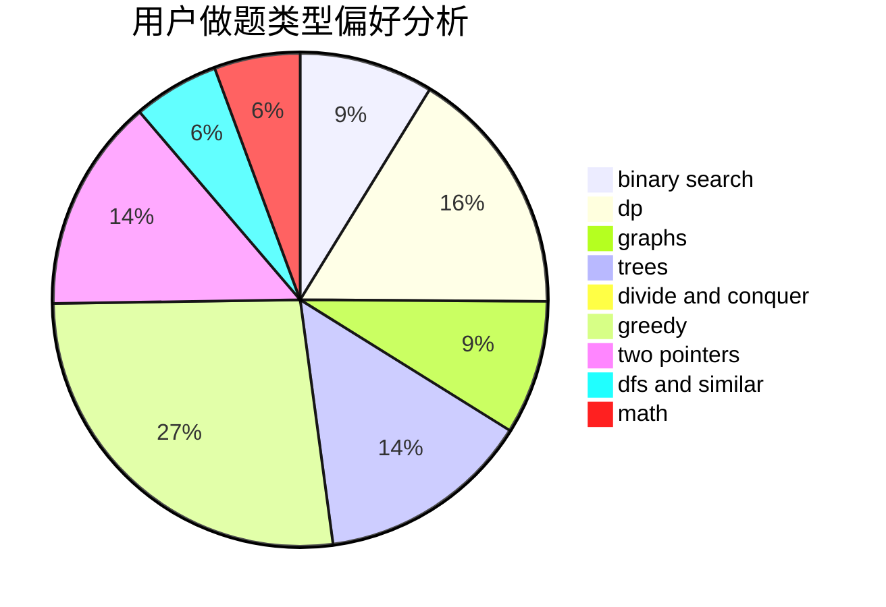

# WorldPigSuperman

<!-- tabs:start -->

#### **用户提交结果分析**

#### **用户做题类型偏好分析**

<!-- tabs:end -->
# 推荐题目
[61E](https://codeforces.com/contest/61/problem/E)
[182D](https://codeforces.com/contest/182/problem/D)
[13561](https://codeforces.com/contest/1356/problem/1)
[683B](https://codeforces.com/contest/683/problem/B)
[1205F](https://codeforces.com/contest/1205/problem/F)
[865D](https://codeforces.com/contest/865/problem/D)
[862D](https://codeforces.com/contest/862/problem/D)
[462A](https://codeforces.com/contest/462/problem/A)
[922C](https://codeforces.com/contest/922/problem/C)
[1142D](https://codeforces.com/contest/1142/problem/D)
