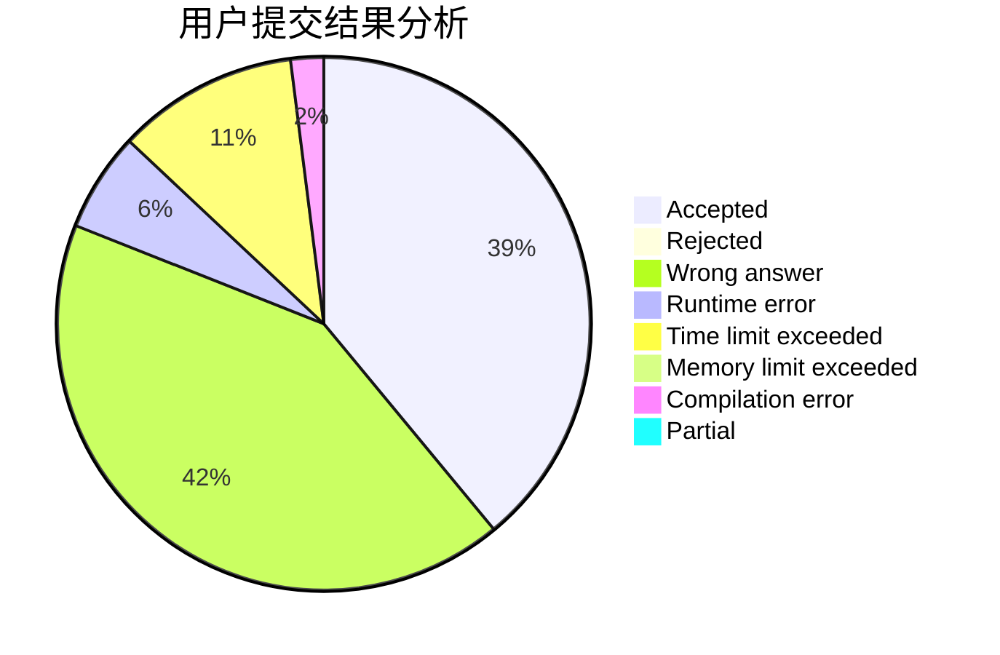
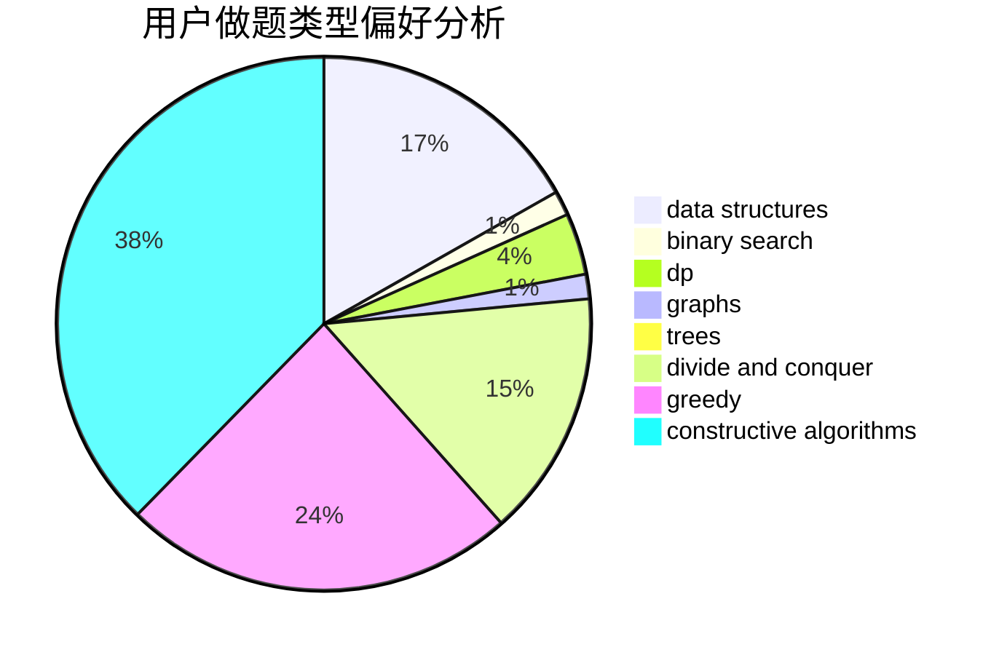
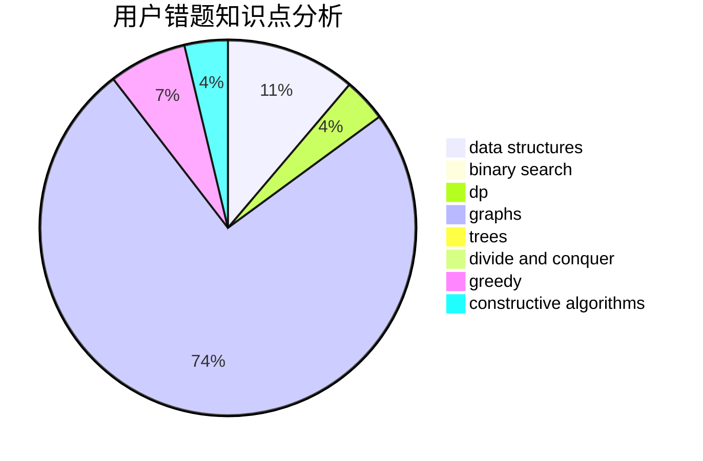

# World_Best

<!-- tabs:start -->

#### **用户提交结果分析**

#### **用户做题类型偏好分析**

#### **用户错题知识点分析**

<!-- tabs:end -->
# 推荐题目
[1198E](https://codeforces.com/contest/1198/problem/E)		flows,
                        graph matchings,
                        graphs		  
[1471B](https://codeforces.com/contest/1471/problem/B)		brute force,
                        greedy,
                        implementation,
                        math		  
[268D](https://codeforces.com/contest/268/problem/D)		dp		  
[1132E](https://codeforces.com/contest/1132/problem/E)		dfs and similar,
                        dp,
                        greedy		  
[1244A](https://codeforces.com/contest/1244/problem/A)		math		  
[691F](https://codeforces.com/contest/691/problem/F)		brute force,
                        dp,
                        number theory		  
[1142E](https://codeforces.com/contest/1142/problem/E)		graphs,
                        interactive		  
[1002D3](https://codeforces.com/contest/1002D/problem/3)		nan		  
[1142B](https://codeforces.com/contest/1142/problem/B)		data structures,
                        dfs and similar,
                        dp,
                        math,
                        trees		  
[1175A](https://codeforces.com/contest/1175/problem/A)		implementation,
                        math		  
