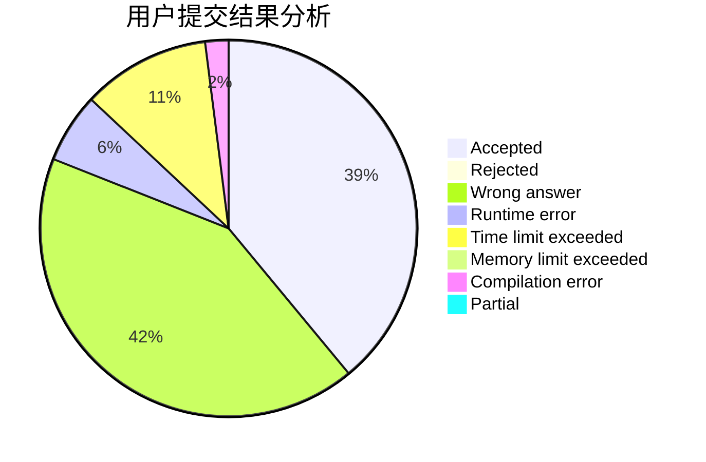
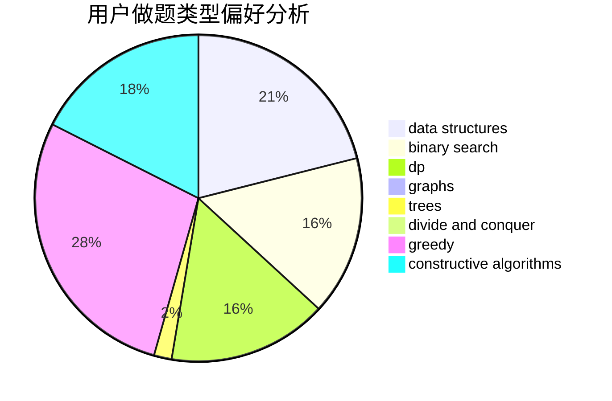
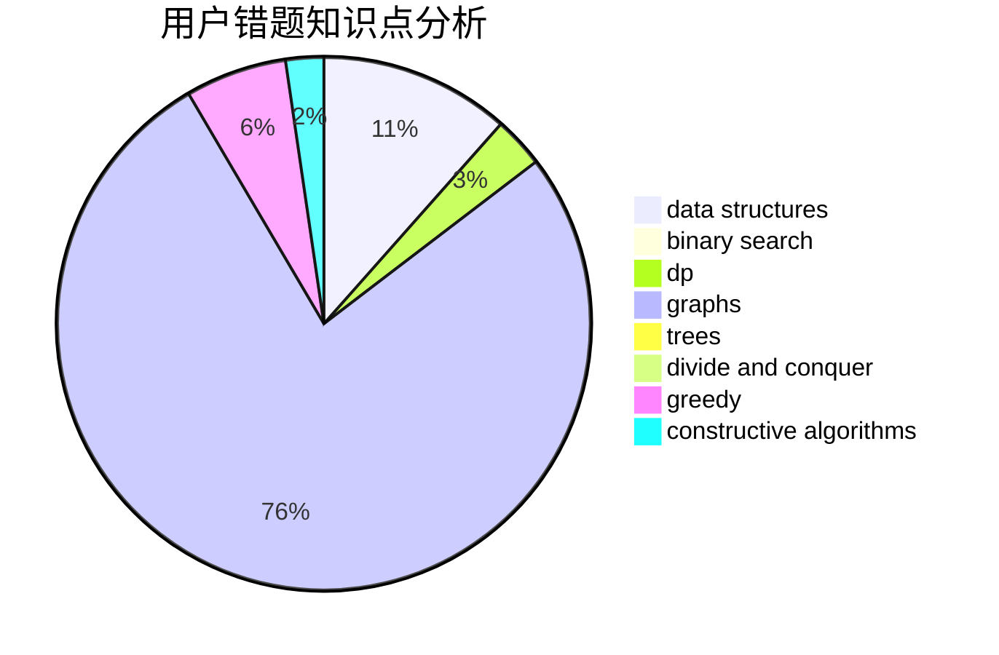

# World_Best

<!-- tabs:start -->

#### **用户提交结果分析**

#### **用户做题类型偏好分析**

#### **用户错题知识点分析**

<!-- tabs:end -->
# 推荐题目
[1202C](https://codeforces.com/contest/1202/problem/C)		brute force,
                        data structures,
                        dp,
                        greedy,
                        implementation,
                        math,
                        strings		  
[1479D](https://codeforces.com/contest/1479/problem/D)		binary search,
                        bitmasks,
                        brute force,
                        data structures,
                        probabilities,
                        trees		  
[283E](https://codeforces.com/contest/283/problem/E)		combinatorics,
                        data structures,
                        math		  
[1136D](https://codeforces.com/contest/1136/problem/D)		greedy		  
[12492](https://codeforces.com/contest/1249/problem/2)		dsu,graphs,sortings,trees		  
[711D](https://codeforces.com/contest/711/problem/D)		combinatorics,
                        dfs and similar,
                        graphs,
                        math		  
[1144G](https://codeforces.com/contest/1144/problem/G)		dp,
                        greedy		  
[1003A](https://codeforces.com/contest/1003/problem/A)		implementation		  
[1144D](https://codeforces.com/contest/1144/problem/D)		constructive algorithms,
                        greedy		  
[1178A](https://codeforces.com/contest/1178/problem/A)		greedy		  
