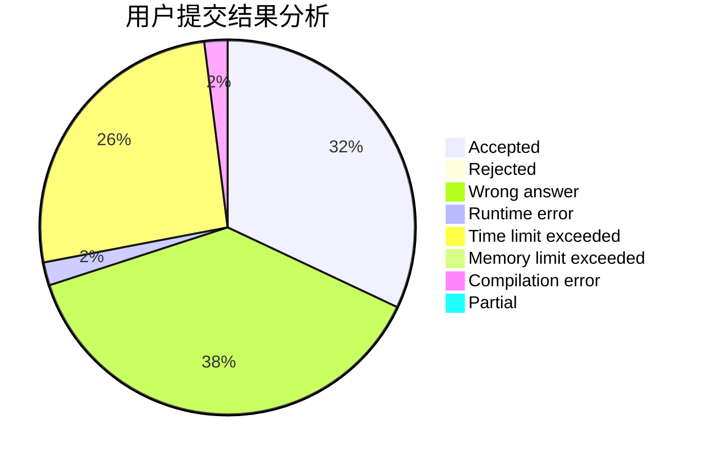
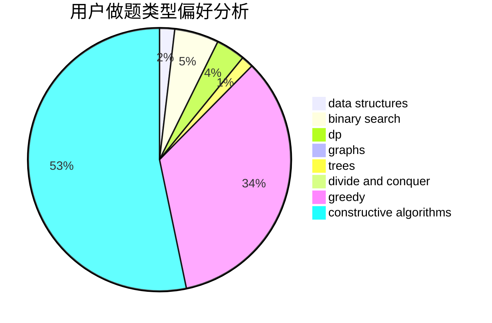

# Wrong_Answer_Duck

<!-- tabs:start -->

#### **用户提交结果分析**

#### **用户做题类型偏好分析**

#### **用户错题知识点分析**

<!-- tabs:end -->
# 推荐题目
[747A](https://codeforces.com/contest/747/problem/A)		brute force,
                        math		  
[1253D](https://codeforces.com/contest/1253/problem/D)		constructive algorithms,
                        dfs and similar,
                        dsu,
                        graphs,
                        greedy,
                        sortings		  
[1151C](https://codeforces.com/contest/1151/problem/C)		constructive algorithms,
                        math		  
[1201B](https://codeforces.com/contest/1201/problem/B)		greedy,
                        math		  
[1104B](https://codeforces.com/contest/1104/problem/B)		data structures,
                        implementation,
                        math		  
[814A](https://codeforces.com/contest/814/problem/A)		constructive algorithms,
                        greedy,
                        implementation,
                        sortings		  
[845D](https://codeforces.com/contest/845/problem/D)		data structures,
                        dp,
                        greedy		  
[1247D](https://codeforces.com/contest/1247/problem/D)		dsu,graphs,sortings,trees		  
[825D](https://codeforces.com/contest/825/problem/D)		binary search,
                        greedy,
                        implementation		  
[934D](https://codeforces.com/contest/934/problem/D)		dsu,graphs,sortings,trees		  
