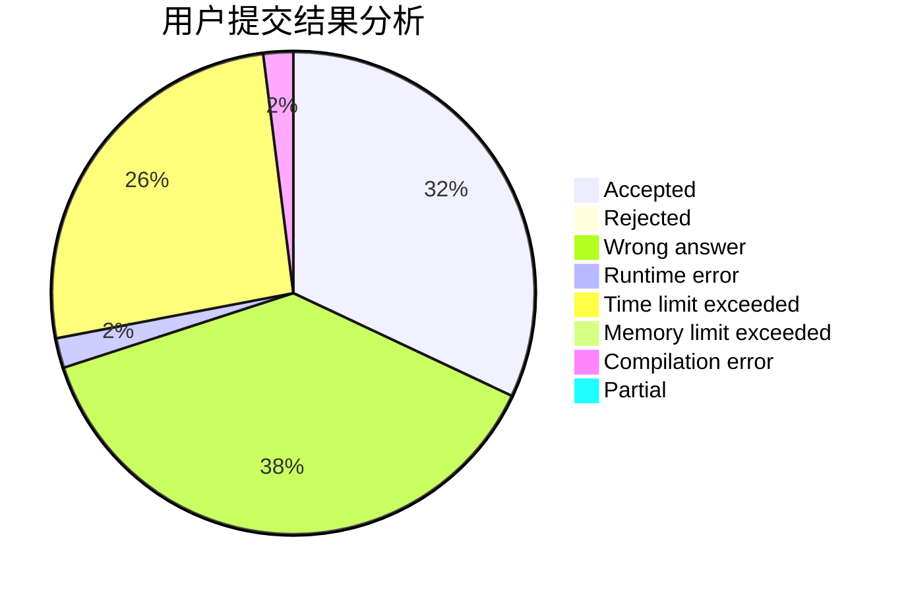
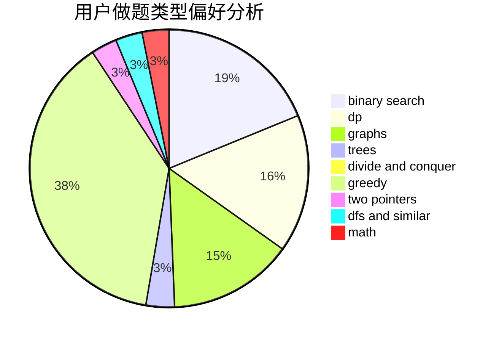

# Wrong_Answer_Duck

<!-- tabs:start -->

#### **用户提交结果分析**

#### **用户做题类型偏好分析**

<!-- tabs:end -->
# 推荐题目
[766D](https://codeforces.com/contest/766/problem/D)
[1260F](https://codeforces.com/contest/1260/problem/F)
[1153C](https://codeforces.com/contest/1153/problem/C)
[1205F](https://codeforces.com/contest/1205/problem/F)
[1104E](https://codeforces.com/contest/1104/problem/E)
[832C](https://codeforces.com/contest/832/problem/C)
[863E](https://codeforces.com/contest/863/problem/E)
[1251C](https://codeforces.com/contest/1251/problem/C)
[844A](https://codeforces.com/contest/844/problem/A)
[956C](https://codeforces.com/contest/956/problem/C)
