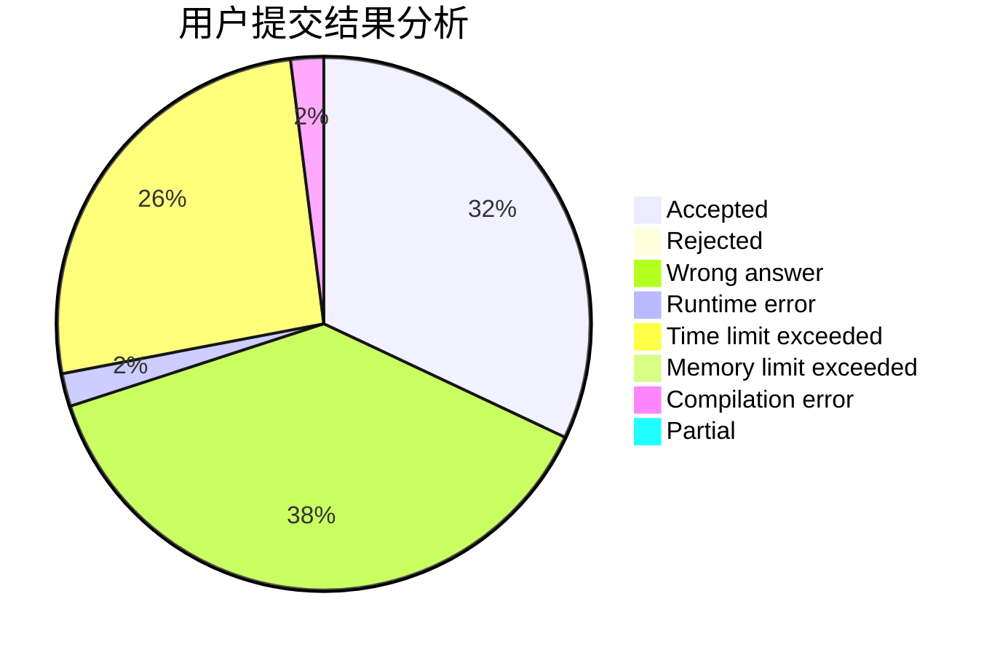
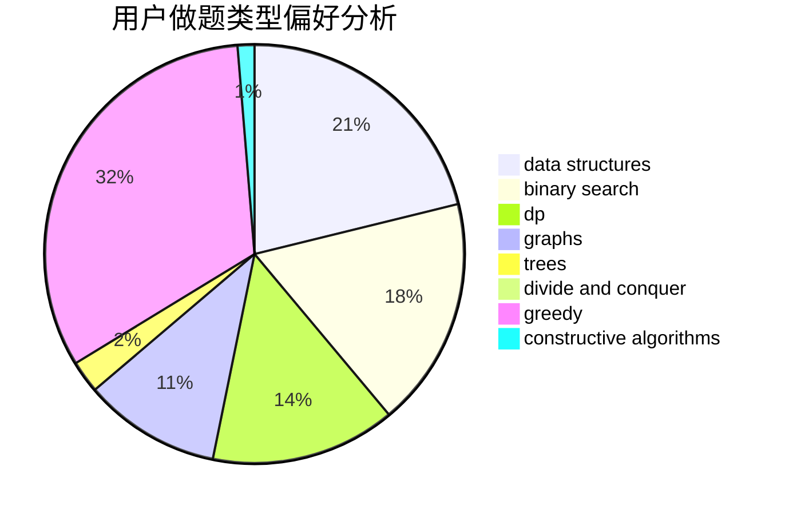

# Wrong_Answer_Duck

<!-- tabs:start -->

#### **用户提交结果分析**

#### **用户做题类型偏好分析**

#### **用户错题知识点分析**

<!-- tabs:end -->
# 推荐题目
[766D](https://codeforces.com/contest/766/problem/D)		data structures,
                        dfs and similar,
                        dp,
                        dsu,
                        graphs		  
[1260F](https://codeforces.com/contest/1260/problem/F)		data structures,
                        trees		  
[1153C](https://codeforces.com/contest/1153/problem/C)		greedy,
                        strings		  
[1205F](https://codeforces.com/contest/1205/problem/F)		constructive algorithms,
                        math		  
[1104E](https://codeforces.com/contest/1104/problem/E)		dsu,graphs,sortings,trees		  
[832C](https://codeforces.com/contest/832/problem/C)		binary search,
                        implementation,
                        math		  
[863E](https://codeforces.com/contest/863/problem/E)		data structures,
                        sortings		  
[1251C](https://codeforces.com/contest/1251/problem/C)		greedy,
                        two pointers		  
[844A](https://codeforces.com/contest/844/problem/A)		greedy,
                        implementation,
                        strings		  
[956C](https://codeforces.com/contest/956/problem/C)		dsu,graphs,sortings,trees		  
