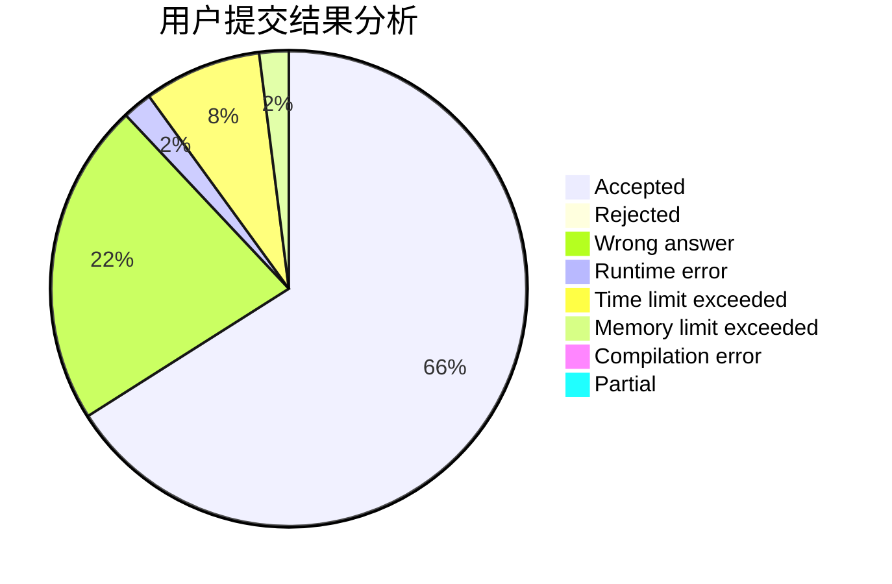
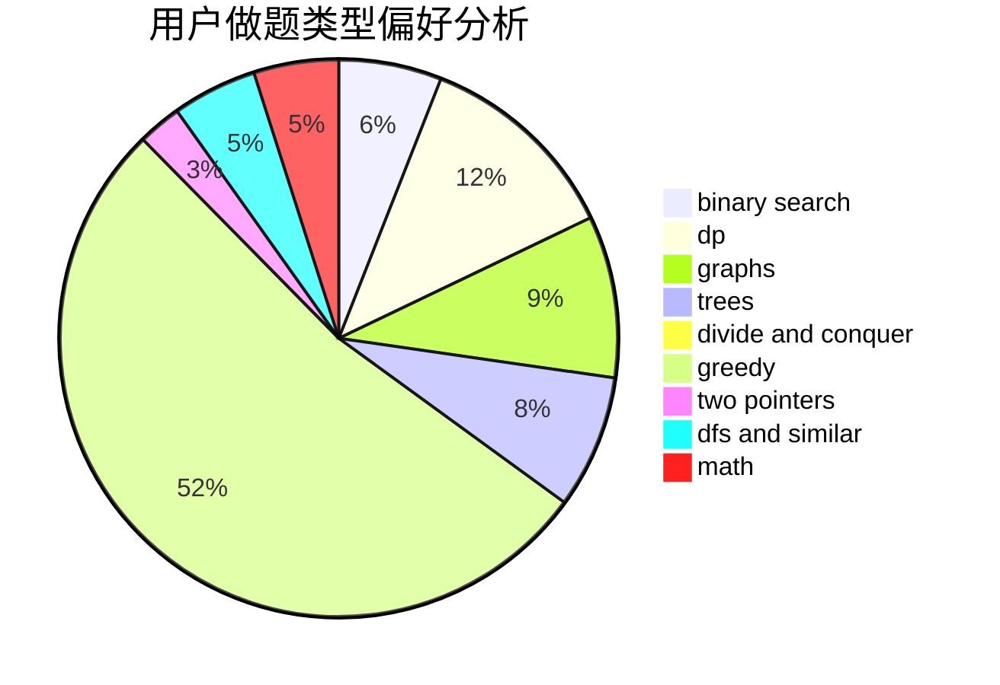

# Wrz-cai

<!-- tabs:start -->

#### **用户提交结果分析**

#### **用户做题类型偏好分析**

<!-- tabs:end -->
# 推荐题目
[1267G](https://codeforces.com/contest/1267/problem/G)
[936D](https://codeforces.com/contest/936/problem/D)
[11411](https://codeforces.com/contest/1141/problem/1)
[600D](https://codeforces.com/contest/600/problem/D)
[12042](https://codeforces.com/contest/1204/problem/2)
[266B](https://codeforces.com/contest/266/problem/B)
[913D](https://codeforces.com/contest/913/problem/D)
[1186D](https://codeforces.com/contest/1186/problem/D)
[434C](https://codeforces.com/contest/434/problem/C)
[271D](https://codeforces.com/contest/271/problem/D)
