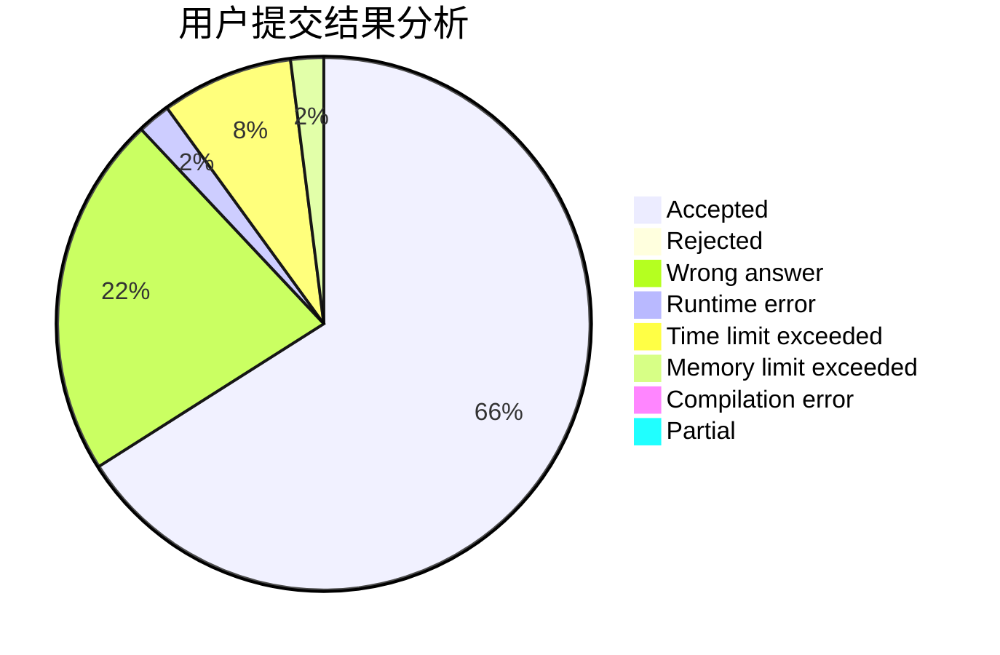
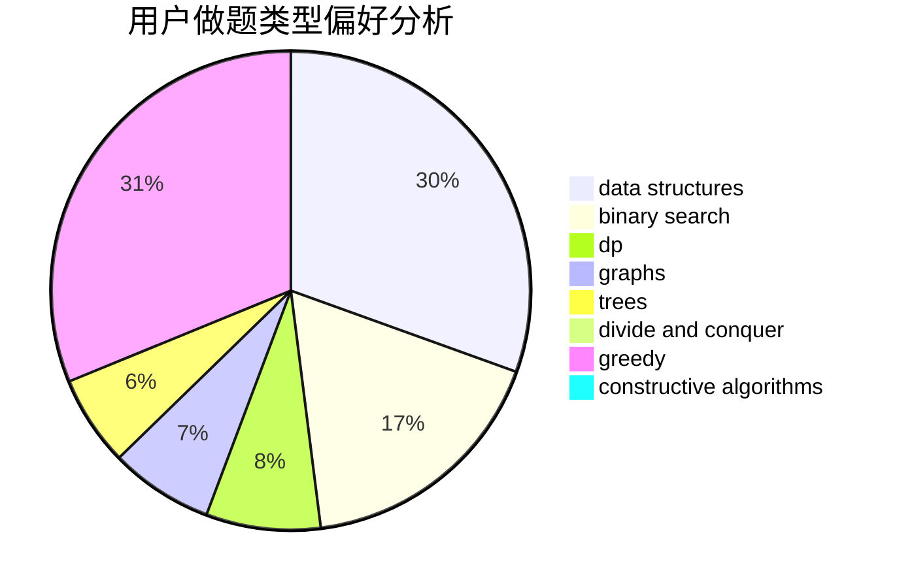
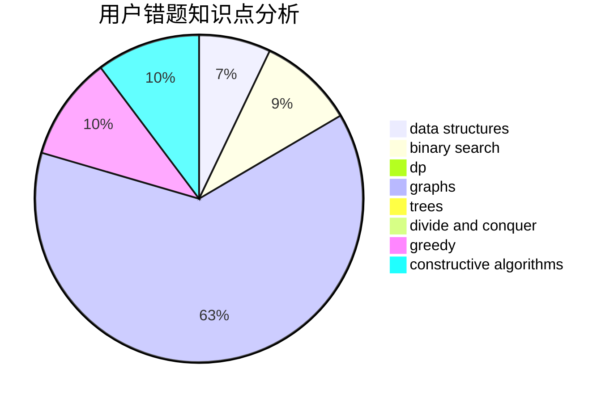

# Wrz-cai

<!-- tabs:start -->

#### **用户提交结果分析**

#### **用户做题类型偏好分析**

#### **用户错题知识点分析**

<!-- tabs:end -->
# 推荐题目
[1261F](https://codeforces.com/contest/1261/problem/F)		bitmasks,
                        divide and conquer,
                        math		  
[916C](https://codeforces.com/contest/916/problem/C)		constructive algorithms,
                        graphs,
                        shortest paths		  
[1139D](https://codeforces.com/contest/1139/problem/D)		dp,
                        math,
                        number theory,
                        probabilities		  
[580B](https://codeforces.com/contest/580/problem/B)		binary search,
                        sortings,
                        two pointers		  
[11B](https://codeforces.com/contest/11/problem/B)		math		  
[245H](https://codeforces.com/contest/245/problem/H)		dp,
                        hashing,
                        strings		  
[896A](https://codeforces.com/contest/896/problem/A)		binary search,
                        dfs and similar		  
[1183F](https://codeforces.com/contest/1183/problem/F)		brute force,
                        math,
                        sortings		  
[405C](https://codeforces.com/contest/405/problem/C)		implementation,
                        math		  
[253D](https://codeforces.com/contest/253/problem/D)		brute force,
                        two pointers		  
