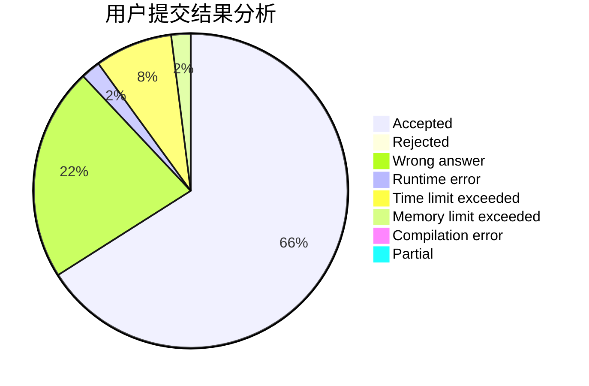
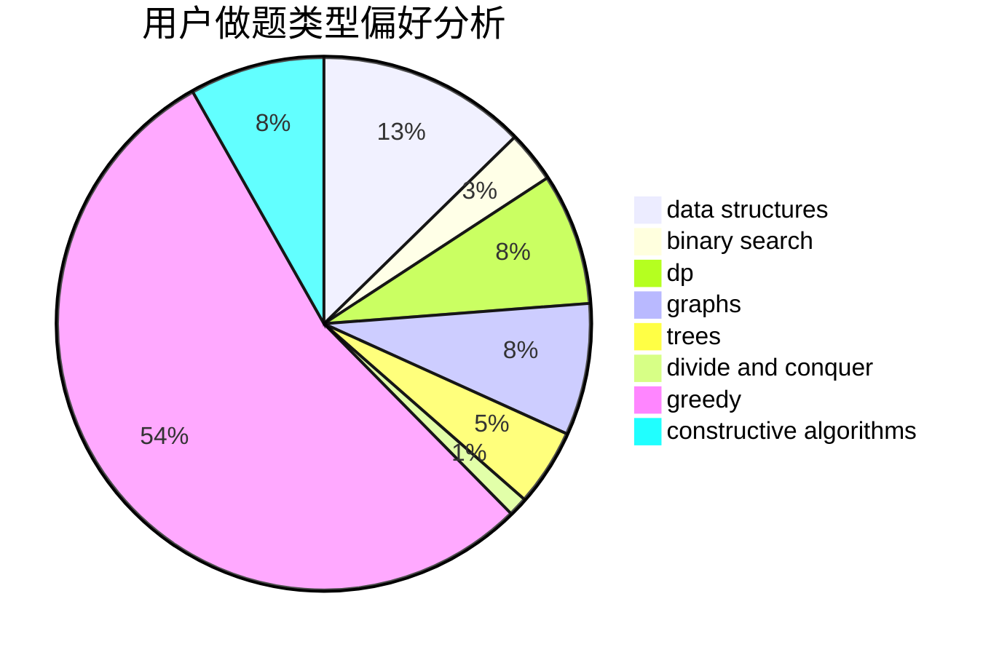

# Wrz-cai

<!-- tabs:start -->

#### **用户提交结果分析**

#### **用户做题类型偏好分析**

#### **用户错题知识点分析**

<!-- tabs:end -->
# 推荐题目
[1267G](https://codeforces.com/contest/1267/problem/G)		math,
                        probabilities		  
[936D](https://codeforces.com/contest/936/problem/D)		dp,
                        greedy		  
[11411](https://codeforces.com/contest/1141/problem/1)		dsu,graphs,sortings,trees		  
[600D](https://codeforces.com/contest/600/problem/D)		geometry		  
[12042](https://codeforces.com/contest/1204/problem/2)		dsu,graphs,sortings,trees		  
[266B](https://codeforces.com/contest/266/problem/B)		constructive algorithms,
                        graph matchings,
                        implementation,
                        shortest paths		  
[913D](https://codeforces.com/contest/913/problem/D)		binary search,
                        brute force,
                        data structures,
                        greedy,
                        sortings		  
[1186D](https://codeforces.com/contest/1186/problem/D)		constructive algorithms,
                        greedy,
                        math		  
[434C](https://codeforces.com/contest/434/problem/C)		dsu,graphs,sortings,trees		  
[271D](https://codeforces.com/contest/271/problem/D)		data structures,
                        strings		  
