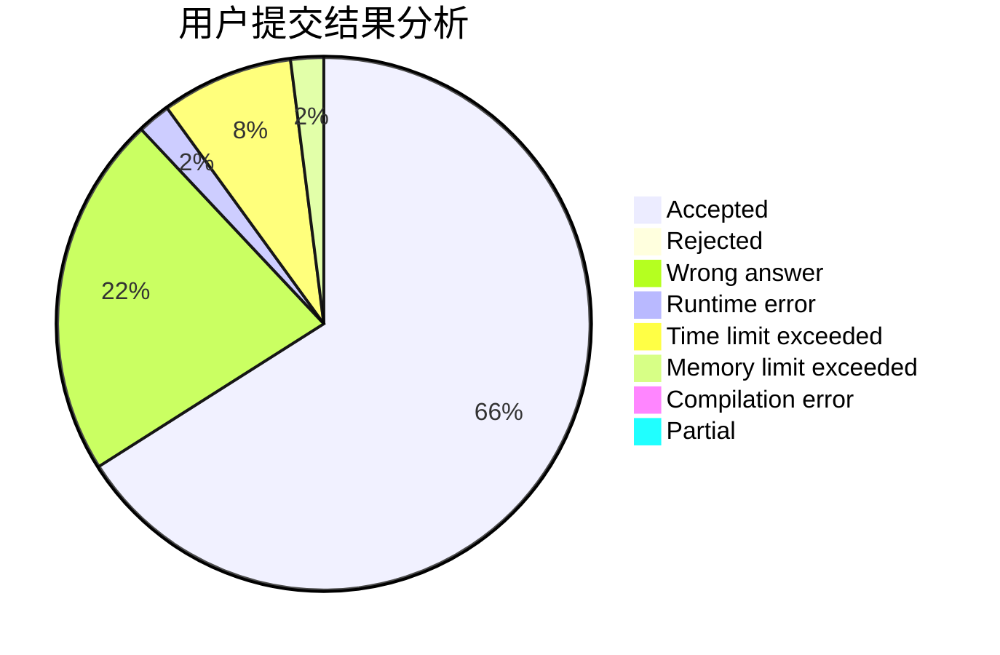
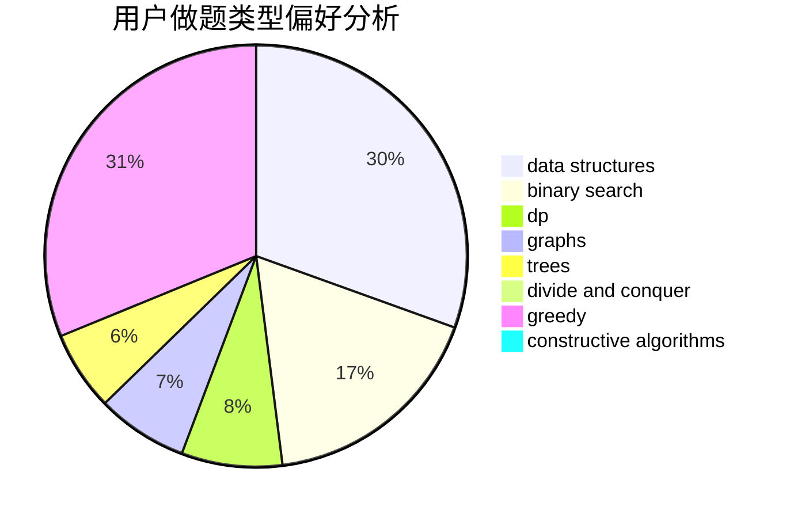
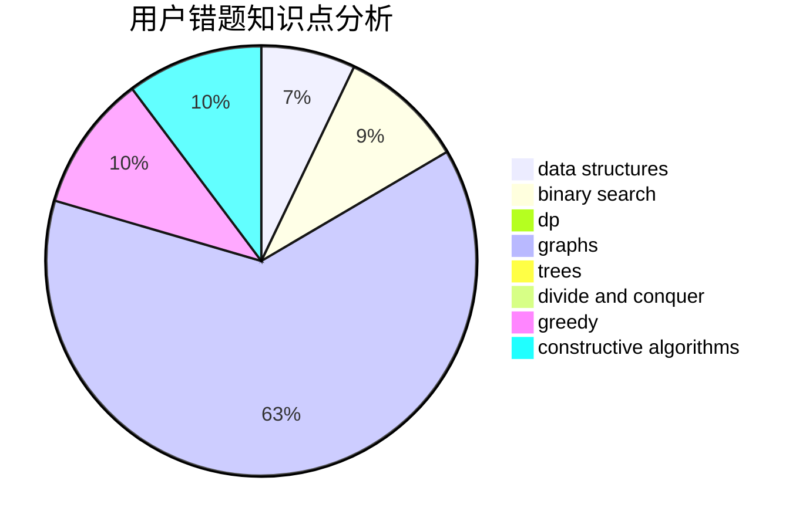

# Wrz-cai
<!-- tabs:start -->
#### **用户提交结果分析**

#### **用户做题类型偏好分析**

#### **用户错题知识点分析**

<!-- tabs:end -->
# 推荐题目
[Stairs and Elevators](https://codeforces.com/contest/966/problem/A)		binary search		  
[Topforces Strikes Back](http://codeforces.com/problemset/problem/1183/F)		brute force,
                        math,
                        sortings		  
[Boredom](http://codeforces.com/problemset/problem/853/C)		data structures		  
[Jumping Jack](http://codeforces.com/problemset/problem/11/B)		math		  
[Kefa and Company](http://codeforces.com/problemset/problem/580/B)		binary search,
                        sortings,
                        two pointers		  
[Steps to One](http://codeforces.com/problemset/problem/1139/D)		dp,
                        math,
                        number theory,
                        probabilities		  
[Queries for Number of Palindromes](http://codeforces.com/problemset/problem/245/H)		dp,
                        hashing,
                        strings		  
[Fools and Roads](http://codeforces.com/problemset/problem/191/C)		data structures,
                        dfs and similar,
                        trees		  
[Nephren gives a riddle](http://codeforces.com/problemset/problem/896/A)		binary search,
                        dfs and similar		  
[Mars rover](http://codeforces.com/problemset/problem/1010/D)		dfs and similar,
                        graphs,
                        implementation,
                        trees		  
<!-- tabs:start -->
#### **data structures**
[Stairs and Elevators](http://codeforces.com/problemset/problem/853/C)		data structures		  
[Topforces Strikes Back](http://codeforces.com/problemset/problem/191/C)		data structures,
                        dfs and similar,
                        trees		  
[Boredom](http://codeforces.com/problemset/problem/1070/B)		data structures,
                        greedy		  
[Jumping Jack](http://codeforces.com/problemset/problem/1277/D)		data structures,
                        hashing,
                        implementation,
                        math		  
[Kefa and Company](http://codeforces.com/problemset/problem/757/G)		data structures,
                        divide and conquer,
                        graphs,
                        trees		  
[Steps to One](http://codeforces.com/problemset/problem/788/E)		data structures		  
[Queries for Number of Palindromes](http://codeforces.com/problemset/problem/1492/C)		binary search,
                        data structures,
                        dp,
                        greedy,
                        two pointers		  
[Fools and Roads](http://codeforces.com/problemset/problem/1490/G)		binary search,
                        data structures,
                        math		  
[Nephren gives a riddle](http://codeforces.com/problemset/problem/1479/D)		binary search,
                        bitmasks,
                        brute force,
                        data structures,
                        probabilities,
                        trees		  
[Mars rover](http://codeforces.com/problemset/problem/1497/A)		brute force,
                        data structures,
                        greedy,
                        sortings		  
#### **binary search**
[Stairs and Elevators](https://codeforces.com/contest/966/problem/A)		binary search		  
[Topforces Strikes Back](http://codeforces.com/problemset/problem/580/B)		binary search,
                        sortings,
                        two pointers		  
[Boredom](http://codeforces.com/problemset/problem/896/A)		binary search,
                        dfs and similar		  
[Jumping Jack](http://codeforces.com/problemset/problem/165/C)		binary search,
                        brute force,
                        dp,
                        math,
                        strings,
                        two pointers		  
[Kefa and Company](http://codeforces.com/problemset/problem/1223/G)		binary search,
                        math,
                        number theory		  
[Steps to One](http://codeforces.com/problemset/problem/1183/C)		binary search,
                        math		  
[Queries for Number of Palindromes](http://codeforces.com/problemset/problem/1492/C)		binary search,
                        data structures,
                        dp,
                        greedy,
                        two pointers		  
[Fools and Roads](http://codeforces.com/problemset/problem/1463/D)		binary search,
                        constructive algorithms,
                        greedy,
                        two pointers		  
[Nephren gives a riddle](http://codeforces.com/problemset/problem/1490/G)		binary search,
                        data structures,
                        math		  
[Mars rover](http://codeforces.com/problemset/problem/1479/D)		binary search,
                        bitmasks,
                        brute force,
                        data structures,
                        probabilities,
                        trees		  
#### **dp**
[Stairs and Elevators](http://codeforces.com/problemset/problem/1139/D)		dp,
                        math,
                        number theory,
                        probabilities		  
[Topforces Strikes Back](http://codeforces.com/problemset/problem/245/H)		dp,
                        hashing,
                        strings		  
[Boredom](http://codeforces.com/problemset/problem/165/C)		binary search,
                        brute force,
                        dp,
                        math,
                        strings,
                        two pointers		  
[Jumping Jack](http://codeforces.com/problemset/problem/1349/F2)		dp,
                        fft,
                        math		  
[Kefa and Company](http://codeforces.com/problemset/problem/747/D)		dp,
                        greedy,
                        sortings		  
[Steps to One](http://codeforces.com/problemset/problem/145/C)		combinatorics,
                        dp,
                        math		  
[Queries for Number of Palindromes](http://codeforces.com/problemset/problem/1340/C)		dfs and similar,
                        dp,
                        graphs,
                        shortest paths		  
[Fools and Roads](http://codeforces.com/problemset/problem/1423/J)		bitmasks,
                        constructive algorithms,
                        dp,
                        math		  
[Nephren gives a riddle](http://codeforces.com/problemset/problem/1455/D)		dp,
                        greedy,
                        sortings		  
[Mars rover](http://codeforces.com/problemset/problem/1492/C)		binary search,
                        data structures,
                        dp,
                        greedy,
                        two pointers		  
#### **graph**
[Stairs and Elevators](http://codeforces.com/problemset/problem/1010/D)		dfs and similar,
                        graphs,
                        implementation,
                        trees		  
[Topforces Strikes Back](http://codeforces.com/problemset/problem/28/B)		dfs and similar,
                        dsu,
                        graphs		  
[Boredom](http://codeforces.com/problemset/problem/1340/C)		dfs and similar,
                        dp,
                        graphs,
                        shortest paths		  
[Jumping Jack](http://codeforces.com/problemset/problem/757/G)		data structures,
                        divide and conquer,
                        graphs,
                        trees		  
[Kefa and Company](http://codeforces.com/problemset/problem/916/C)		constructive algorithms,
                        graphs,
                        shortest paths		  
[Steps to One](http://codeforces.com/problemset/problem/1487/C)		brute force,
                        constructive algorithms,
                        dfs and similar,
                        graphs,
                        greedy,
                        implementation,
                        math		  
[Queries for Number of Palindromes](http://codeforces.com/problemset/problem/1437/C)		dp,
                        flows,
                        graph matchings,
                        greedy,
                        math,
                        sortings		  
[Fools and Roads](http://codeforces.com/problemset/problem/1470/D)		constructive algorithms,
                        dfs and similar,
                        graph matchings,
                        graphs,
                        greedy		  
[Nephren gives a riddle](http://codeforces.com/problemset/problem/1476/C)		dp,
                        graphs,
                        greedy		  
[Mars rover](http://codeforces.com/problemset/problem/1304/D)		constructive algorithms,
                        graphs,
                        greedy,
                        two pointers		  
#### **trees**
[Stairs and Elevators](http://codeforces.com/problemset/problem/191/C)		data structures,
                        dfs and similar,
                        trees		  
[Topforces Strikes Back](http://codeforces.com/problemset/problem/1010/D)		dfs and similar,
                        graphs,
                        implementation,
                        trees		  
[Boredom](http://codeforces.com/problemset/problem/757/G)		data structures,
                        divide and conquer,
                        graphs,
                        trees		  
[Jumping Jack](http://codeforces.com/problemset/problem/1479/D)		binary search,
                        bitmasks,
                        brute force,
                        data structures,
                        probabilities,
                        trees		  
[Kefa and Company](http://codeforces.com/problemset/problem/1511/C)		brute force,
                        data structures,
                        implementation,
                        trees		  
[Steps to One](http://codeforces.com/problemset/problem/1499/F)		combinatorics,
                        dfs and similar,
                        dp,
                        trees		  
[Queries for Number of Palindromes](http://codeforces.com/problemset/problem/1491/E)		brute force,
                        dfs and similar,
                        divide and conquer,
                        number theory,
                        trees		  
[Fools and Roads](http://codeforces.com/problemset/problem/1466/D)		data structures,
                        greedy,
                        sortings,
                        trees		  
[Nephren gives a riddle](http://codeforces.com/problemset/problem/1495/D)		combinatorics,
                        dfs and similar,
                        graphs,
                        math,
                        shortest paths,
                        trees		  
[Mars rover](http://codeforces.com/problemset/problem/1303/G)		data structures,
                        divide and conquer,
                        geometry,
                        trees		  
#### **divide and conquer**
[Stairs and Elevators](http://codeforces.com/problemset/problem/97/B)		constructive algorithms,
                        divide and conquer		  
[Topforces Strikes Back](http://codeforces.com/problemset/problem/1261/F)		bitmasks,
                        divide and conquer,
                        math		  
[Boredom](http://codeforces.com/problemset/problem/757/G)		data structures,
                        divide and conquer,
                        graphs,
                        trees		  
[Jumping Jack](http://codeforces.com/problemset/problem/1461/D)		binary search,
                        brute force,
                        data structures,
                        divide and conquer,
                        implementation,
                        sortings		  
[Kefa and Company](http://codeforces.com/problemset/problem/1466/G)		combinatorics,
                        divide and conquer,
                        hashing,
                        math,
                        string suffix structures,
                        strings		  
[Steps to One](http://codeforces.com/problemset/problem/1490/D)		dfs and similar,
                        divide and conquer,
                        implementation		  
[Queries for Number of Palindromes](https://codeforces.com/contest/1483/problem/C)		data structures,
                        divide and conquer,
                        dp		  
[Fools and Roads](http://codeforces.com/problemset/problem/1491/E)		brute force,
                        dfs and similar,
                        divide and conquer,
                        number theory,
                        trees		  
[Nephren gives a riddle](http://codeforces.com/problemset/problem/1303/G)		data structures,
                        divide and conquer,
                        geometry,
                        trees		  
[Mars rover](http://codeforces.com/problemset/problem/1494/D)		constructive algorithms,
                        data structures,
                        dfs and similar,
                        divide and conquer,
                        dsu,
                        greedy,
                        sortings,
                        trees		  
#### **greedy**
[Stairs and Elevators](http://codeforces.com/problemset/problem/1271/A)		brute force,
                        greedy,
                        math		  
[Topforces Strikes Back](http://codeforces.com/problemset/problem/1070/B)		data structures,
                        greedy		  
[Boredom](http://codeforces.com/problemset/problem/205/B)		brute force,
                        greedy		  
[Jumping Jack](http://codeforces.com/problemset/problem/1187/C)		constructive algorithms,
                        greedy,
                        implementation		  
[Kefa and Company](http://codeforces.com/problemset/problem/1250/B)		brute force,
                        constructive algorithms,
                        greedy,
                        math		  
[Steps to One](https://codeforces.com/contest/1072/problem/C)		greedy		  
[Queries for Number of Palindromes](http://codeforces.com/problemset/problem/747/D)		dp,
                        greedy,
                        sortings		  
[Fools and Roads](http://codeforces.com/problemset/problem/1096/A)		greedy,
                        implementation,
                        math		  
[Nephren gives a riddle](http://codeforces.com/problemset/problem/1070/F)		greedy		  
[Mars rover](http://codeforces.com/problemset/problem/1455/D)		dp,
                        greedy,
                        sortings		  
#### **constructive algorithms**
[Stairs and Elevators](https://codeforces.com/contest/759/problem/A)		constructive algorithms,
                        dfs and similar		  
[Topforces Strikes Back](https://codeforces.com/contest/716/problem/C)		constructive algorithms,
                        math		  
[Boredom](http://codeforces.com/problemset/problem/1187/C)		constructive algorithms,
                        greedy,
                        implementation		  
[Jumping Jack](http://codeforces.com/problemset/problem/1250/B)		brute force,
                        constructive algorithms,
                        greedy,
                        math		  
[Kefa and Company](http://codeforces.com/problemset/problem/720/C)		constructive algorithms		  
[Steps to One](http://codeforces.com/problemset/problem/97/B)		constructive algorithms,
                        divide and conquer		  
[Queries for Number of Palindromes](http://codeforces.com/problemset/problem/710/C)		constructive algorithms,
                        math		  
[Fools and Roads](https://codeforces.com/contest/947/problem/D)		constructive algorithms,
                        implementation,
                        strings		  
[Nephren gives a riddle](http://codeforces.com/problemset/problem/916/C)		constructive algorithms,
                        graphs,
                        shortest paths		  
[Mars rover](http://codeforces.com/problemset/problem/1423/J)		bitmasks,
                        constructive algorithms,
                        dp,
                        math		  
#### **sortings**
[Stairs and Elevators](http://codeforces.com/problemset/problem/1183/F)		brute force,
                        math,
                        sortings		  
[Topforces Strikes Back](http://codeforces.com/problemset/problem/580/B)		binary search,
                        sortings,
                        two pointers		  
[Boredom](http://codeforces.com/problemset/problem/747/D)		dp,
                        greedy,
                        sortings		  
[Jumping Jack](http://codeforces.com/problemset/problem/1455/D)		dp,
                        greedy,
                        sortings		  
[Kefa and Company](https://codeforces.com/contest/1496/problem/C)		geometry,
                        greedy,
                        math,
                        sortings		  
[Steps to One](http://codeforces.com/problemset/problem/1495/A)		geometry,
                        greedy,
                        math,
                        sortings		  
[Queries for Number of Palindromes](http://codeforces.com/problemset/problem/1497/A)		brute force,
                        data structures,
                        greedy,
                        sortings		  
[Fools and Roads](http://codeforces.com/problemset/problem/1427/A)		math,
                        sortings		  
[Nephren gives a riddle](http://codeforces.com/problemset/problem/1461/D)		binary search,
                        brute force,
                        data structures,
                        divide and conquer,
                        implementation,
                        sortings		  
[Mars rover](http://codeforces.com/problemset/problem/1437/C)		dp,
                        flows,
                        graph matchings,
                        greedy,
                        math,
                        sortings		  
<!-- tabs:end -->
