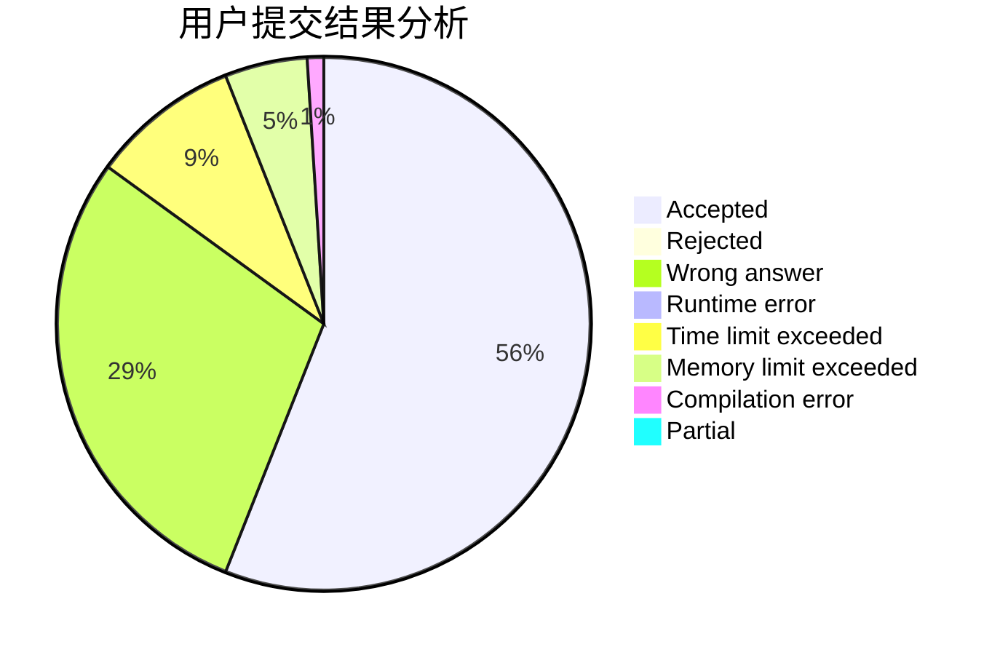
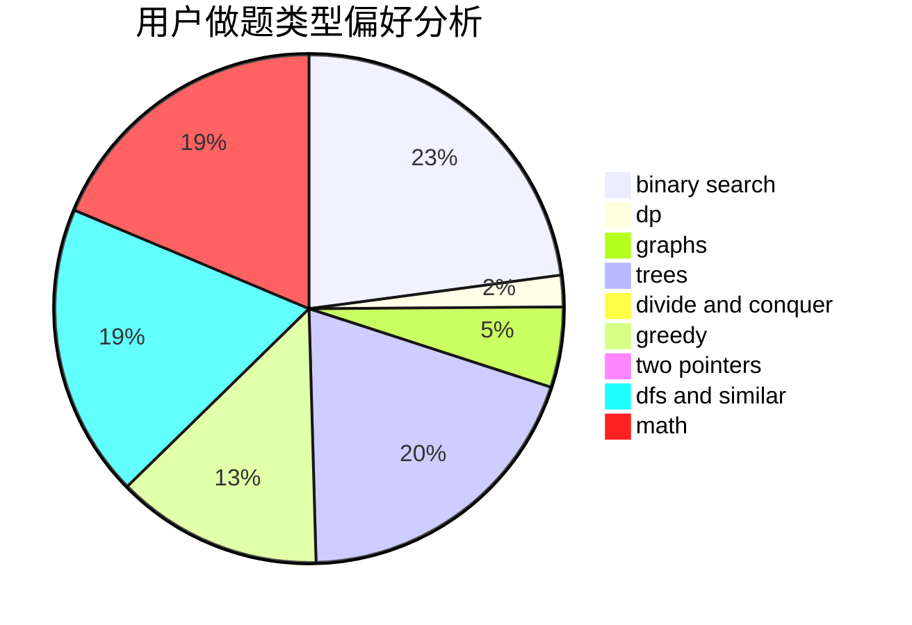

# WuYantao

<!-- tabs:start -->

#### **用户提交结果分析**

#### **用户做题类型偏好分析**

<!-- tabs:end -->
# 推荐题目
[1106B](https://codeforces.com/contest/1106/problem/B)
[765C](https://codeforces.com/contest/765/problem/C)
[787A](https://codeforces.com/contest/787/problem/A)
[886C](https://codeforces.com/contest/886/problem/C)
[12131](https://codeforces.com/contest/1213/problem/1)
[216B](https://codeforces.com/contest/216/problem/B)
[12472](https://codeforces.com/contest/1247/problem/2)
[1391B](https://codeforces.com/contest/1391/problem/B)
[1256A](https://codeforces.com/contest/1256/problem/A)
[1491F](https://codeforces.com/contest/1491/problem/F)
